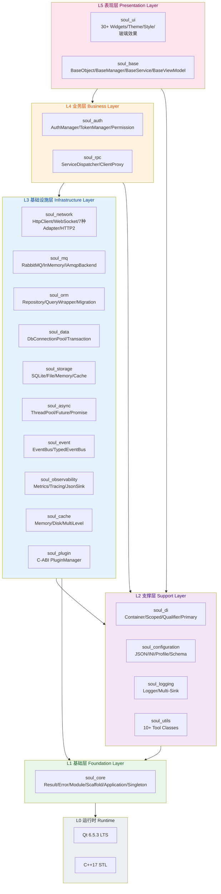
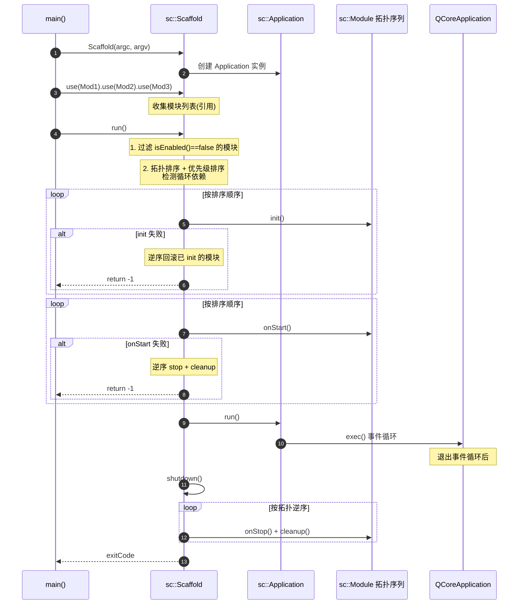
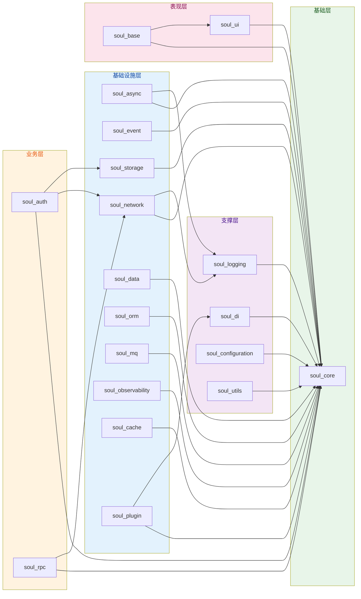

# SoulCoreKit

> 基于 Qt6 的现代 C++ 应用程序开发框架,定位为 **"Qt CS 架构 · SpringBoot 风格脚手架"**,用于构建高性能、可扩展的 Client-Server 架构应用。Client 端覆盖 Windows/macOS/Linux 桌面,Server 端默认部署 Linux(Ubuntu 20.04+)/云服务器,通过统一框架实现两端代码复用与协议互通。

[](LICENSE)
[](https://github.com/sclzj595/SoulCoreKit/releases)
[](https://github.com/sclzj595/SoulCoreKit/actions/workflows/build.yml)
[](https://github.com/sclzj595/SoulCoreKit)
[](https://en.wikipedia.org/wiki/C%2B%2B17)
[](https://www.qt.io)

---

## 目录

- [项目愿景](#项目愿景)
- [核心特性](#核心特性)
- [架构总览](#架构总览)
- [模块分层](#模块分层)
- [快速开始](#快速开始)
- [使用示例](#使用示例)
- [构建系统](#构建系统)
- [与 SpringBoot 对齐度](#与-springboot-对齐度)
- [脚手架缺失功能审查报告](#脚手架缺失功能审查报告)
- [文档体系](#文档体系)
- [贡献指南](#贡献指南)
- [License](#license)

---

## 项目愿景

SoulCoreKit 旨在成为 **Qt CS(Client-Server)架构应用的基础设施骨架**,跨项目复用。脚手架风格参考 SpringBoot,但架构是 CS 而非 BS:

- **CS 架构定位**:Client 端是 Qt 桌面应用(Windows/macOS/Linux),Server 端是部署在 Linux(Ubuntu 20.04+)或云服务器上的后台进程,两端通过 HTTP/TCP/WebSocket/RPC 等协议通信。这不是浏览器-服务器的 BS 架构。
- **SpringBoot 风格脚手架**:借鉴 SpringBoot 的声明式装配、IoC/DI、模块生命周期、AOP 等设计理念,但应用于 C++/Qt 的 CS 场景,而非照搬 Web/Servlet 概念。
- **声明式装配**:链式 `scaffold.use(Module&)` 注册模块,自动按依赖顺序初始化与清理。
- **分层架构**:严格 5 层依赖规则,模块低耦合高内聚,禁止循环依赖与向下依赖。
- **工业级稳定性**:基于 Qt 6.5.3 LTS + C++17 + GCC 11 / MSVC 2019 / Clang 14 工具链锁定。
- **5-10 年可维护性**:所有 API 设计预留版本缓冲层,优先 LTS 版本特性,严禁使用未经验证的 C++20+ 特性(如协程、Modules)。
- **零裸指针**:全项目采用 RAII + 智能指针资源管理,严禁裸 new/delete。

---

## 核心特性

> **架构定位**:SoulCoreKit 是 CS(Client-Server)架构脚手架,不是 BS(Browser-Server)架构。下表中标注了每个能力的适用端(C=Client / S=Server / CS=两端共享)。

| 特性 | 端 | 说明 |
|------|----|------|
| **声明式脚手架** | CS | `sc::Scaffold` 借鉴 `@SpringBootApplication` 理念,链式声明模块,拓扑排序 + 优先级 + 循环依赖检测,自动回滚 |
| **完整模块生命周期** | CS | `Module` 提供 `init()/onStart()/onStop()/cleanup()` 四阶段,借鉴 `@PostConstruct`/`ContextRefreshed`/`ContextClosed`/`@PreDestroy`;支持 `dependsOn()` 依赖声明、`priority()` 优先级、`isEnabled()` 条件装配 |
| **依赖注入容器** | CS | `sc::di::Container` 支持 Singleton/Scoped/Transient 三种生命周期,`bindNamed()` 按名称注册,`setPrimary()` 默认实现,`createScope()/disposeScope()` 作用域管理,DCLP 线程安全 `resolve()` |
| **统一错误处理** | CS | `Result<T>` + `Error` 模式,类型安全的错误传播,严禁异常跨模块边界 |
| **协议无关网络层** | CS | `sc::network` 嵌套命名空间,统一 HTTP/TCP/WebSocket/MQTT/Bluetooth/Serial/NamedPipe 接口,策略模式 + 拦截器链 + 连接池,HTTP/2 多路复用。Client 端提供 HttpClient/WebSocket/TcpClient,Server 端提供 HttpServer |
| **事件驱动架构** | CS | `EventBus` + `TypedEventBus<T>` 发布订阅,支持同步/异步分发,Qt 信号桥接 |
| **异步任务框架** | CS | `ThreadPool` + `TaskRunner` + `Future<T>` + `Promise<T>`,基于 Qt6 QPromise 适配,TSan 安全 |
| **ORM 层** | S | `QueryWrapper` 类型安全 SQL 构建,`BaseRepository<T>` 模板方法模式,`ISqlDialect` 多数据库方言(SQLite/MySQL/PostgreSQL),`MigrationManager` Schema 迁移,`CachedRepository` 装饰器,反射宏减少样板代码 |
| **可扩展存储层** | CS | Memory/File/SQLite 三后端 + `ICache` 抽象 + `MultiLevelCache` 多级缓存 + `Settings` 配置持久化 |
| **消息队列集成** | S | `IAmqpBackend` 抽象,`InMemoryAmqpBackend` 内存模拟(测试用),`AmqpCppBackend` 真实 RabbitMQ 集成(Qt 事件循环集成 + 心跳保活) |
| **RPC 框架** | CS | `ServiceDispatcher` 服务端分发 + `ClientProxy` 客户端代理 + `HttpTransport` 传输 + `LoadBalancer` 负载均衡,CS 架构核心通信能力 |
| **可观测性** | CS | `Counter`/`Gauge`/`Histogram` 三种指标 + `Tracer`/`Span` 链路追踪 + `JsonSink` 结构化日志(适配 ELK/Loki) |
| **认证授权** | CS | `AuthManager` 用户登录/登出 + `TokenManager` Token 管理 + `Permission` 权限验证,Client/Server 双端共享认证逻辑 |
| **插件系统** | CS | C-ABI 边界接口,DLL/SO/DYLIB 动态加载,`PluginMetadata` ABI 版本兼容检查,死锁安全初始化/关闭 |
| **配置管理** | CS | JSON/INI 多源 + 环境变量覆盖 + 热加载 + Profile 环境隔离(dev/test/prod) + `ConfigSchema` 验证 |
| **AOP 切面编程** | CS | `sc::aop::AspectWeaver` 借鉴 `@Aspect` 理念,支持 Before/After/Around/AfterReturning/AfterThrowing,`Pointcut` 方法名匹配,`JoinPoint` 封装方法调用上下文(v1.9.0 新增) |
| **内嵌 HTTP Server** | S | `sc::server::HttpServer` 作为 CS 架构中的 Server 端通信入口,基于 `QTcpServer` 自研轻量 HTTP/1.1 Server,路由分发 + per-socket 缓冲 + 连接超时 + DoS 防护(v1.9.0 新增) |
| **资源池监控** | CS | `IResourcePoolMonitor` 统一接口,适配 ThreadPool/ConnectionPool/DbConnectionPool,`ResourcePoolMetricsCollector` 后台采集 Gauge 指标,阈值告警回调(v1.9.0 新增) |
| **声明式 UI** | C | 30+ 现代化组件(Button/Card/Dialog/Toast/Nav/TabBar 等)+ Theme 主题切换 + QSS 样式 + iOS17 风格玻璃效果,独立 `SoulCoreKitUi` 库可按需链接,仅 Client 端使用 |

---

## 架构总览

SoulCoreKit 采用 **5 层分层架构**,严格遵循依赖方向规则(上层可依赖下层,下层禁止依赖上层,严禁循环依赖)。

### 分层架构图



### Scaffold 启动流程



### 模块依赖图



---

## 模块分层

### 模块清单(共 22 个模块)

> **端标识**:C=Client 端专用 / S=Server 端专用 / CS=两端共享

| 层级 | 端 | 模块 | 职责 | 核心类 |
|------|----|------|------|--------|
| **L1 基础层** | CS | `soul_core` | 基础设施 | `Result<T>`/`Error`/`IInterface`/`Singleton`/`Factory<T>`/`Module`/`Scaffold`/`Application`/`Platform`/`Time`/`Uuid`/`Version`/`Environment` |
| **L2 支撑层** | CS | `soul_di` | 依赖注入 | `Container`/`Lifetime`/`SingletonWrapper<T>`/`Module`/`NamedKey` |
| | CS | `soul_logging` | 日志系统 | `Logger`/`ISink`/`LogFormatter`/`ConsoleSink`/`FileSink`/`DailyFileSink`/`CallbackSink`/`CompositeSink` |
| | CS | `soul_configuration` | 配置管理 | `Config`/`IConfiguration`/`JsonConfiguration`/`IniConfiguration`/`ConfigSchema` |
| | CS | `soul_utils` | 工具库 | JSON/File/String/Crypto/Image/Datetime/Process/Compress/XML/Clipboard 工具 |
| **L3 基础设施层** | CS | `soul_async` | 异步执行 | `ThreadPool`/`TaskRunner`/`Future<T>`/`Promise<T>`/`Dispatcher`/`CancelableTask`/`AsyncRunner`/`Task` |
| | CS | `soul_event` | 事件总线 | `EventBus`/`TypedEventBus<T>`/`Subscription`/`QtSignalAdapter`/`IEvent`/`IMessageBus` |
| | CS | `soul_network` | 网络通信(Client+Server 共享传输层) | `HttpClient`/`WebSocket`/`TcpClient`/`NetworkFactory`/`Session`/HTTP/TCP/WS/MQTT/Bluetooth/Serial/NamedPipe Adapter/Policy/Interceptor/Codec/Monitor/Pool |
| | CS | `soul_storage` | 数据存储 | `IStorage`/`SqliteDatabase`/`Cache`/`FileStorage`/`MemoryStorage`/`JsonSerializer`/`Settings`/`ISerializer` |
| | S | `soul_data` | 数据访问(Server 端数据库连接池) | `DbConnectionPool`/`DatabaseDriver`/`MemoryRepository<T>`/`ITransaction`/`ITransactionManager` |
| | S | `soul_orm` | ORM 层(Server 端数据持久化) | `QueryWrapper`/`TypedQueryWrapper<T>`/`BaseRepository<T>`/`SqlRepository<T>`/`CachedRepository<T>`/`ISqlDialect`/`Migration`/`Reflection`/`Column<T>`/`CodeGenerator`/`Entities` |
| | S | `soul_mq` | 消息队列(Server 端异步消息) | `RabbitMQConnection`/`RabbitMQProducer`/`RabbitMQConsumer`/`MQFactory`/`IAmqpBackend`/`InMemoryAmqpBackend`/`AmqpCppBackend` |
| | CS | `soul_cache` | 缓存系统 | `ICache<T>`/`MemoryCache<T>`/`DiskCache<T>`/`MultiLevelCache<T>`/`SizeEstimator<T>` |
| | CS | `soul_observability` | 可观测性 | `Counter`/`Gauge`/`Histogram`/`MetricsRegistry`/`Tracer`/`Span`/`TraceContext`/`JsonSink` |
| | CS | `soul_plugin` | 插件系统 | `IPlugin`/`PluginManager`/`PluginMetadata`/`PluginHandle`/`Module` |
| | CS | `soul_aop` | AOP 切面编程 | `JoinPoint`/`Pointcut`/`Aspect`/`AspectWeaver`/`BeforeFunc`/`AfterFunc`/`AroundFunc` |
| | S | `soul_server` | 内嵌 HTTP Server(Server 端通信入口) | `HttpServer`/`HttpRequest`/`HttpResponse`/`RouteHandler`/`HttpMethod` |
| **L4 业务层** | CS | `soul_auth` | 认证授权 | `AuthManager`/`TokenManager`/`Permission`/`User` |
| | CS | `soul_rpc` | RPC 框架(CS 通信核心) | `ServiceDispatcher`/`ClientProxy`/`HttpTransport`/`IServiceRegistry`/`LoadBalancer`/`ISerializer`/`IRpcTransport` |
| **L5 表现层** | C | `soul_ui` | UI 组件库(仅 Client 端) | 30+ 组件(Button/Card/Dialog/Toast/Nav/TabBar/Progress/Slider/Switch/Input/Dropdown/Avatar/Badge 等)/Theme/Style/Animation/玻璃效果 |
| | C | `soul_base` | 业务基类(仅 Client 端) | `BaseObject`/`BaseManager`/`BaseService`/`BaseWidget`/`BaseDialog`/`BaseViewModel`/`BaseView` |

### 聚合头文件(借鉴 SpringBoot Starter 理念)

按需引入,避免一次性加载全部依赖:

| 头文件 | 端 | 包含能力 | 借鉴 SpringBoot |
|--------|----|----------|-----------------|
| `#include "soul/soul.h"` | CS | Foundation 层:Core/DI/Logging/Configuration/Utils | `spring-boot-starter` |
| `#include "soul/soul_core.h"` | CS | 最小核心:Result/Error/Module/Scaffold/Application | `spring-core` |
| `#include "soul/soul_async.h"` | CS | 异步:ThreadPool/TaskRunner/Future/Promise | `spring-boot-starter-async` |
| `#include "soul/soul_event.h"` | CS | 事件总线:EventBus/TypedEventBus | `spring-boot-starter-event` |
| `#include "soul/soul_network.h"` | CS | 网络:HttpClient/WebSocket/TcpClient(Client 端通信) | `spring-web` |
| `#include "soul/soul_storage.h"` | CS | 存储:FileStorage/Sqlite/Cache | `spring-boot-starter-data-jpa` |
| `#include "soul/soul_orm.h"` | S | ORM:SqlRepository/多数据库方言/Migration(Server 端持久化) | `spring-data-jpa` |
| `#include "soul/soul_mq.h"` | S | 消息队列:RabbitMQ 适配器(Server 端异步消息) | `spring-boot-starter-amqp` |
| `#include "soul/soul_rpc.h"` | CS | RPC:服务分发(Server)/客户端代理(Client) | `spring-cloud-openfeign` |
| `#include "soul/ui/soul_ui.h"` | C | UI:Widgets/QSS/玻璃效果(仅 Client 端,需链接 SoulCoreKitUi) | — |

---

## 快速开始

### 环境要求

| 组件 | 版本 | 说明 |
|------|------|------|
| C++ 编译器 | GCC 11+ / Clang 14+ / MSVC 2019 (VC142) | 严格工具链锁定 |
| Qt | 6.5.3 LTS | Core/Network/WebSockets/Sql/Widgets |
| CMake | 3.16+ | 构建系统 |
| C++ 标准 | C++17 | 严禁 C++20+ 未验证特性 |

### 部署目标

| 端 | 平台 | 说明 |
|----|------|------|
| **Client** | Windows 10+ / macOS 11+ / Linux | Qt 桌面应用,链接 SoulCoreKit + SoulCoreKitUi |
| **Server** | Linux(Ubuntu 20.04+)/ 云服务器 | 后台进程,链接 SoulCoreKit(不含 UI),通过 systemd / Docker 部署 |

### 三步启动 Client 端(5 分钟接入)

**Step 1: CMakeLists.txt 接入脚手架**

```cmake
cmake_minimum_required(VERSION 3.16)
project(MyClient VERSION 1.0.0 LANGUAGES CXX)

set(CMAKE_CXX_STANDARD 17)
set(CMAKE_CXX_STANDARD_REQUIRED ON)

find_package(Qt6 REQUIRED COMPONENTS Core Widgets)
add_subdirectory(SoulCoreKit)

add_executable(MyClient main.cpp)
target_link_libraries(MyClient PRIVATE SoulCoreKit SoulCoreKitUi)  # Client 端含 UI
```

**Step 2: main.cpp 三行启动进程**

```cpp
#include "soul/soul.h"   // 一行接入 Foundation Layer

class MyModule : public sc::Module {
public:
    MyModule() : sc::Module("MyModule") {}
    sc::Result<void> init() override {
        SC_INFO("Hello SoulCoreKit Client!");
        return {};
    }
};

int main(int argc, char* argv[]) {
    MyModule myModule;
    sc::Scaffold scaffold(argc, argv);
    scaffold.use(myModule);          // 声明式注册模块
    return scaffold.run();           // 自动 init -> start -> 事件循环 -> stop -> cleanup
}
```

**Step 3: 构建运行**

```bash
mkdir build && cd build
cmake .. -DCMAKE_PREFIX_PATH=/path/to/Qt6
cmake --build .
./MyClient   # 看到日志 "Hello SoulCoreKit Client!" 即启动成功
```

### 三步启动 Server 端(Linux 部署)

**Step 1: CMakeLists.txt(Server 端不含 UI)**

```cmake
cmake_minimum_required(VERSION 3.16)
project(MyServer VERSION 1.0.0 LANGUAGES CXX)

set(CMAKE_CXX_STANDARD 17)
set(CMAKE_CXX_STANDARD_REQUIRED ON)

find_package(Qt6 REQUIRED COMPONENTS Core Network Sql)
add_subdirectory(SoulCoreKit)

add_executable(MyServer main.cpp)
target_link_libraries(MyServer PRIVATE SoulCoreKit)  # Server 端不含 SoulCoreKitUi
```

**Step 2: main.cpp 启动 HTTP Server**

```cpp
#include "soul/soul.h"
#include "soul/server/http_server.h"

class ServerModule : public sc::Module {
public:
    ServerModule() : sc::Module("ServerModule") {}
    sc::Result<void> onStart() override {
        m_server.route(sc::server::HttpMethod::Get, "/api/health",
            [](const sc::server::HttpRequest& req, sc::server::HttpResponse& resp) {
                resp.setStatus(200).setBody("OK");
            });
        m_server.listen(QHostAddress::Any, 8080);
        SC_INFO("Server listening on 0.0.0.0:8080");
        return {};
    }
    sc::Result<void> onStop() override {
        m_server.close();
        return {};
    }
private:
    sc::server::HttpServer m_server;
};

int main(int argc, char* argv[]) {
    ServerModule serverModule;
    sc::Scaffold scaffold(argc, argv);
    scaffold.use(serverModule);
    return scaffold.run();
}
```

**Step 3: 在 Ubuntu 20.04 上构建部署**

```bash
# 构建
mkdir build && cd build
cmake .. -DCMAKE_PREFIX_PATH=/opt/Qt/6.5.3/gcc_64 -DCMAKE_BUILD_TYPE=Release
cmake --build . -j$(nproc)

# 直接运行
./MyServer

# 或使用 systemd 管理进程(生产部署)
sudo cp MyServer /usr/local/bin/
sudo cat > /etc/systemd/system/myserver.service << 'EOF'
[Unit]
Description=SoulCoreKit Server
After=network.target

[Service]
Type=simple
ExecStart=/usr/local/bin/MyServer
Restart=on-failure
User=www-data

[Install]
WantedBy=multi-user.target
EOF
sudo systemctl enable myserver
sudo systemctl start myserver
```

---

## 使用示例

### 网络模块(HTTP Client,含 HTTP/2)

```cpp
#include "soul/network/http_client.h"
#include "soul/network/http_request.h"
#include "soul/network/http_response.h"

sc::network::HttpClient client;
client.setTimeout(30000);
client.setRetryPolicy(sc::network::RetryPolicy(3));
// HTTP/2 默认启用,服务器不支持时 Qt 自动降级到 HTTP/1.1
// client.setHttp2Enabled(false);  // 显式禁用

client.addInterceptor(std::make_shared<sc::network::LoggingInterceptor>());
client.addInterceptor(std::make_shared<sc::network::AuthInterceptor>());

sc::network::HttpRequest request(sc::network::HttpMethod::Get, QUrl("https://api.example.com/users"));
request.addHeader("Accept", "application/json")
       .addParam("page", 1)
       .addParam("limit", 10);

// 同步请求(建议在工作线程调用,避免阻塞 UI 线程)
auto result = client.send(request);
if (result.isOk()) {
    auto response = result.unwrap();
    qDebug() << "Status:" << response.statusCode();
    qDebug() << "Body:" << response.text();
} else {
    qDebug() << "Error:" << result.unwrapErr().message();
}

// 异步请求
client.sendAsync(request, [](const sc::Result<sc::network::HttpResponse>& result) {
    if (result.isOk()) {
        qDebug() << "Async Status:" << result.unwrap().statusCode();
    }
});
```

### 依赖注入(完整生命周期 + Qualifier + Primary)

```cpp
#include "soul/di/container.h"

// 接口与实现
class IDataSource {
public:
    virtual ~IDataSource() = default;
    virtual std::string query(const std::string& sql) = 0;
};

class SqliteDataSource : public IDataSource {
public:
    std::string query(const std::string& sql) override { return "sqlite-result"; }
};

class MySqlDataSource : public IDataSource {
public:
    std::string query(const std::string& sql) override { return "mysql-result"; }
};

auto& container = sc::di::Container::instance();

// 1. Singleton 生命周期(线程安全 DCLP)
container.bindSingleton<IDataSource>([]() { return new SqliteDataSource(); });

// 2. Transient 生命周期(每次 resolve 创建新实例)
container.bindTransient<IDataSource>([]() { return new SqliteDataSource(); });

// 3. Scoped 生命周期(每个 scope 一个实例,project_memory 强制要求)
container.bindScoped<IDataSource>([]() { return new SqliteDataSource(); });

// 4. Qualifier 按名称注册(对标 @Qualifier)
container.bindNamed<IDataSource>("sqlite", []() { return new SqliteDataSource(); });
container.bindNamed<IDataSource>("mysql", []() { return new MySqlDataSource(); });

// 5. Primary 默认实现(对标 @Primary)
container.setPrimary<IDataSource>("sqlite");

// 6. 作用域管理
auto scopeId = container.createScope();
auto service = container.resolve<IDataSource>();           // 返回 Primary(sqlite)
auto mysqlSvc = container.resolveNamed<IDataSource>("mysql");
container.disposeScope(scopeId);
```

### 事件总线

```cpp
#include "soul/event/event_bus.h"
#include "soul/event/typed_event_bus.h"

class UserLoggedInEvent : public sc::IEvent {
public:
    std::string userId;
    std::string interfaceName() const override { return "UserLoggedInEvent"; }
};

// 类型安全订阅
auto subscription = sc::EventBus::instance().subscribe<UserLoggedInEvent>(
    [](const UserLoggedInEvent& event) {
        qDebug() << "User logged in:" << event.userId.c_str();
    }
);

// 发布事件
sc::EventBus::instance().publish(UserLoggedInEvent{"user123"});
```

### ORM(多数据库 + 类型安全查询)

```cpp
#include "soul/orm/sqlite_repository.h"
#include "soul/orm/query_wrapper.h"

// 定义实体(使用反射宏减少样板代码)
class User : public sc::orm::Entity<User> {
public:
    SC_DEFINE_REFLECTION(User, "users")
    SC_FIELD(id, "id", "INTEGER PRIMARY KEY")
    SC_FIELD(name, "name", "TEXT")
    SC_FIELD(age, "age", "INTEGER")
    long id = 0;
    QString name;
    int age = 0;
};

// 多数据库方言
auto sqliteDialect = sc::orm::ISqlDialect::create(sc::orm::DbType::SQLite);
auto mysqlDialect = sc::orm::ISqlDialect::create(sc::orm::DbType::MySQL);

// Repository(同一实现,方言注入)
sc::orm::SqlRepository<User> repo(sqliteDialect, dbConnection);

// 类型安全查询
auto users = repo.find(
    sc::orm::QueryWrapper()
        .select({"id", "name", "age"})
        .where(sc::orm::Column<User>("age") > 18)
        .orderBy("age", false)
        .limit(10)
        .offset(0)
);
```

### 错误处理(Result<T> 模式)

```cpp
#include "soul/core/result.h"

sc::Result<int> divide(int a, int b) {
    if (b == 0) {
        return sc::Error(1, "Division by zero");
    }
    return a / b;
}

auto result = divide(10, 2);
if (result.isOk()) {
    qDebug() << "Result:" << result.unwrap();
} else {
    qDebug() << "Error:" << result.unwrapErr().message();
}
```

### 插件系统

```cpp
#include "soul/plugin/plugin_manager.h"

auto& pm = sc::plugin::PluginManager::instance();
pm.loadPlugin("./plugins/libmyplugin.dll");      // ABI 版本自动检查
pm.initializeAllPlugins();                       // 死锁安全初始化

auto plugin = pm.getPlugin("com.soulcore.plugin.myplugin");
if (plugin) {
    qDebug() << "Plugin:" << plugin->name().c_str();
}

pm.shutdownAllPlugins();                         // 死锁安全关闭
```

### 日志系统(多 Sink)

```cpp
#include "soul/logging/logger.h"
#include "soul/logging/console_sink.h"
#include "soul/logging/file_sink.h"
#include "soul/logging/daily_file_sink.h"

sc::Logger::instance().addSink(std::make_shared<sc::ConsoleSink>());
sc::Logger::instance().addSink(std::make_shared<sc::FileSink>("app.log"));
sc::Logger::instance().addSink(std::make_shared<sc::DailyFileSink>("logs/", "yyyy-MM-dd"));

SC_LOG_TRACE("Trace message");
SC_LOG_INFO("Info message");
SC_LOG_ERROR("Error message");
```

---

## 构建系统

### CMake 选项

| 选项 | 说明 | 默认值 |
|------|------|--------|
| `CMAKE_BUILD_TYPE` | 构建类型(Debug/Release) | Release |
| `BUILD_TESTS` | 构建测试套件 | ON |
| `BUILD_EXAMPLES` | 构建示例 | ON |
| `BUILD_DOCS` | 构建文档 | OFF |
| `BUILD_SHARED_LIBS` | 构建共享库 | OFF |
| `ENABLE_WARNINGS` | 启用编译器警告(/W4 /WX 或 -Wall -Werror) | ON |
| `ENABLE_SANITIZERS` | 启用 ASan/UBSan | OFF |
| `ENABLE_TSAN` | 启用 ThreadSanitizer(与 ASan 互斥) | OFF |
| `ENABLE_LTO` | 启用链接时优化 | OFF |
| `ENABLE_COVERAGE` | 启用代码覆盖率(Linux + GCC) | OFF |
| `ENABLE_RABBITMQ` | 启用 amqpcpp 真实 RabbitMQ 集成 | OFF |
| `BUILD_FULL_STACK_EXAMPLE` | 构建全栈示例 | OFF |

### 构建命令

```bash
# 基础构建
cmake -S . -B build -DCMAKE_PREFIX_PATH=/path/to/Qt6
cmake --build build --config Release

# 启用 TSan 测试
cmake -S . -B build-tsan -DENABLE_TSAN=ON -DENABLE_SANITIZERS=OFF -DBUILD_TESTS=ON
cmake --build build-tsan
cd build-tsan && ctest --output-on-failure

# 启用覆盖率
cmake -S . -B build-coverage -DENABLE_COVERAGE=ON -DBUILD_TESTS=ON
cmake --build build-coverage
cd build-coverage && ctest --output-on-failure
```

### CI/CD 工作流

SoulCoreKit 使用 GitHub Actions 进行多平台持续集成:

| 工作流 | 文件 | 说明 |
|--------|------|------|
| CI | `.github/workflows/ci.yml` | 多平台构建 + 测试 + Clang-Tidy + 覆盖率 |
| Lint | `.github/workflows/lint.yml` | Clang-Tidy + CppCheck + Blanket-Catch Guard |
| Build | `.github/workflows/build.yml` | 跨平台构建验证(Windows/Linux/macOS) |
| TSan | `.github/workflows/tsan.yml` | ThreadSanitizer 数据竞争检测 |
| Release | `.github/workflows/release.yml` | 版本发布 + DEB/ZIP 打包 |

---

## 与 SpringBoot 脚手架风格对齐度

> **注意**:SoulCoreKit 借鉴 SpringBoot 的**脚手架设计理念**(IoC/DI/模块生命周期/AOP/配置管理等),但架构是 CS(Client-Server)而非 BS(Browser-Server)。因此不对标 Servlet/Tomcat/Filter 等 Web 专属概念,而是对标 CS 架构所需的通信、持久化、调度的能力。

### 脚手架核心能力对齐(适用 CS 双端)

| SpringBoot 理念 | SoulCoreKit 实现 | 状态 |
|------------------|------------------|------|
| `@SpringBootApplication` | `sc::Scaffold` 链式 `use(Module&)`,拓扑排序 + 优先级 + 循环依赖检测 | 已就位 |
| `@Component / @Service` | `sc::Module` 子类,四阶段生命周期(init/onStart/onStop/cleanup) | 已就位 |
| `@PostConstruct` | `Module::init()` | 已就位 |
| `@PreDestroy` | `Module::cleanup()` | 已就位 |
| `@DependsOn` | `Module::dependsOn()`,Scaffold 拓扑排序 | 已就位 |
| `@Order` | `Module::priority()` 优先级排序 | 已就位 |
| `@ConditionalOnProperty` | `Module::isEnabled()` 条件装配 | 已就位 |
| `@Autowired` | `sc::di::Container::resolve<T>()` | 已就位 |
| `@Scope("singleton/prototype/request")` | `bindSingleton`/`bindTransient`/`bindScoped` + `createScope()/disposeScope()` | 已就位 |
| `@Qualifier` / `@Primary` | `bindNamed<T>(name)` / `setPrimary<T>(name)` | 已就位 |
| `@Configuration` / `@Profile` / `@Value` | `JsonConfiguration`/`IniConfiguration` + `setProfile()` + `getString/getInt/...` | 已就位 |
| `@EventListener` | `sc::EventBus::subscribe<T>()` | 已就位 |
| `@Async` | `sc::async::async()` / `ThreadPool` | 已就位 |
| `@Aspect`(AOP) | `sc::aop::AspectWeaver` Before/After/Around/AfterReturning/AfterThrowing | 已就位 |
| `spring-boot-starter-*` | 聚合头文件 `soul_*.h` 按需引入 | 已就位 |

### CS 架构特有能力对齐

| CS 架构能力 | SoulCoreKit 实现 | 状态 |
|------------|------------------|------|
| Client 端网络通信 | `HttpClient`/`WebSocket`/`TcpClient` + HTTP/2 + 连接池 + 拦截器链 | 已就位 |
| Server 端通信入口 | `sc::server::HttpServer` 基于 QTcpServer 自研 HTTP/1.1 Server | 已就位 |
| CS 双向 RPC | `ServiceDispatcher`(Server) + `ClientProxy`(Client) + `HttpTransport` | 已就位 |
| Server 端数据持久化 | `SqlRepository<T>` + `ISqlDialect`(SQLite/MySQL/PostgreSQL) + `MigrationManager` | 已就位 |
| Server 端消息队列 | `AmqpCppBackend` 真实 RabbitMQ 集成 | 已就位 |
| Client/Server 共享认证 | `AuthManager` + `TokenManager` + `Permission` | 已就位 |
| Client 端 UI 组件 | 30+ 现代化组件 + iOS17 玻璃效果 + Theme 主题切换 | 已就位 |
| 双端可观测性 | `Metrics`(Counter/Gauge/Histogram) + `Tracer`/`Span` + `JsonSink` | 已就位 |
| 双端资源池监控 | `IResourcePoolMonitor`(ThreadPool/ConnectionPool/DbConnectionPool) | 已就位 |
| Server 端进程探活 | 健康检查端点 | **缺失**(v1.9.1 计划) |
| Server 端连接管理 | HTTP Server 中间件链(鉴权/日志/CORS) | **缺失**(v1.9.1 计划) |
| CS 心跳保活/断线重连 | `ReconnectPolicy`/`HeartbeatPolicy` 已有,缺 Server 端推送 | **部分就位** |
| WebSocket Server | 仅 Client 端,Server 端缺 WebSocket 升级 | **缺失**(v1.9.1 计划) |
| 声明式事务 | `ITransaction` 接口已有,缺 `withTransaction<T>` | **部分就位** |
| 定时任务调度 | 无,需自行使用 QTimer | **缺失**(v1.9.1 计划) |

### 不对标的 BS 专属概念(明确排除)

| BS 概念 | 排除原因 |
|---------|----------|
| 嵌入式 Tomcat / Servlet 容器 | SoulCoreKit 是 CS 架构,不是 Web 容器;HTTP Server 是 CS 通信入口,非 Servlet 运行时 |
| API 网关(路由/限流/熔断) | BS 微服务概念;CS 架构客户端直连服务端,不需要网关层 |
| Filter / HandlerInterceptor | Servlet Filter 链;CS 架构使用协议层拦截器(`IInterceptor`),已有实现 |
| `@Controller` / `@RestController` | MVC 模式是 BS 专属;CS 架构使用 RPC `ServiceDispatcher` + `ClientProxy` |
| Spring MVC ViewResolver | BS 视图渲染;CS 架构 Client 端使用 Qt UI 组件,不需要服务端渲染 |

**对齐度评估**(v1.9.0):

- 脚手架核心能力(IoC/DI/事件/配置/模块生命周期/Scaffold/AOP):**~90%**
- CS 通信能力(Client 网络 + Server HTTP + RPC):**~65%**(缺 WebSocket Server / 中间件链 / 心跳推送)
- Server 端持久化(ORM/MQ/Cache):**~85%**(缺声明式事务)
- 可观测性(Metrics/Tracing/资源池监控):**~80%**(缺健康检查端点)
- Client 端 UI 组件库:**~90%**(缺自动化测试覆盖)
- **综合脚手架风格对齐度: ~75%**

---

## 脚手架缺失功能审查报告

> 本节基于 TRAE-code-review 流程,以 CS 架构脚手架需求为基线,对 SoulCoreKit v1.9.0 进行全链路审查,识别真正缺失的功能模块与改进建议。

### 审查范围

- 全项目 `include/soul/` + `src/soul/` + `examples/` + `CMakeLists.txt`
- 基线版本: v1.9.0
- 审计基准:
  - 项目定位:Qt CS 架构 · SpringBoot 风格脚手架(Client 桌面 + Server Linux)
  - ADR-001 ~ ADR-005

### 缺失功能清单(15 项)

> v1.9.0 已完成 AOP/HTTP Server/资源池监控。
> v1.9.1 起以 CS 架构为基线重新评估,去掉 BS 专属需求(如 API 网关),增加 CS 特有能力。
> 详细跟踪见 [scaffold_gap_roadmap.md](docs/scaffold_gap_roadmap.md)。

| No. | 缺失项 | 端 | 严重程度 | 状态 | 目标版本 |
|-----|--------|----|----------|------|----------|
| 1 | Server 端健康检查端点 | S | major | pending | v1.9.1 |
| 2 | HTTP Server 中间件链(鉴权/日志/CORS) | S | major | pending | v1.9.1 |
| 3 | 声明式事务 `withTransaction<T>` | S | major | pending | v1.9.1 |
| 4 | WebSocket Server | S | major | pending | v1.9.1 |
| 5 | 定时任务框架 `@Scheduled` | CS | minor | pending | v1.9.1 |
| 6 | Client 端断线重连/心跳管理增强 | C | major | pending | v1.9.1 |
| 7 | Server 端连接数限制与负载保护 | S | minor | pending | v1.9.1 |
| 8 | UI 组件测试覆盖(30+ 组件) | C | major | pending | v1.9.1 |
| 9 | 配置元数据 `Config::bind<T>` | CS | minor | pending | v1.9.1 |
| 10 | 自动配置机制 `Scaffold::scan()` | CS | minor | pending | v1.9.1 |
| 11 | Clang-Tidy CI 强制闭环 | CS | minor | pending | v1.9.1 |
| 12 | Repository 自动实现代理 | S | minor | pending | v2.0.0 |
| 13 | OAuth2/OIDC 认证流程 | CS | minor | pending | v2.0.0 |
| 14 | 分布式配置中心 | CS | minor | pending | v2.1.0+ |
| 15 | C++20 协程支持 | CS | minor | pending | v2.1.0+ |

> **v1.9.0 已完成(3 项)**:AOP 切面编程 / HTTP Server / 资源池监控
> **v1.9.1 变更**:移除原 GAP-05(API 网关,BS 专属概念)、移除原 GAP-14(OpenTelemetry,优先级降低);新增 CS 特有需求(断线重连增强、连接数限制)

### v1.9.1 优先级路线图

**P0 — 影响 CS 架构生产可用性**:

| # | 任务 | 端 | 类型 |
|---|------|----|------|
| 1 | Server 端健康检查端点 HealthIndicator | S | 新模块 |
| 2 | HTTP Server 中间件链 | S | 架构 |
| 3 | 声明式事务 `withTransaction<T>` | S | 架构 |
| 4 | WebSocket Server | S | 新模块 |
| 6 | Client 端断线重连/心跳管理增强 | C | 架构 |
| 8 | UI 组件测试覆盖(30+ 组件) | C | 测试 |

**P1 — 脚手架易用性提升**:

| # | 任务 | 端 | 类型 |
|---|------|----|------|
| 5 | 定时任务框架 `@Scheduled` | CS | 新模块 |
| 7 | Server 端连接数限制与负载保护 | S | 架构 |
| 9 | 配置元数据 `Config::bind<T>` | CS | 架构 |
| 10 | 自动配置机制 `Scaffold::scan()` | CS | 架构 |
| 11 | Clang-Tidy CI 强制闭环 | CS | CI |

**v2.0.0+ — 中长期演进**:

| # | 任务 | 端 | 类型 |
|---|------|----|------|
| 12 | Repository 自动实现代理 | S | 架构 |
| 13 | OAuth2/OIDC 认证流程 | CS | 新模块 |
| 14 | 分布式配置中心 | CS | 新模块 |
| 15 | C++20 协程支持 | CS | 架构 |

### 审查结论

**SoulCoreKit v1.9.0 CS 架构脚手架核心能力已基本就位**:

- 脚手架核心(IoC/DI/事件/配置/模块生命周期/Scaffold/AOP) **100% 就位**
- CS 通信(Client 网络 + Server HTTP + RPC) **~65% 就位**(缺 WebSocket Server / 中间件链)
- Server 端持久化(ORM/MQ/Cache) **~85% 就位**(缺声明式事务)
- 可观测性(Metrics/Tracing/资源池监控) **~80% 就位**(缺健康检查端点)
- Client 端 UI 组件库 **~90% 就位**(缺自动化测试覆盖)

**v1.9.1 目标**: 完成 P0 六项后,CS 架构脚手架将具备生产可用性;完成 P1 五项后,脚手架易用性将显著提升。

---

## 文档体系

- **API 文档**: `doxygen Doxyfile` 生成
- **设计文档**: `docs/`(英文)与 `docs_chinese/`(中文)目录
- **ADR(架构决策记录)**: `docs/adr/` 下 5 份关键决策
  - ADR-001 错误处理边界规则(bool vs Result<T>)
  - ADR-002 模块依赖规则(5 层架构)
  - ADR-003 内存管理策略(智能指针 + Qt 父子)
  - ADR-004 ORM 多数据库架构(策略模式)
  - ADR-005 线程安全策略(4 级分类)
- **版本规划**: `docs/v1.7.0/`、`docs/v1.8.0/` 目录
- **变更日志**: [CHANGELOG.md](CHANGELOG.md)
- **快速上手**: `examples/` 目录(含 `skeleton_main.cpp` 5 分钟示例)

---

## 贡献指南

### 开发流程

1. Fork 仓库
2. 创建特性分支(`git checkout -b feature/your-feature`)
3. 提交变更(遵循 [Conventional Commits](https://www.conventionalcommits.org/))
4. 推送分支(`git push origin feature/your-feature`)
5. 创建 Pull Request

### 代码规范

- **C++ 标准**: C++17,严禁 C++20+ 未验证特性
- **代码风格**: 遵循 Google C++ Style Guide,使用 `clang-format` 自动格式化(配置见 `.clang-format`)
- **静态分析**: 通过 `clang-tidy`(.clang-tidy 配置)与 `cppcheck` 检查
- **资源管理**: 全项目 RAII + 智能指针,严禁裸 new/delete
- **错误处理**: 统一 `Result<T>` 模式,严禁异常跨模块边界
- **命名规范**:
  - C++ 类/函数: `snake_case` / `PascalCase`(类名)
  - Qt 属性: 遵循 `Q_PROPERTY` 标准宏
  - 网络模块: 使用 `sc::network` 嵌套命名空间
- **线程安全**: 遵循 ADR-005 四级分类,UI 操作严禁跨线程
- **测试覆盖**: 新功能必须配套单元测试
- **API 文档**: 公共 API 必须有 Doxygen 风格注释(含参数说明与返回值)
- **Blanket Catch**: 所有 `catch(...)` 必须添加 `// Blanket catch:` 注释说明原因

### 提交规范

```text
<type>(<scope>): <subject>

<body>

<footer>
```

类型(type): `feat`(新功能)/`fix`(修复)/`docs`(文档)/`style`(格式)/`refactor`(重构)/`test`(测试)/`chore`(构建)

---

## License

SoulCoreKit 基于 [MIT License](LICENSE) 开源。

---

## 致谢

- [Qt Framework](https://www.qt.io) - 跨平台应用框架
- [CMake](https://cmake.org) - 构建系统
- [Doxygen](https://www.doxygen.nl) - 文档生成
- [amqpcpp](https://github.com/CopernicaMarketingSoftware/AMQP-CPP) - RabbitMQ C++ 客户端(v1.7.0 集成)

---

**项目**: SoulCoreKit
**版本**: 1.9.0 (CS 架构定位确立 + AOP / HTTP Server / 资源池监控)
**下一迭代**: v1.9.1 (CS 架构生产可用性:健康检查 / 中间件链 / 声明式事务 / WebSocket Server / 断线重连 / UI 测试)
**维护**: SoulCoreKit Team
**联系**: soulcorekit@gmail.com
