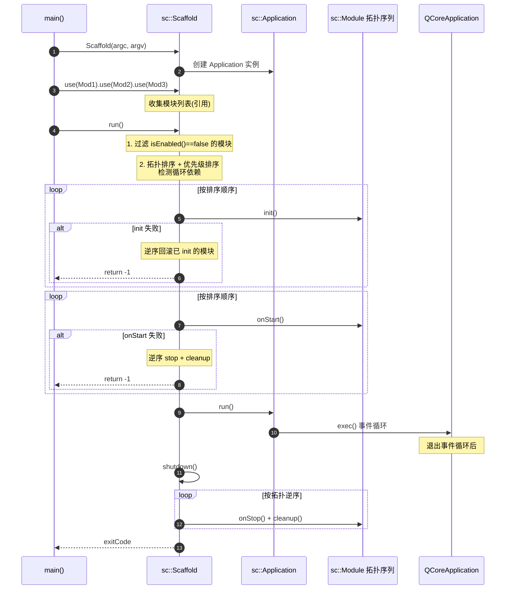
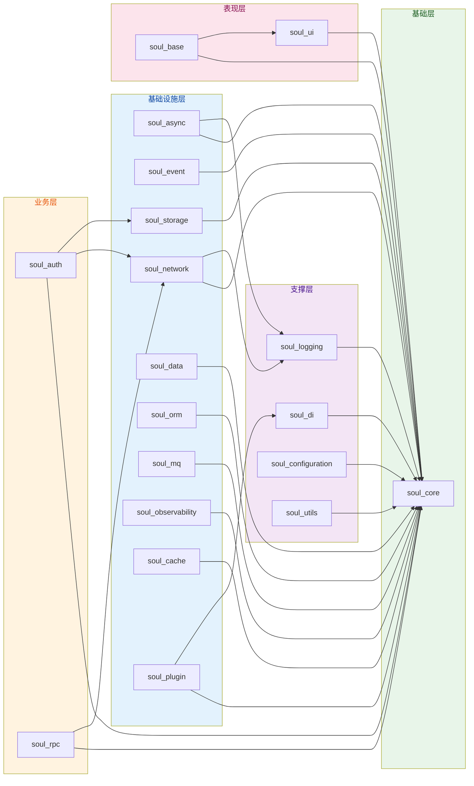

# SoulCoreKit v3.0.0

> **面向 CS + BS 场景的 C++/Qt 通用应用基础平台** — 首个 MAJOR 稳定版本。
> API / ABI / Architecture Frozen。

[](LICENSE)
[](https://github.com/sclzj595/SoulCoreKit)
[](https://github.com/sclzj595/SoulCoreKit)
[](https://en.wikipedia.org/wiki/C%2B%2B17)
[](https://www.qt.io)

---

## 目录

- [场景定位](#场景定位)
- [项目愿景](#项目愿景)
- [核心特性](#核心特性)
- [架构总览](#架构总览)
- [四层架构详解](#四层架构详解)
- [典型应用场景](#典型应用场景)
- [快速开始](#快速开始)
- [使用示例](#使用示例)
- [构建系统](#构建系统)
- [文档体系](#文档体系)
- [贡献指南](#贡献指南)
- [License](#license)

---

## 场景定位

SoulCoreKit 不是一个单纯的 Qt 工具库，而是 **面向 CS + BS 双场景的 C++/Qt 通用应用基础平台**。

```
                    SoulCoreKit
                         │
          ┌──────────────┴──────────────┐
          │                             │
         CS                            BS
          │                             │
    Qt Client/Server              Web Backend
          │                             │
    ┌─────┼─────┐              ┌────────┼────────┐
    │     │     │              │        │        │
  Desktop LAN  IPC        HTTP/WS    REST     RPC
  Client App   App        Server    API      Backend
          │                             │
          └──────────────┬──────────────┘
                         │
                    Shared Core
```

**典型复用场景：**

| 项目 | 类型 | 使用的 SoulCoreKit 能力 |
|------|------|------------------------|
| scChat | CS Qt Desktop Client | Core + DI + Network + ORM + Auth + UI + CS |
| SoulCove | CS Qt Server | Core + DI + Network + Data + ORM + RPC + MQ |
| Web Backend | BS HTTP/WS Server | Core + DI + Network + Server + ORM + Auth |
| Node/C++ Backend | BS REST API | Core + DI + Network + Server + Data + Cache |

**核心设计原则：**
- **Core 层极稳定** — CS/BS 都用，零业务绑定
- **通信层是核心竞争力** — TCP(CS) / HTTP(BS) / WebSocket(CS/BS) 统一抽象
- **MySQL 一等公民** — BS Server 主数据库，SQLite 服务 CS Client 本地缓存
- **Extensions 不污染核心** — RPC/MQ/Auth 保留抽象，Adapter 按需接入

---

## 项目愿景

SoulCoreKit 旨在成为 **CS + BS 场景共用的 C++/Qt 基础设施平台**，让 Qt 生态的开发者能够用同一套框架同时构建桌面客户端、后端服务、Web API 等各种形态的应用。

- **双场景统一**:不再是单纯的 CS 框架 — BS Web Backend、REST API、WebSocket 后端都是正式支持的一等场景。CS Client/Server 和 BS Backend 共享 Core、Network、Data、DI 等基础设施。
- **SpringBoot 风格脚手架**:借鉴 SpringBoot 的声明式装配、IoC/DI、模块生命周期、AOP 等设计理念，链式 `scaffold.use(Module&)` 注册模块，自动按依赖顺序初始化与清理。
- **四层架构**:Core → Infrastructure → Extensions → Application，严格依赖方向，禁止循环依赖与向下依赖。
- **通信统一抽象**:TCP / HTTP / WebSocket 统一抽象层，CS 和 BS 场景复用同一套网络基础设施。
- **工业级稳定性**:基于 Qt 6.5.3 LTS + C++17 + GCC 11 / MSVC 2019 / Clang 14 工具链锁定。
- **5-10 年可维护性**:所有 API 设计预留版本缓冲层，优先 LTS 版本特性，严禁使用未经验证的 C++20+ 特性。
- **零裸指针**:全项目采用 RAII + 智能指针资源管理，严禁裸 new/delete。

---

## 核心特性

> **场景标注**: C=CS Client / S=CS Server / B=BS Backend / CS=两端共享 / ALL=全场景

| 特性 | 场景 | 说明 |
|------|------|------|
| **声明式脚手架** | ALL | `sc::Scaffold` 借鉴 `@SpringBootApplication` 理念,链式声明模块,拓扑排序 + 优先级 + 循环依赖检测,自动回滚 |
| **完整模块生命周期** | ALL | `Module` 提供 `init()/onStart()/onStop()/cleanup()` 四阶段,借鉴 `@PostConstruct`/`ContextRefreshed`/`ContextClosed`/`@PreDestroy`;支持 `dependsOn()` 依赖声明、`priority()` 优先级、`isEnabled()` 条件装配 |
| **依赖注入容器** | ALL | `sc::di::Container` 支持 Singleton/Scoped/Transient 三种生命周期,`bindNamed()` 按名称注册,`setPrimary()` 默认实现,`createScope()/disposeScope()` 作用域管理,DCLP 线程安全 `resolve()` |
| **统一错误处理** | ALL | `Result<T>` + `Error` 模式,类型安全的错误传播,严禁异常跨模块边界 |
| **协议无关网络层** | ALL | 统一 HTTP/TCP/WebSocket/MQTT/Bluetooth/Serial/NamedPipe 接口,策略模式 + 拦截器链 + 连接池。**CS 场景用 TCP/WebSocket，BS 场景用 HTTP/WebSocket** |
| **事件驱动架构** | ALL | `EventBus` + `TypedEventBus<T>` 发布订阅,支持同步/异步分发,Qt 信号桥接 |
| **异步任务框架** | ALL | `ThreadPool` + `TaskRunner` + `Future<T>` + `Promise<T>`,基于 Qt6 QPromise 适配,TSan 安全 |
| **嵌入式 HTTP Server** | B | `sc::server::HttpServer` 作为 BS 场景核心入口,基于 `QTcpServer` 自研轻量 HTTP/1.1 Server,路由分发 + per-socket 缓冲 + 连接超时 + DoS 防护 |
| **WebSocket Server** | B | `sc::server::WebSocketServer` 支持 BS 实时双向通信 |
| **ORM 层** | S/B | `QueryWrapper` 类型安全 SQL 构建,`BaseRepository<T>` 模板方法模式,`ISqlDialect` 多数据库方言(SQLite/MySQL/PostgreSQL),`MigrationManager` Schema 迁移,**MySQL 为一等公民** |
| **可扩展存储层** | ALL | Memory/File/SQLite 三后端 + `ICache` 抽象 + `MultiLevelCache` 多级缓存 + `Settings` 配置持久化 |
| **消息队列** | S/B | `MessageBus` 抽象 + `InMemory` 核心实现(CS小型项目) + RabbitMQ/Kafka/RocketMQ Adapter(BS企业后端) |
| **RPC 框架** | ALL | `ServiceDispatcher` 服务端分发 + `ClientProxy` 客户端代理 + Transport 抽象(HTTP/WS/TCP) + `LoadBalancer` 负载均衡。gRPC 作为 Adapter 接入 |
| **可观测性** | ALL | `Counter`/`Gauge`/`Histogram` 三种指标 + `Tracer`/`Span` 链路追踪 + `JsonSink` 结构化日志(适配 ELK/Loki) + Prometheus/Otlp 导出 |
| **认证授权** | ALL | `AuthManager` 用户登录/登出 + `TokenManager` Token 管理 + `Permission` 权限验证 + OAuth2/OIDC |
| **插件系统** | ALL | C-ABI 边界接口,DLL/SO/DYLIB 动态加载,`PluginMetadata` ABI 版本兼容检查,死锁安全初始化/关闭 |
| **配置管理** | ALL | JSON/INI 多源 + 环境变量覆盖 + 热加载 + Profile 环境隔离(dev/test/prod) + `ConfigSchema` 验证 + ConfigCenter |
| **AOP 切面编程** | ALL | `sc::aop::AspectWeaver` 借鉴 `@Aspect` 理念,支持 Before/After/Around/AfterReturning/AfterThrowing,`Pointcut` 方法名匹配 |
| **资源池监控** | ALL | `IResourcePoolMonitor` 统一接口,适配 ThreadPool/ConnectionPool/DbConnectionPool,阈值告警回调 |
| **声明式 UI** | C | 30+ 现代化组件(Button/Card/Dialog/Toast/Nav/TabBar 等)+ Theme 主题切换 + QSS 样式 + iOS17 风格玻璃效果,独立 `SoulCoreKitUi` 库可按需链接 |
| **CS 架构适配** | C/S | `CsController/CsRouter/CsViewModel/CsWindowManager/CsAdminPanel`,完整 CS 应用骨架 |

---

## 架构总览

SoulCoreKit 采用 **四层分层架构**，严格遵循依赖方向规则（上层可依赖下层，下层禁止依赖上层，严禁循环依赖）。

### 四层架构图

```mermaid
flowchart TB
    subgraph L3["Layer 3: Application 应用层"]
        direction LR
        CS["CS 架构<br/>CsController/CsRouter/<br/>CsViewModel/CsAdminPanel"]
        UI["UI 组件库<br/>30+ Widgets/Theme/<br/>Style/玻璃效果"]
        BS["BS 后端<br/>HttpServer/WebSocketServer/<br/>REST API"]
    end

    subgraph L2["Layer 2: Extensions 扩展层"]
        direction LR
        RPC["RPC 框架<br/>ServiceDispatcher/ClientProxy/<br/>Transport抽象"]
        MQ["消息队列<br/>MessageBus + InMemory<br/>+ RabbitMQ/Kafka Adapter"]
        Auth["认证授权<br/>AuthManager/TokenManager/<br/>OAuth2/OIDC"]
        Plugin["插件系统<br/>C-ABI/PluginManager/<br/>动态加载"]
        Scheduler["定时任务<br/>ScheduledTask/<br/>CronTrigger"]
        AOP["AOP切面<br/>AspectWeaver/<br/>Before/After/Around"]
    end

    subgraph L1["Layer 1: Infrastructure 基础设施层"]
        direction LR
        Net["Network 通信<br/>HTTP/TCP/WebSocket/<br/>统一抽象"]
        Data["Data 数据<br/>MySQL/SQLite/ORM/<br/>Repository/Transaction"]
        Cache["Cache 缓存<br/>Memory/Disk/<br/>MultiLevel"]
        Storage["Storage 存储<br/>KV/Memory/File/<br/>SQLite/Settings"]
        Config["Configuration<br/>JSON/INI/热加载/<br/>Profile隔离"]
        Obs["Observability<br/>Metrics/Tracing/<br/>HealthCheck"]
        Val["Validation<br/>数据校验/<br/>规则链"]
        Utils["Utils<br/>Crypto/File/JSON/<br/>10+工具类"]
    end

    subgraph L0["Layer 0: Core 核心层 (极稳定，CS/BS共用)"]
        direction LR
        DI["DI Container<br/>Singleton/Scoped/<br/>Transient"]
        Error["Result/Error<br/>类型安全<br/>错误传播"]
        Event["EventBus<br/>同步/异步<br/>发布订阅"]
        Log["Logging<br/>spdlog后端<br/>多Sink"]
        Async["Async<br/>ThreadPool/Future/<br/>Promise/Coroutine"]
        App["Application<br/>生命周期/<br/>模块管理"]
    end

    L3 --> L2
    L3 --> L1
    L2 --> L1
    L1 --> L0

    style L3 fill:#fce4ec,color:#880e4f
    style L2 fill:#fff3e0,color:#e65100
    style L1 fill:#e3f2fd,color:#0d47a1
    style L0 fill:#e8f5e9,color:#1b5e20
```



### 通信层核心竞争力

```
                    SoulCoreKit
                         │
                 Network Abstraction
                         │
          ┌──────────────┼──────────────┐
          ↓              ↓              ↓
         TCP           HTTP        WebSocket
          │              │              │
      CS Server      BS Backend    CS/BS 共用
      CS Client      REST API      实时通信
```

### Scaffold 启动流程



### 模块依赖图



---

## 四层架构详解

### Layer 0: Core 层 — CS/BS 共用极稳定核心

> **设计原则**: 零业务绑定，API 极简稳定，CS/BS 统一使用

| 模块 | 场景 | 职责 | 核心类 |
|------|------|------|--------|
| `soul_core` | ALL | 核心类型与基础设施 | `Result<T>`/`Error`/`Singleton`/`Scaffold`/`Application`/`Environment`/`Platform`/`Time`/`Uuid`/`Version`/`Lifecycle` |
| `soul_di` | ALL | 依赖注入容器 | `Container`/`Singleton`/`Scoped`/`Transient`/`bindNamed`/`setPrimary`/`createScope` |
| `soul_logging` | ALL | 日志系统(spdlog) | `Logger`/`ISink`/`ConsoleSink`/`FileSink`/`DailyFileSink`/`CallbackSink`/`CompositeSink` |
| `soul_async` | ALL | 异步任务框架 | `ThreadPool`/`TaskRunner`/`Future<T>`/`Promise<T>`/`Coroutine`/`Dispatcher`/`CancelableTask` |
| `soul_event` | ALL | 事件总线 | `EventBus`/`TypedEventBus<T>`/`Subscription`/`QtSignalAdapter` |
| `soul_application` | ALL | 应用上下文与生命周期 | `ApplicationContext`/`ControllerRegistry`/`ServiceRegistry` |

### Layer 1: Infrastructure 层 — CS/BS 共用基础设施

> **设计原则**: 统一抽象、多后端适配，CS/BS 都需要的通用能力

#### 通信基础设施 (SoulCoreKit 核心竞争力)

```
       SoulCoreKit
            │
    Network Abstraction
            │
 ┌──────────┼──────────┐
 ↓          ↓          ↓
TCP       HTTP     WebSocket
 │          │          │
CS       BS Backend  CS/BS
```

| 模块 | 场景 | 职责 | 核心类 |
|------|------|------|--------|
| `soul_network_core` | ALL | 网络核心抽象层 | `NetworkAdapterBase`/`CodecFactory`/`JsonCodec`/`Monitor` |
| `soul_network_policy` | ALL | 网络策略 | `CircuitBreaker`/`RetryPolicy`/`RateLimiter`/`HeartbeatPolicy`/`TimeoutPolicy` |
| `soul_network_http` | ALL | HTTP 适配器 | `HttpClientAdapter`/`AuthInterceptor`/`LoggingInterceptor` |
| `soul_network_protocol` | ALL | 多协议适配 | TCP/WebSocket/MQTT/Bluetooth/Serial/NamedPipe Adapter |
| `soul_network` | ALL | 网络通信聚合 | `HttpClient`/`WebSocket`/`TcpClient`/`Downloader`/`Uploader`/`ConnectionPool` |

#### 数据基础设施

| 模块 | 场景 | 职责 | 核心类 |
|------|------|------|--------|
| `soul_data` | S/B | 数据访问抽象 | `IRepository`/`BaseRepository`/`MemoryRepository`/`QueryBuilder`/`QueryCache`/`Transaction` |
| `soul_database` | S/B | 数据库驱动聚合 | `IDatabaseDriver`/`ConnectionPool`/**MySQL一等公民** / SQLite(CS Client本地) |
| `soul_orm` | S/B | ORM 对象关系映射 | `QueryWrapper`/`SqlDialect`(MySQL/SQLite/PostgreSQL)/`MigrationManager`/`CachedRepository`/`SC_REFLECT` |
| `soul_storage` | ALL | KV 存储与持久化 | `MemoryStorage`/`FileStorage`/`SQLiteDatabase`/`Settings`/`JsonSerializer` |
| `soul_cache` | ALL | 缓存抽象 | `ICache`/`MemoryCache`/`DiskCache`/`MultiLevelCache`/`SizeEstimator` |

#### 通用基础设施

| 模块 | 场景 | 职责 | 核心类 |
|------|------|------|--------|
| `soul_base` | ALL | 基础类与抽象 | `BaseObject`/`BaseManager`/`BaseService`/`ILifecycle`/`INameable` |
| `soul_utils` | ALL | 工具函数集 | Clipboard/Crypto/File/JSON/String/XML/Process/Compress/Datetime/Image |
| `soul_configuration` | ALL | 配置管理 | `Config`/`JsonConfiguration`/`IniConfiguration`/`ConfigSchema`/热加载/Profile隔离/ConfigCenter |
| `soul_observability` | ALL | 可观测性 | `Counter`/`Gauge`/`Histogram`/`Tracer`/`Span`/`HealthChecker`/`PrometheusExporter`/`OtlpExporter` |
| `soul_validation` | ALL | 数据校验 | `Validator`/注解式校验/规则链 |

### Layer 2: Extensions 层 — 企业级扩展能力

> **设计原则**: 保留抽象，不过度实现，不污染核心架构。Adapter 按需接入。

| 模块 | 场景 | 职责 | 核心类 |
|------|------|------|--------|
| `soul_rpc` | ALL | RPC 框架 | `RpcClient`/`RpcServer`/`ServiceDispatcher`/`ClientProxy`/`ServiceDiscovery`/Transport抽象(HTTP/WS/TCP)/`LoadBalancer` |
| `soul_mq` | S/B | 消息队列 | `MessageBus`抽象 + `InMemory`核心实现 + `RabbitMQ`/`Kafka`/`RocketMQ` Adapter |
| `soul_auth` | ALL | 认证授权 | `AuthManager`/`TokenManager`/`Permission`/`OAuth2`/`OIDC`/`SecureStorage` |
| `soul_plugin` | ALL | 插件系统 | `PluginManager`/`IPlugin`/C-ABI边界/DLL动态加载/版本兼容检查 |
| `soul_scheduler` | ALL | 定时任务调度 | `ScheduledTask`/`CronTrigger`/`Scheduler` |
| `soul_server` | B | 嵌入式HTTP/WS Server | `HttpServer`(自研轻量HTTP/1.1)/`WebSocketServer`/`Middleware`/`Health` — BS场景核心入口 |
| `soul_aop` | ALL | AOP 切面编程 | `AspectWeaver`/`Before`/`After`/`Around`/`Pointcut`/`JoinPoint` |

### Layer 3: Application 层 — 业务场景适配

> **设计原则**: 面向具体应用场景，CS 和 BS 各自独立，按需链接

| 模块 | 场景 | 职责 | 核心类 |
|------|------|------|--------|
| `soul_ui` | C | 声明式 UI 组件库 | 30+ Widgets(Button/Card/Dialog/Toast/Nav/TabBar等)/Theme/Style/Animation/玻璃效果 — **仅CS Client使用** |
| `soul_cs` | C/S | CS 架构适配 | `CsController`/`CsRouter`/`CsViewModel`/`CsWindowManager`/`CsAdminPanel`/`CsIpcRouter` |

### 聚合头文件 (借鉴 SpringBoot Starter 理念)

按需引入，避免一次性加载全部依赖：

| 头文件 | 场景 | 包含能力 | 借鉴 SpringBoot |
|--------|------|----------|-----------------|
| `#include "soul/soul.h"` | ALL | Core 全量: DI/Logging/Async/Event/Application | `spring-boot-starter` |
| `#include "soul/soul_core.h"` | ALL | 最小核心: Result/Error/Module/Scaffold | `spring-core` |
| `#include "soul/soul_async.h"` | ALL | 异步: ThreadPool/TaskRunner/Future/Promise | `spring-boot-starter-async` |
| `#include "soul/soul_event.h"` | ALL | 事件总线: EventBus/TypedEventBus | `spring-boot-starter-event` |
| `#include "soul/soul_network.h"` | ALL | 网络: HttpClient/WebSocket/TcpClient | `spring-web` |
| `#include "soul/soul_storage.h"` | ALL | 存储: FileStorage/SQLite/Cache | `spring-boot-starter-data` |
| `#include "soul/soul_orm.h"` | S/B | ORM: SqlRepository/多数据库方言/Migration | `spring-data-jpa` |
| `#include "soul/soul_mq.h"` | S/B | 消息队列: MessageBus + InMemory + RabbitMQ Adapter | `spring-boot-starter-amqp` |
| `#include "soul/soul_rpc.h"` | ALL | RPC: ServiceDispatcher/ClientProxy/Transport | `spring-cloud-openfeign` |
| `#include "soul/ui/soul_ui.h"` | C | UI: Widgets/QSS/玻璃效果 (需链接 SoulCoreKitUi) | — |

---

## 快速开始

### 环境要求

| 组件 | 版本 | 说明 |
|------|------|------|
| C++ 编译器 | GCC 11+ / Clang 14+ / MSVC 2019 (VC142) | 严格工具链锁定 |
| Qt | 6.5.3 LTS | Core/Network/WebSockets/Sql (Widgets 可选) |
| CMake | 3.16+ | 构建系统 |
| C++ 标准 | C++17 | 严禁 C++20+ 未验证特性 |

### 部署目标

| 场景 | 平台 | 链接库 | 说明 |
|------|------|--------|------|
| **CS Client** | Windows 10+ / macOS 11+ / Linux | `SoulCoreKit` + `SoulCoreKitUi` + `soul_cs` | Qt 桌面应用，含 UI |
| **CS Server** | Linux(Ubuntu 20.04+)/云服务器 | `SoulCoreKit` + `soul_cs` | CS 后台服务 |
| **BS Backend** | Linux(Ubuntu 20.04+)/云服务器 | `SoulCoreKit` | Web Backend / REST API / WebSocket Server |
| **CLI / Headless** | 全平台 | `SoulCoreKit` | 命令行工具 / 守护进程 |

### 场景一: BS Web Backend (REST API)

**Step 1: CMakeLists.txt**

```cmake
cmake_minimum_required(VERSION 3.16)
project(MyWebBackend VERSION 1.0.0 LANGUAGES CXX)

set(CMAKE_CXX_STANDARD 17)
set(CMAKE_CXX_STANDARD_REQUIRED ON)

find_package(Qt6 REQUIRED COMPONENTS Core Network Sql)
add_subdirectory(SoulCoreKit)

add_executable(MyWebBackend main.cpp)
target_link_libraries(MyWebBackend PRIVATE SoulCoreKit)  # BS场景: 不含 UI/CS
```

**Step 2: main.cpp — 启动 HTTP Server**

```cpp
#include "soul/soul.h"
#include "soul/server/http_server.h"

class MyApiModule : public sc::Module {
public:
    MyApiModule() : sc::Module("MyApi") {}

    sc::Result<void> init() override {
        auto& server = sc::server::HttpServer::instance();
        server.route("/api/health", [](const sc::server::HttpRequest& req) {
            return sc::server::HttpResponse::ok(R"({"status":"ok"})");
        });
        server.listen(8080);
        SC_INFO("REST API listening on :8080");
        return {};
    }
};

int main(int argc, char* argv[]) {
    MyApiModule api;
    sc::Scaffold scaffold(argc, argv);
    scaffold.use(api);
    return scaffold.run();
}
```

### 场景二: CS Qt Desktop Client

**Step 1: CMakeLists.txt**

```cmake
cmake_minimum_required(VERSION 3.16)
project(MyClient VERSION 1.0.0 LANGUAGES CXX)

set(CMAKE_CXX_STANDARD 17)
set(CMAKE_CXX_STANDARD_REQUIRED ON)

find_package(Qt6 REQUIRED COMPONENTS Core Widgets)
add_subdirectory(SoulCoreKit)

add_executable(MyClient main.cpp)
target_link_libraries(MyClient PRIVATE SoulCoreKitFull)  # CS全量: 含 UI + CS架构
```

**Step 2: main.cpp — 启动 CS 客户端**

```cpp
#include "soul/soul.h"

class MyModule : public sc::Module {
public:
    MyModule() : sc::Module("MyModule") {}
    sc::Result<void> init() override {
        SC_INFO("Hello SoulCoreKit Client!");
        return {};
    }
};

int main(int argc, char* argv[]) {
    MyModule myModule;
    sc::Scaffold scaffold(argc, argv);
    scaffold.use(myModule);
    return scaffold.run();
}
```

### 场景三: CLI 工具 / Headless 服务

```cmake
# 最小依赖: 仅 Core 层
target_link_libraries(MyTool PRIVATE SoulCoreKit)
```

```cpp
#include "soul/soul.h"

int main(int argc, char* argv[]) {
    sc::Scaffold scaffold(argc, argv);
    // 无需注册模块即可使用 Core 能力
    SC_INFO("CLI tool started");
    return 0;
}
```

### 构建运行

```bash
mkdir build && cd build
cmake .. -DCMAKE_PREFIX_PATH=/path/to/Qt6
cmake --build .
./MyClient   # 或 ./MyWebBackend
```

---

## 使用示例

### 网络模块(HTTP Client,含 HTTP/2)

```cpp
#include "soul/network/http_client.h"
#include "soul/network/http_request.h"
#include "soul/network/http_response.h"

sc::network::HttpClient client;
client.setTimeout(30000);
client.setRetryPolicy(sc::network::RetryPolicy(3));
// HTTP/2 默认启用,服务器不支持时 Qt 自动降级到 HTTP/1.1
// client.setHttp2Enabled(false);  // 显式禁用

client.addInterceptor(std::make_shared<sc::network::LoggingInterceptor>());
client.addInterceptor(std::make_shared<sc::network::AuthInterceptor>());

sc::network::HttpRequest request(sc::network::HttpMethod::Get, QUrl("https://api.example.com/users"));
request.addHeader("Accept", "application/json")
       .addParam("page", 1)
       .addParam("limit", 10);

// 同步请求(建议在工作线程调用,避免阻塞 UI 线程)
auto result = client.send(request);
if (result.isOk()) {
    auto response = result.unwrap();
    qDebug() << "Status:" << response.statusCode();
    qDebug() << "Body:" << response.text();
} else {
    qDebug() << "Error:" << result.unwrapErr().message();
}

// 异步请求
client.sendAsync(request, [](const sc::Result<sc::network::HttpResponse>& result) {
    if (result.isOk()) {
        qDebug() << "Async Status:" << result.unwrap().statusCode();
    }
});
```

### 依赖注入(完整生命周期 + Qualifier + Primary)

```cpp
#include "soul/di/container.h"

// 接口与实现
class IDataSource {
public:
    virtual ~IDataSource() = default;
    virtual std::string query(const std::string& sql) = 0;
};

class SqliteDataSource : public IDataSource {
public:
    std::string query(const std::string& sql) override { return "sqlite-result"; }
};

class MySqlDataSource : public IDataSource {
public:
    std::string query(const std::string& sql) override { return "mysql-result"; }
};

auto& container = sc::di::Container::instance();

// 1. Singleton 生命周期(线程安全 DCLP)
container.bindSingleton<IDataSource>([]() { return new SqliteDataSource(); });

// 2. Transient 生命周期(每次 resolve 创建新实例)
container.bindTransient<IDataSource>([]() { return new SqliteDataSource(); });

// 3. Scoped 生命周期(每个 scope 一个实例,project_memory 强制要求)
container.bindScoped<IDataSource>([]() { return new SqliteDataSource(); });

// 4. Qualifier 按名称注册(对标 @Qualifier)
container.bindNamed<IDataSource>("sqlite", []() { return new SqliteDataSource(); });
container.bindNamed<IDataSource>("mysql", []() { return new MySqlDataSource(); });

// 5. Primary 默认实现(对标 @Primary)
container.setPrimary<IDataSource>("sqlite");

// 6. 作用域管理
auto scopeId = container.createScope();
auto service = container.resolve<IDataSource>();           // 返回 Primary(sqlite)
auto mysqlSvc = container.resolveNamed<IDataSource>("mysql");
container.disposeScope(scopeId);
```

### 事件总线

```cpp
#include "soul/event/event_bus.h"
#include "soul/event/typed_event_bus.h"

class UserLoggedInEvent : public sc::IEvent {
public:
    std::string userId;
    std::string interfaceName() const override { return "UserLoggedInEvent"; }
};

// 类型安全订阅
auto subscription = sc::EventBus::instance().subscribe<UserLoggedInEvent>(
    [](const UserLoggedInEvent& event) {
        qDebug() << "User logged in:" << event.userId.c_str();
    }
);

// 发布事件
sc::EventBus::instance().publish(UserLoggedInEvent{"user123"});
```

### ORM(多数据库 + 类型安全查询)

```cpp
#include "soul/orm/sqlite_repository.h"
#include "soul/orm/query_wrapper.h"

// 定义实体(使用反射宏减少样板代码)
class User : public sc::orm::Entity<User> {
public:
    SC_DEFINE_REFLECTION(User, "users")
    SC_FIELD(id, "id", "INTEGER PRIMARY KEY")
    SC_FIELD(name, "name", "TEXT")
    SC_FIELD(age, "age", "INTEGER")
    long id = 0;
    QString name;
    int age = 0;
};

// 多数据库方言
auto sqliteDialect = sc::orm::ISqlDialect::create(sc::orm::DbType::SQLite);
auto mysqlDialect = sc::orm::ISqlDialect::create(sc::orm::DbType::MySQL);

// Repository(同一实现,方言注入)
sc::orm::SqlRepository<User> repo(sqliteDialect, dbConnection);

// 类型安全查询
auto users = repo.find(
    sc::orm::QueryWrapper()
        .select({"id", "name", "age"})
        .where(sc::orm::Column<User>("age") > 18)
        .orderBy("age", false)
        .limit(10)
        .offset(0)
);
```

### 错误处理(Result<T> 模式)

```cpp
#include "soul/core/result.h"

sc::Result<int> divide(int a, int b) {
    if (b == 0) {
        return sc::Error(1, "Division by zero");
    }
    return a / b;
}

auto result = divide(10, 2);
if (result.isOk()) {
    qDebug() << "Result:" << result.unwrap();
} else {
    qDebug() << "Error:" << result.unwrapErr().message();
}
```

### 插件系统

```cpp
#include "soul/plugin/plugin_manager.h"

auto& pm = sc::plugin::PluginManager::instance();
pm.loadPlugin("./plugins/libmyplugin.dll");      // ABI 版本自动检查
pm.initializeAllPlugins();                       // 死锁安全初始化

auto plugin = pm.getPlugin("com.soulcore.plugin.myplugin");
if (plugin) {
    qDebug() << "Plugin:" << plugin->name().c_str();
}

pm.shutdownAllPlugins();                         // 死锁安全关闭
```

### 日志系统(多 Sink)

```cpp
#include "soul/logging/logger.h"
#include "soul/logging/console_sink.h"
#include "soul/logging/file_sink.h"
#include "soul/logging/daily_file_sink.h"

sc::Logger::instance().addSink(std::make_shared<sc::ConsoleSink>());
sc::Logger::instance().addSink(std::make_shared<sc::FileSink>("app.log"));
sc::Logger::instance().addSink(std::make_shared<sc::DailyFileSink>("logs/", "yyyy-MM-dd"));

SC_LOG_TRACE("Trace message");
SC_LOG_INFO("Info message");
SC_LOG_ERROR("Error message");
```

---

## 构建系统

### CMake 选项

| 选项 | 说明 | 默认值 |
|------|------|--------|
| `CMAKE_BUILD_TYPE` | 构建类型(Debug/Release) | Release |
| `BUILD_TESTS` | 构建测试套件 | ON |
| `BUILD_EXAMPLES` | 构建示例 | ON |
| `BUILD_DOCS` | 构建文档 | OFF |
| `BUILD_SHARED_LIBS` | 构建共享库 | OFF |
| `ENABLE_WARNINGS` | 启用编译器警告(/W4 /WX 或 -Wall -Werror) | ON |
| `ENABLE_SANITIZERS` | 启用 ASan/UBSan | OFF |
| `ENABLE_TSAN` | 启用 ThreadSanitizer(与 ASan 互斥) | OFF |
| `ENABLE_LTO` | 启用链接时优化 | OFF |
| `ENABLE_COVERAGE` | 启用代码覆盖率(Linux + GCC) | OFF |
| `ENABLE_RABBITMQ` | 启用 amqpcpp 真实 RabbitMQ 集成 | OFF |
| `BUILD_FULL_STACK_EXAMPLE` | 构建全栈示例 | OFF |

### 构建命令

```bash
# 基础构建
cmake -S . -B build -DCMAKE_PREFIX_PATH=/path/to/Qt6
cmake --build build --config Release

# 启用 TSan 测试
cmake -S . -B build-tsan -DENABLE_TSAN=ON -DENABLE_SANITIZERS=OFF -DBUILD_TESTS=ON
cmake --build build-tsan
cd build-tsan && ctest --output-on-failure

# 启用覆盖率
cmake -S . -B build-coverage -DENABLE_COVERAGE=ON -DBUILD_TESTS=ON
cmake --build build-coverage
cd build-coverage && ctest --output-on-failure
```

### CI/CD 工作流

SoulCoreKit 使用 GitHub Actions 进行多平台持续集成:

| 工作流 | 文件 | 说明 |
|--------|------|------|
| CI | `.github/workflows/ci.yml` | 多平台构建 + 测试 + Clang-Tidy + 覆盖率 |
| Lint | `.github/workflows/lint.yml` | Clang-Tidy + CppCheck + Blanket-Catch Guard |
| Build | `.github/workflows/build.yml` | 跨平台构建验证(Windows/Linux/macOS) |
| TSan | `.github/workflows/tsan.yml` | ThreadSanitizer 数据竞争检测 |
| Release | `.github/workflows/release.yml` | 版本发布 + DEB/ZIP 打包 |

---

## 与 SpringBoot 脚手架风格对齐度

> SoulCoreKit 借鉴 SpringBoot 的**脚手架设计理念**(IoC/DI/模块生命周期/AOP/配置管理)，但定位为 CS+BS 双场景通用平台。

### 脚手架核心能力对齐

| SpringBoot 理念 | SoulCoreKit 实现 | 状态 |
|------------------|------------------|------|
| `@SpringBootApplication` | `sc::Scaffold` 链式 `use(Module&)`,拓扑排序 + 循环依赖检测 | ✅ |
| `@Component` / `@Service` | `sc::Module` 子类,四阶段生命周期 | ✅ |
| `@PostConstruct` / `@PreDestroy` | `Module::init()` / `Module::cleanup()` | ✅ |
| `@DependsOn` / `@Order` | `Module::dependsOn()` / `priority()` | ✅ |
| `@ConditionalOnProperty` | `Module::isEnabled()` 条件装配 | ✅ |
| `@Autowired` / `@Qualifier` | `sc::di::Container::resolve<T>()` / `bindNamed<T>()` | ✅ |
| `@Scope` | Singleton / Scoped / Transient 三生命周期 | ✅ |
| `@Configuration` / `@Profile` | `JsonConfiguration`/`IniConfiguration` + Profile 隔离 | ✅ |
| `@EventListener` | `sc::EventBus::subscribe<T>()` | ✅ |
| `@Async` | `sc::async::async()` / `ThreadPool` | ✅ |
| `@Aspect`(AOP) | `sc::aop::AspectWeaver` Before/After/Around | ✅ |
| `@Scheduled` | `sc::scheduler::ScheduledTask` / `CronTrigger` | ✅ |
| `@Controller` (REST) | `sc::server::HttpServer` 路由分发 | ✅ |
| `spring-boot-starter-*` | 聚合头文件 `soul_*.h` 按需引入 | ✅ |

### CS + BS 双场景能力矩阵

| 能力 | CS Client | CS Server | BS Backend | 状态 |
|------|-----------|-----------|------------|------|
| DI / 模块生命周期 | ✅ | ✅ | ✅ | 就位 |
| 日志 / 配置 / 事件 | ✅ | ✅ | ✅ | 就位 |
| HTTP Client | ✅ | — | ✅ | 就位 |
| HTTP Server | — | ✅ | ✅ | 就位 |
| WebSocket Client/Server | ✅ | ✅ | ✅ | 就位 |
| TCP Client/Server | ✅ | ✅ | — | 就位 |
| RPC | ✅ | ✅ | ✅ | 就位 |
| ORM (MySQL/SQLite) | — | ✅ | ✅ | 就位 |
| MQ (MessageBus) | — | ✅ | ✅ | 就位 |
| Auth (OAuth2/OIDC) | ✅ | ✅ | ✅ | 就位 |
| Plugin | ✅ | ✅ | ✅ | 就位 |
| Observability | ✅ | ✅ | ✅ | 就位 |
| UI 组件库 | ✅ | — | — | 就位 |
| CS 架构适配 | ✅ | ✅ | — | 就位 |

### 迭代优先级

| 优先级 | 层级 | 内容 |
|--------|------|------|
| **P0** | Core + Infrastructure | DI / Lifecycle / Error / Logging / Event / Async / Network / Database |
| **P1** | CS/BS 共用能力 | HTTP / WebSocket / ORM / Cache / Storage / Configuration / Validation / Observability / Security |
| **P2** | Extensions | RPC / MQ / Service Discovery / Config Center / Plugin / Auth |
| **P3** | Adapters (不污染核心) | gRPC / Kafka / RocketMQ / Nacos / Eureka / Redis / OAuth2/OIDC |

---

## 文档体系

- **API 文档**: `doxygen Doxyfile` 生成
- **设计文档**: `docs/`(英文)与 `docs_chinese/`(中文)目录
- **ADR(架构决策记录)**: `docs/adr/` 下 5 份关键决策
  - ADR-001 错误处理边界规则(bool vs Result<T>)
  - ADR-002 模块依赖规则(5 层架构)
  - ADR-003 内存管理策略(智能指针 + Qt 父子)
  - ADR-004 ORM 多数据库架构(策略模式)
  - ADR-005 线程安全策略(4 级分类)
- **版本规划**: `docs/v1.7.0/`、`docs/v1.8.0/` 目录
- **变更日志**: [CHANGELOG.md](CHANGELOG.md)
- **快速上手**: `examples/` 目录(含 `skeleton_main.cpp` 5 分钟示例)

---

## 贡献指南

### 开发流程

1. Fork 仓库
2. 创建特性分支(`git checkout -b feature/your-feature`)
3. 提交变更(遵循 [Conventional Commits](https://www.conventionalcommits.org/))
4. 推送分支(`git push origin feature/your-feature`)
5. 创建 Pull Request

### 代码规范

- **C++ 标准**: C++17,严禁 C++20+ 未验证特性
- **代码风格**: 遵循 Google C++ Style Guide,使用 `clang-format` 自动格式化(配置见 `.clang-format`)
- **静态分析**: 通过 `clang-tidy`(.clang-tidy 配置)与 `cppcheck` 检查
- **资源管理**: 全项目 RAII + 智能指针,严禁裸 new/delete
- **错误处理**: 统一 `Result<T>` 模式,严禁异常跨模块边界
- **命名规范**:
  - C++ 类/函数: `snake_case` / `PascalCase`(类名)
  - Qt 属性: 遵循 `Q_PROPERTY` 标准宏
  - 网络模块: 使用 `sc::network` 嵌套命名空间
- **线程安全**: 遵循 ADR-005 四级分类,UI 操作严禁跨线程
- **测试覆盖**: 新功能必须配套单元测试
- **API 文档**: 公共 API 必须有 Doxygen 风格注释(含参数说明与返回值)
- **Blanket Catch**: 所有 `catch(...)` 必须添加 `// Blanket catch:` 注释说明原因

### 提交规范

```text
<type>(<scope>): <subject>

<body>

<footer>
```

类型(type): `feat`(新功能)/`fix`(修复)/`docs`(文档)/`style`(格式)/`refactor`(重构)/`test`(测试)/`chore`(构建)

---

## License

SoulCoreKit 基于 [MIT License](LICENSE) 开源。

---

## 致谢

- [Qt Framework](https://www.qt.io) - 跨平台应用框架
- [CMake](https://cmake.org) - 构建系统
- [Doxygen](https://www.doxygen.nl) - 文档生成
- [amqpcpp](https://github.com/CopernicaMarketingSoftware/AMQP-CPP) - RabbitMQ C++ 客户端(v1.7.0 集成)

---

**项目**: SoulCoreKit  
**版本**: v3.0.0 (首个 MAJOR 稳定版本 — API / ABI / Architecture Frozen)  
**定位**: 面向 CS + BS 场景的 C++/Qt 通用应用基础平台  
**维护**: SoulCoreKit Team  
**联系**: soulcorekit@gmail.com
