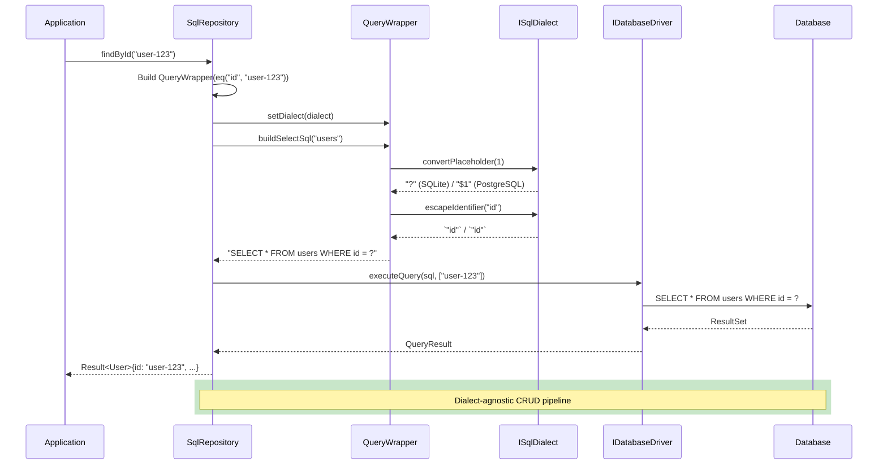

# ADR-004: ORM Multi-Database Architecture

| | |
|---|---|
| **Status** | Accepted |
| **Date** | 2026-07-25 |
| **Module** | ORM, Data |

## Context

SoulCoreKit's ORM must support multiple relational databases (SQLite, MySQL, PostgreSQL, MSSQL, Oracle) without forking the repository layer. Historically, adding database support required duplicating repository implementations, leading to:

- Code duplication across database-specific repositories
- Inconsistent feature support (e.g., SQLite supports `AUTOINCREMENT`, PostgreSQL uses `SERIAL`)
- Hard-coded SQL dialects leaking into business logic
- Difficulty adding new databases (estimated 2–3 weeks per database)

## Decision

### Strategy Pattern for SQL Dialects

Introduce the `ISqlDialect` interface using the **Strategy Pattern**, encapsulating all database-specific SQL generation. The repository layer is dialect-agnostic — it delegates all SQL generation to the injected dialect.

### Architecture Components

```
┌──────────────────────────────────────────────────────────────────┐
│                        Business Logic                              │
│  Service → Repository<T> → BaseRepository<T> → SqlRepository<T>   │
└──────────────────────────────────┬───────────────────────────────┘
                                   │ delegates SQL generation
                                   ▼
┌──────────────────────────────────────────────────────────────────┐
│                    ISqlDialect (Strategy Interface)                │
│  getDriverName()        getType()                                 │
│  buildLimitOffset()     getAutoIncrementKeyword()                 │
│  escapeIdentifier()     escapeString()                            │
│  convertPlaceholder()   castToDateTime()                          │
│  getConcatFunction()    getCurrentTimestampFunction()             │
│  softDeleteConfig()     getCreateTableSuffix()                    │
└──────────┬──────────┬──────────┬──────────┬──────────┬──────────┘
           │          │          │          │          │
     ┌─────┴──┐  ┌────┴───┐  ┌──┴─────┐  ┌──┴─────┐  ┌──┴─────┐
     │SQLite  │  │ MySQL  │  │PostgreSQL│  │ MSSQL  │  │ Oracle │
     │Dialect │  │Dialect │  │ Dialect │  │Dialect │  │Dialect │
     └─────────┘  └────────┘  └────────┘  └────────┘  └────────┘
```

### Dialect Placeholder Mapping

Each database uses a different parameter placeholder syntax. The `convertPlaceholder(int index)` method abstracts this:

| Database | Placeholder Format | Example |
|----------|-------------------|---------|
| SQLite | `?` | `SELECT * FROM users WHERE id = ?` |
| MySQL | `?` | `SELECT * FROM users WHERE id = ?` |
| PostgreSQL | `$1`, `$2`, ... | `SELECT * FROM users WHERE id = $1` |
| MSSQL | `@p1`, `@p2`, ... | `SELECT * FROM users WHERE id = @p1` |
| Oracle | `:1`, `:2`, ... | `SELECT * FROM users WHERE id = :1` |

### Repository Architecture

```cpp
// BaseRepository<T> provides 7 default methods:
//   findById, findAll, save, removeById, find, remove, count
// Subclasses implement the 3 abstract methods:
//   save(T), find(QueryWrapper), remove(QueryWrapper), count(QueryWrapper)

template<typename T>
class SqlRepository : public BaseRepository<T> {
public:
    SqlRepository(std::shared_ptr<data::DbConnectionPool> pool, SqlDialectType dialectType)
        : m_pool(std::move(pool)), m_dialect(ISqlDialect::create(dialectType)) {}

    SqlRepository(std::shared_ptr<data::DbConnectionPool> pool, std::unique_ptr<ISqlDialect> dialect)
        : m_pool(std::move(pool)), m_dialect(std::move(dialect)) {}
    // ...
};
```

### SoftDeleteConfig per Dialect

```cpp
struct SoftDeleteConfig {
    bool enabled = true;
    QString columnName = "deleted";
    QString logicNotDeletedValue = "0";
    QString logicDeletedValue = "1";
};
```

Soft delete behavior is configurable per-dialect because different databases may use different conventions (e.g., `TINYINT` vs `BOOLEAN` vs `NUMBER(1)`).

### QueryWrapper Integration

```cpp
// QueryWrapper uses the injected dialect for SQL generation
void setDialect(ISqlDialect* dialect) { m_dialect = dialect; }
QString placeholder(int index) const { return m_dialect->convertPlaceholder(index); }
```

The `QueryWrapper` is dialect-aware at construction time and generates dialect-specific SQL without any knowledge of the underlying database.

### Adding a New Database

To add support for a new database (e.g., MariaDB):

1. Create `MariaDBDialect : public ISqlDialect` (~30 lines)
2. Implement all pure virtual methods
3. Register in `ISqlDialect::create()` factory
4. Add `SqlDialectType::MariaDB` to the enum
5. **Done** — no changes to any repository or service code

## Consequences

### Positive
- **Database-agnostic repositories**: The same `SqlRepository<T>` works with all supported databases
- **Minimal addition cost**: Adding a new database requires implementing only the `ISqlDialect` interface
- **Testability**: The dialect can be mocked for unit testing repository logic
- **Consistent behavior**: All repositories share the same CRUD semantics, pagination, and soft-delete behavior
- **Runtime flexibility**: The dialect can be swapped at runtime (e.g., for read replicas)

### Negative
- **Abstraction overhead**: The Strategy pattern adds a virtual call per SQL generation (negligible for I/O-bound operations)
- **Edge case complexity**: Some databases have unique features (e.g., MySQL's `ON DUPLICATE KEY UPDATE`) that require dialect-specific extensions
- **SQL Injection risk**: Raw SQL concatenation in `QueryWrapper` must be carefully tested across all dialects
- **Learning curve**: Contributors must understand both the ORM layer and the dialect abstraction

## Enforcement

1. **Interface completeness**: Every new dialect must pass the full test suite (`tests/test_orm.cpp`) which validates all CRUD operations
2. **Placeholder compliance**: Integration tests verify correct placeholder generation for each database type
3. **Soft delete tests**: Each dialect is tested for correct soft-delete SQL generation

## Multi-Database Flow Diagram

