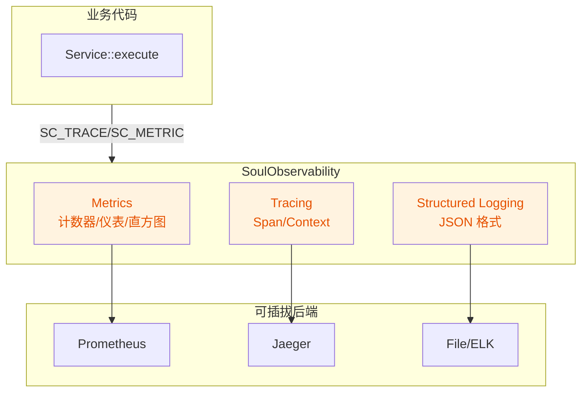

# 03 — SoulObservability 模块设计

**优先级**: P1(选做)
**模块名**: soul_observability
**命名空间**: `sc::observability`
**依赖**: soul_core, soul_logging

---

## 1. 设计目标

提供统一的可观测性能力,涵盖 Metrics(指标)、Tracing(追踪)、Structured Logging(结构化日志)三大支柱,为生产环境运维提供端到端可见性。

### 1.1 设计原则

1. **低开销**: 采集本身不能成为性能瓶颈(目标 < 5% 开销)
2. **可插拔**: 后端通过 sink 模式接入(Prometheus/Jaeger/CloudWatch)
3. **上下文传播**: 自动传播 trace context(单机内 thread_local,跨机通过 HTTP header)
4. **不侵入业务**: 通过宏/RAII 自动采集,业务代码无感知

---

## 2. 三大支柱架构



---

## 3. Metrics 指标

### 3.1 指标类型

```cpp
// include/soul/observability/metrics.h
namespace sc::observability {

class Counter {
public:
    void increment(uint64_t value = 1);
    uint64_t value() const;
};

class Gauge {
public:
    void set(double value);
    void increment(double value = 1.0);
    void decrement(double value = 1.0);
    double value() const;
};

class Histogram {
public:
    explicit Histogram(const std::vector<double>& bucketBounds = {0.001, 0.01, 0.1, 1.0, 10.0});
    void observe(double value);
    HistogramSnapshot snapshot() const;
};

class Meter {
public:
    void mark(uint64_t count = 1);
    double meanRate() const;
    double oneMinuteRate() const;
};

} // namespace sc::observability
```

### 3.2 注册中心

```cpp
class MetricsRegistry {
public:
    static MetricsRegistry& instance();

    Counter& counter(const std::string& name, const std::string& description = "");
    Gauge& gauge(const std::string& name, const std::string& description = "");
    Histogram& histogram(const std::string& name,
                         const std::vector<double>& buckets = {},
                         const std::string& description = "");

    // 导出为 Prometheus 格式
    std::string exportPrometheus() const;

    // 注册自定义 sink
    void addSink(std::shared_ptr<IMetricsSink> sink);
};
```

### 3.3 使用示例

```cpp
// 业务代码中
auto& requestCounter = MetricsRegistry::instance().counter(
    "http_requests_total", "Total HTTP requests");
auto& requestDuration = MetricsRegistry::instance().histogram(
    "http_request_duration_seconds", {0.001, 0.01, 0.1, 1.0});

void handleRequest() {
    requestCounter.increment();
    auto start = std::chrono::steady_clock::now();
    // ... 处理请求
    auto duration = std::chrono::duration<double>(
        std::chrono::steady_clock::now() - start).count();
    requestDuration.observe(duration);
}
```

---

## 4. Tracing 分布式追踪

### 4.1 Span 模型

```cpp
// include/soul/observability/span.h
namespace sc::observability {

class Span {
public:
    Span(const std::string& operationName);
    ~Span();

    Span(const Span&) = delete;
    Span& operator=(const Span&) = delete;
    Span(Span&& other) noexcept;
    Span& operator=(Span&& other) noexcept;

    void setTag(const std::string& key, const std::string& value);
    void setTag(const std::string& key, int64_t value);
    void setTag(const std::string& key, bool value);

    void log(const std::string& event, const std::string& message = "");
    void setError(const std::string& message);

    void finish();

    std::string traceId() const;
    std::string spanId() const;
    std::string parentId() const;

private:
    std::string m_traceId;
    std::string m_spanId;
    std::string m_parentId;
    std::string m_operationName;
    std::chrono::steady_clock::time_point m_startTime;
    std::vector<Tag> m_tags;
    std::vector<LogEntry> m_logs;
    bool m_finished = false;
};

} // namespace sc::observability
```

### 4.2 RAII 宏

```cpp
#define SC_TRACE(operationName) \
    ::sc::observability::Span __span(operationName)

#define SC_TRACE_CHILD(operationName) \
    ::sc::observability::Span __span = \
        ::sc::observability::Tracer::instance().startChild(operationName)

#define SC_SET_TAG(key, value) \
    __span.setTag(key, value)

#define SC_LOG_EVENT(event) \
    __span.log(event)
```

### 4.3 使用示例

```cpp
void UserService::createUser(const User& user) {
    SC_TRACE("UserService.createUser");
    SC_SET_TAG("user.id", user.id);
    SC_SET_TAG("user.email", user.email);

    try {
        m_repository->save(user);
        SC_LOG_EVENT("user_saved");
    } catch (const std::exception& e) {
        __span.setError(e.what());
        throw;
    }
}
```

### 4.4 上下文传播

**单机内**: 使用 `thread_local` 自动传播 parent span。

**跨进程**: 通过 HTTP header 传播 W3C TraceContext:
```
traceparent: 00-{trace-id}-{parent-span-id}-01
```

```cpp
// HTTP 客户端自动注入
class TracingInterceptor : public IInterceptor {
    Result<HttpResponse> intercept(HttpRequest& request) override {
        auto currentSpan = Tracer::instance().currentSpan();
        if (currentSpan) {
            request.setHeader("traceparent",
                formatTraceParent(currentSpan->traceId(),
                                  currentSpan->spanId()));
        }
        return m_next->intercept(request);
    }
};
```

---

## 5. 结构化日志增强

### 5.1 JSON 格式输出

```cpp
// 在现有 Logger 基础上新增 JsonSink
class JsonSink : public ISink {
public:
    void write(const LogEntry& entry) override {
        QJsonObject json;
        json["timestamp"] = entry.timestamp.toString(Qt::ISODateWithMs);
        json["level"] = levelToString(entry.level);
        json["message"] = entry.message;
        json["module"] = entry.module;
        json["file"] = entry.file;
        json["line"] = static_cast<int>(entry.line);
        if (entry.traceId) json["trace_id"] = *entry.traceId;
        if (entry.spanId) json["span_id"] = *entry.spanId;
        // 输出 JSON 行
    }
};
```

### 5.2 与 Tracing 集成

`LogEntry` 扩展字段:
```cpp
struct LogEntry {
    // ... 现有字段
    std::optional<std::string> traceId;
    std::optional<std::string> spanId;
};
```

`Logger` 自动从 `Tracer::currentSpan()` 提取 trace context,业务代码无感知。

---

## 6. 后端 Sink 适配

### 6.1 Metrics Sink

```cpp
class IMetricsSink {
public:
    virtual ~IMetricsSink() = default;
    virtual void flush(const MetricsSnapshot& snapshot) = 0;
};

class PrometheusSink : public IMetricsSink {
    // 通过 HTTP 暴露 /metrics 端点
};

class ConsoleMetricsSink : public IMetricsSink {
    // 定期输出到控制台
};
```

### 6.2 Tracing Sink

```cpp
class ITracingSink {
public:
    virtual ~ITracingSink() = default;
    virtual void exportSpan(const Span& span) = 0;
};

class JaegerSink : public ITracingSink {
    // 通过 Jaeger UDP/HTTP 上报
};

class FileTracingSink : public ITracingSink {
    // 写入本地文件,供离线分析
};
```

---

## 7. 性能考量

### 7.1 开销控制

| 操作 | 目标开销 | 实现策略 |
|------|----------|----------|
| Counter increment | < 10ns | atomic fetch_add |
| Histogram observe | < 100ns | thread_local 累积,定期 flush |
| Span 创建/结束 | < 1μs | 预分配 span pool |
| 日志 trace context 注入 | < 50ns | thread_local 读取 |

### 7.2 采样策略

为避免生产环境过载,Tracing 支持采样:
```cpp
class Tracer {
public:
    void setSampler(std::shared_ptr<ISampler> sampler);
};

class RatioSampler : public ISampler {
public:
    explicit RatioSampler(double ratio);  // 0.0-1.0
    bool shouldSample(const std::string& traceId) override;
};
```

---

## 8. CMake 集成

```cmake
add_library(soul_observability STATIC
    ${SOUL_OBSERVABILITY_HEADERS}
    ${SOUL_OBSERVABILITY_SOURCES}
)

target_link_libraries(soul_observability PUBLIC
    Qt6::Core
    Qt6::Network  # Prometheus HTTP endpoint
    soul_core
    soul_logging
)
```

---

## 9. 范围决策

### 9.1 v1.7.0 范围(建议)

- ✅ Metrics(Counter/Gauge/Histogram)+ ConsoleSink
- ✅ Tracing(Span/RAII/单机上下文传播)
- ✅ JsonSink 结构化日志
- ✅ PrometheusSink(可选,通过编译选项)
- ⏸️ JaegerSink — 延后到 v1.8.0
- ⏸️ 跨进程追踪 — 延后到 v1.8.0

### 9.2 待决策项

1. 是否在 v1.7.0 引入 OpenTelemetry?
2. Metrics 后端:Prometheus vs StatsD vs 自定义?
3. 采样率默认值:0.1%? 1%? 100%?

---

## 10. 测试策略

| 测试类 | 覆盖点 |
|--------|--------|
| `TestCounter` | 原子性/并发递增 |
| `TestHistogram` | 桶分布/百分位计算 |
| `TestSpan` | 生命周期/上下文传播/嵌套 |
| `TestJsonSink` | JSON 格式正确性/字段完整性 |
| `TestTracingInterceptor` | HTTP header 注入/提取 |

---

**文档状态**: Draft
**最后更新**: 2026-07-26
