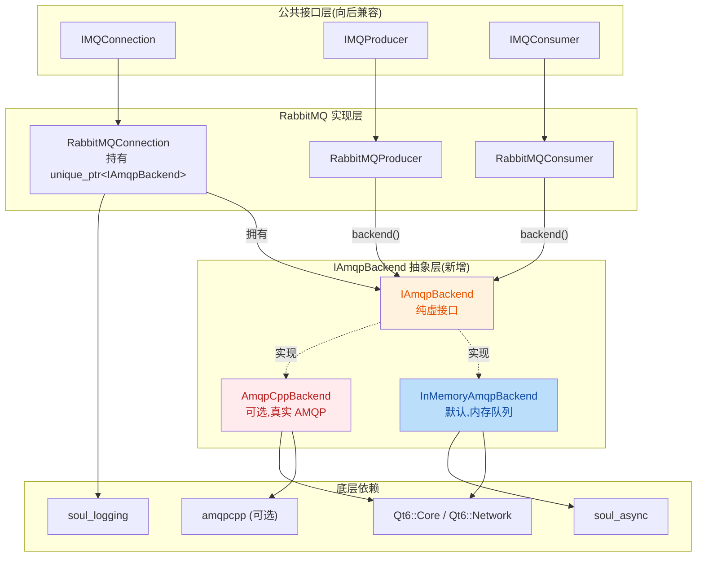
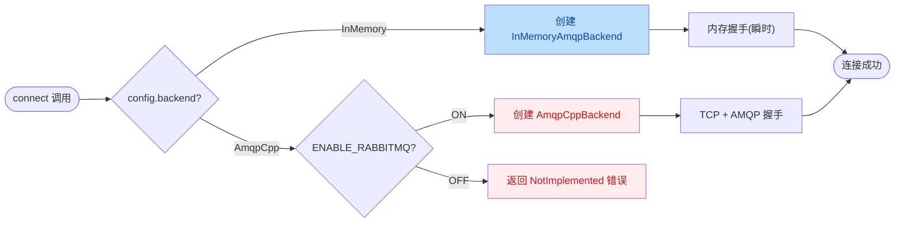
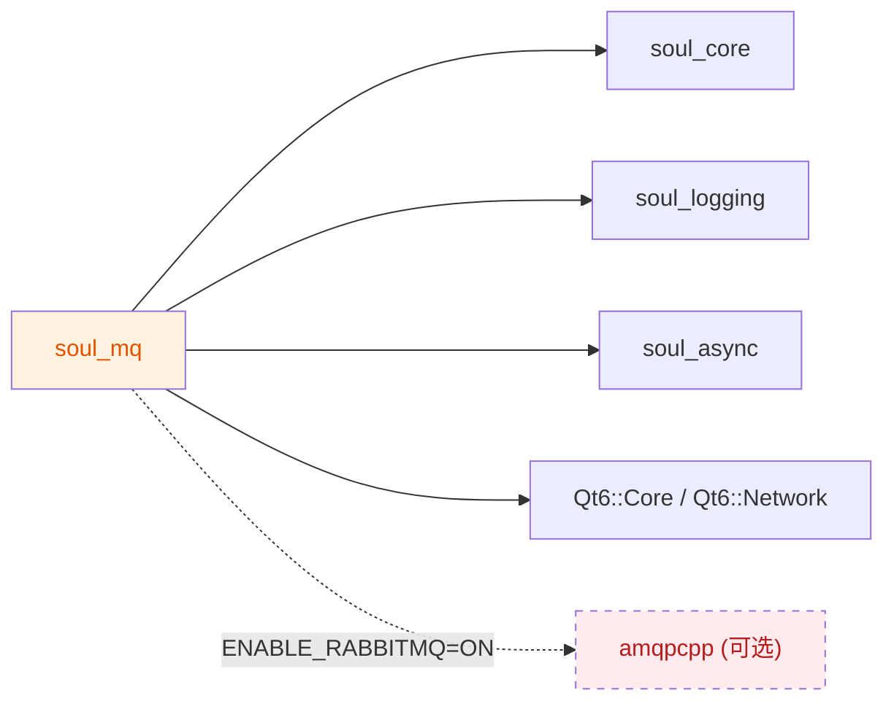
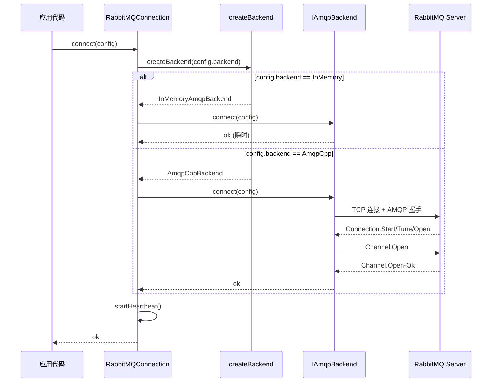
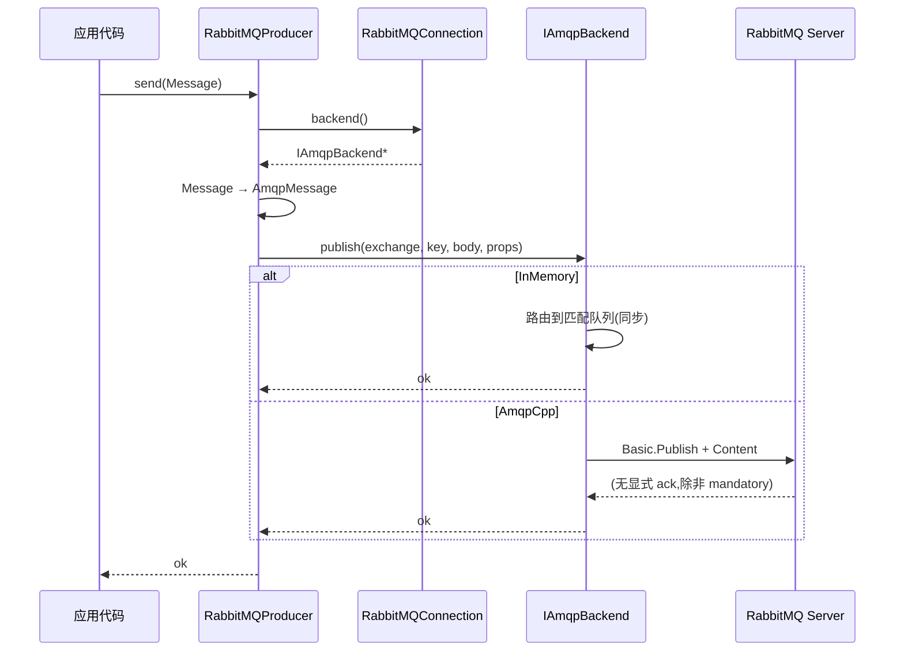
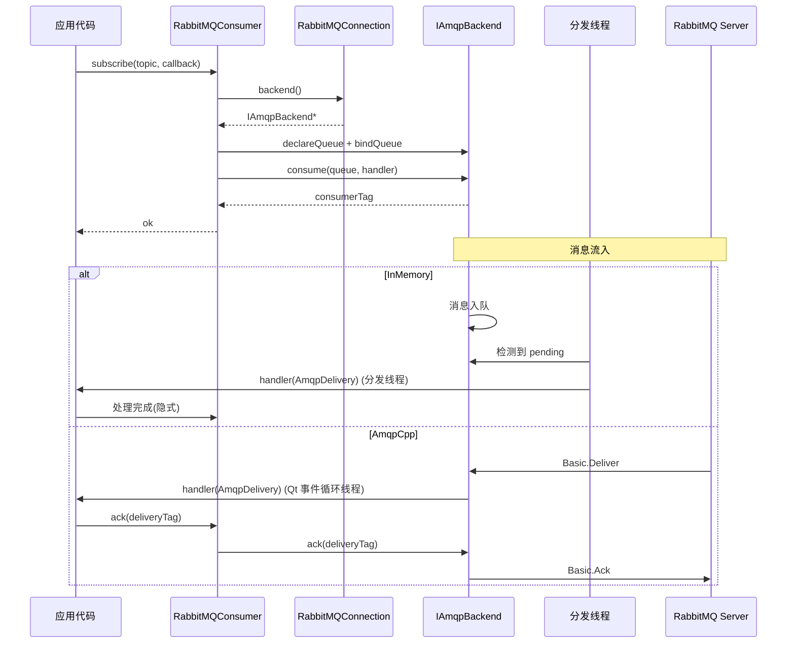

# 06 — RabbitMQ 真实集成设计

**优先级**: P2(已实现,随 v1.7.0 发布)
**模块**: 改造现有 `soul_mq`(非新模块)
**命名空间**: `sc::mq`
**依赖**: soul_core, soul_logging, soul_async, amqpcpp(可选)
**RFC 编号**: RFC-06-MQ-Integration
**文档状态**: Implemented
**创建日期**: 2026-07-26
**实现完成**: 2026-07-26
**作者**: SoulCoreKit 团队

---

## Header

| 字段 | 值 |
|------|-----|
| Title | RabbitMQ 真实集成 — IAmqpBackend 接口抽象 + 双后端实现 |
| Status | Implemented |
| Type | Architecture / Implementation |
| Created | 2026-07-26 |
| Implemented | 2026-07-26 |
| Layer | Layer 3 — Infrastructure |
| Affects | `soul_mq` 模块公共行为(向后兼容) |
| Reviewers | SoulCoreKit 团队 |
| Supersedes | 无 |
| Superseded by | 无 |

---

## Implementation Status

> **实现状态**: ✅ 完成 (2026-07-26)

| 组件 | 状态 | 文件 |
|------|------|------|
| `IAmqpBackend` 接口 | ✅ Implemented | `include/soul/mq/iamqp_backend.h` |
| `InMemoryAmqpBackend` | ✅ Implemented | `include/soul/mq/inmemory_amqp_backend.h`, `src/soul/mq/inmemory_amqp_backend.cpp` |
| `AmqpCppBackend` | ✅ Implemented | `include/soul/mq/amqpcpp_backend.h`, `src/soul/mq/amqpcpp_backend.cpp` |
| `RabbitMQConnection` 重构 | ✅ Implemented | `include/soul/mq/rabbitmq/rabbitmq_connection.h`, `src/soul/mq/rabbitmq/rabbitmq_connection.cpp` |
| `RabbitMQProducer` 重构 | ✅ Implemented | `include/soul/mq/rabbitmq/rabbitmq_producer.h`, `src/soul/mq/rabbitmq/rabbitmq_producer.cpp` |
| `RabbitMQConsumer` 重构 | ✅ Implemented | `include/soul/mq/rabbitmq/rabbitmq_consumer.h`, `src/soul/mq/rabbitmq/rabbitmq_consumer.cpp` |
| CMake `ENABLE_RABBITMQ` | ✅ Implemented | `CMakeLists.txt` |
| `test_mq.cpp` InMemory 测试 | ✅ Implemented | `tests/test_mq.cpp` (16 用例) |
| `test_mq_amqpcpp.cpp` 集成测试 | ⏸ 延期到 v1.8.0 | 需要 RabbitMQ Docker 环境 |

### 实现偏差说明

实际实现相对原设计的最小化调整:

1. **`IAmqpBackend` 接口**: 实际使用嵌套 `Config` 结构而非 `ConnectionConfig` 参数,避免循环依赖,接口更内聚
2. **消息类型**: 实际使用 `AmqpMessage`(扁平属性) + `AmqpDelivery`(含 `message` 字段),而非 `AmqpMessageProperties` 嵌套结构
3. **`consume` 返回类型**: 实际返回 `Result<void>` 而非 `Result<QString>`,consumerTag 由后端内部管理
4. **扩展方法**: 实际未实现 `passive`/`mandatory`/`immediate`/`basicQos`/`deleteExchange`/`deleteQueue`/`pendingMessages`,保持最小接口(可在 v1.8.0 扩展)
5. **后端失败行为**: `AmqpCpp` 后端未编译时返回 `ErrorCode::NotImplemented`,而非静默 fallback 到 InMemory(避免误导用户)
6. **`AmqpCppBackend` 派生 `QObject`**: 为集成 Qt 事件循环,`AmqpCppBackend` 继承 `QObject`,支持 `QSocketNotifier`/`QTimer` 信号槽

---

## Abstract

本 RFC 提出为 `soul_mq` 模块引入真实可用的 RabbitMQ 集成。当前实现中 `RabbitMQConnection`、`RabbitMQProducer`、`RabbitMQConsumer` 三个类均为 stub:`connect()` 仅设置 `m_connected=true` 而无 AMQP 握手;`send()` 仅打日志,不发送数据;`subscribe()` 仅存储 callback,不进行真实订阅。本方案通过引入 `IAmqpBackend` 接口抽象层,在保持对外公共接口(`IMQConnection`/`IMQProducer`/`IMQConsumer`)完全不变的前提下,提供两种可切换的后端实现:

1. **`InMemoryAmqpBackend`**(默认): 使用内存队列模拟 AMQP 0.9.1 语义,适用于开发、测试和无服务器环境,零外部依赖。
2. **`AmqpCppBackend`**(可选): 基于 [amqpcpp](https://github.com/CopernicaMarketingSoftware/AMQP-CPP) 库实现真实 AMQP 0.9.1 协议,通过 CMake `ENABLE_RABBITMQ=ON` 启用。

此设计在向后兼容性、可测试性、生产可用性之间取得平衡:既有 stub 模式被升级为功能完整的内存后端,真实 AMQP 集成作为可选编译项以避免增加默认构建复杂度。

---

## Motivation

### 1.1 现状问题

通过审计 `src/soul/mq/rabbitmq/` 三个实现文件,确认以下 stub 行为:

| 类 | 方法 | 现状 | 问题 |
|----|------|------|------|
| `RabbitMQConnection` | `connect()` | 设置 `m_connected=true`,启动心跳定时器 | 无真实 TCP 握手,无认证,无 channel 协商 |
| `RabbitMQConnection` | `disconnect()` | 停止定时器,置 `m_connected=false` | 无 AMQP connection.close 帧 |
| `RabbitMQProducer` | `send()` | 仅打 `SC_DEBUG` 日志,返回 `ok()` | 消息被丢弃,生产环境不可用 |
| `RabbitMQProducer` | `declareExchange()` | 仅打日志 | exchange 实际未创建 |
| `RabbitMQProducer` | `bindQueue()` | 仅打日志 | 绑定关系未建立 |
| `RabbitMQConsumer` | `subscribe()` | 存 callback 到 `std::map` | 无 AMQP basic.consume,无消息分发 |
| `RabbitMQConsumer` | `start()/stop()` | 切换 `m_running` 标志 | 无消费者线程,无消息拉取 |
| `MQFactory` | `createConnection()` | 仅 RabbitMQ 分支返回实例 | Kafka/RocketMQ 返回 `nullptr` |

### 1.2 设计目标

1. **生产可用**: 启用 `ENABLE_RABBITMQ=ON` 后,能连接真实 RabbitMQ 服务器完成端到端消息收发
2. **零外部依赖默认**: 默认构建不引入 amqpcpp,保持 v1.6.x 构建友好性
3. **测试友好**: 默认后端可在无服务器环境下完成单元测试
4. **向后兼容**: `IMQConnection`/`IMQProducer`/`IMQConsumer` 公共接口签名零变更
5. **协议保真**: 真实后端严格遵循 AMQP 0.9.1 语义(exchange 类型、routing key 匹配、QoS、ack/nack)
6. **可观测**: 集成 SoulObservability(参见 `03_soul_observability_design.md`)上报连接/发布/消费指标

### 1.3 非目标

- ❌ Kafka 真实集成(延后到 v1.8.0,使用 `librdkafka`)
- ❌ RocketMQ 真实集成(无明确时间表)
- ❌ AMQP 1.0(Qpid)协议支持(仅支持 0.9.1)
- ❌ 替换 `MQFactory` 工厂模式(仅扩展分支)
- ❌ 修改 `IMQConnection` 等公共接口(向后兼容硬约束)

---

## Architecture

### 2.1 整体架构

引入 `IAmqpBackend` 接口作为 RabbitMQ 类的内部策略层。`RabbitMQConnection` 通过 `std::unique_ptr<IAmqpBackend>` 持有具体后端实例,所有 AMQP 语义操作通过该接口委托执行。Producer 和 Consumer 通过 `RabbitMQConnection` 暴露的 `backend()` 访问器获取后端引用,完成发布/订阅。



### 2.2 后端选择策略

`RabbitMQConnection::connect()` 根据 `ConnectionConfig::backend` 字段在连接时决定后端类型:



### 2.3 模块依赖关系

`soul_mq` 在 v1.7.0 中的依赖关系(与 v1.6.x 一致,仅在可选编译时增加 amqpcpp):



### 2.4 线程模型

遵循 ADR-005 `docs/adr/005-thread-safety-policy.md` Level 2(可重入安全):

| 组件 | 线程角色 | 同步原语 |
|------|----------|----------|
| `RabbitMQConnection` | 调用方线程 | `QMutex` 保护 `m_backend`/`m_connected` |
| `InMemoryAmqpBackend` | 调用方线程 + 内部分发线程 | `std::mutex` + `std::condition_variable` |
| `AmqpCppBackend` | 调用方线程 + AMQP 事件循环线程 | `std::mutex` + amqpcpp 内部锁 |
| `RabbitMQProducer` | 调用方线程 | `QMutex` 保护 send 序列化 |
| `RabbitMQConsumer` | 调用方线程订阅 + 后端分发线程回调 | `QMutex` 保护 `m_subscriptions` |

**关键约束**:
- 用户回调(ConsumeCallback)在后端分发线程被调用,用户不得在其中执行长任务
- 用户回调可通过 `QMetaObject::invokeMethod` 切回业务线程(由用户负责)

---

## Interface

### 3.1 IAmqpBackend 接口

`IAmqpBackend` 是 `soul_mq` 内部接口(非 `IInterface` 派生),仅 RabbitMQ 实现层可见,不暴露给最终用户。

```cpp
// include/soul/mq/iamqp_backend.h
#ifndef SOUL_MQ_IAMQP_BACKEND_H
#define SOUL_MQ_IAMQP_BACKEND_H

#include <string>
#include <chrono>
#include <functional>
#include <vector>
#include <memory>
#include <variant>
#include "soul/core/result.h"
#include "soul/core/error.h"
#include <QByteArray>
#include <QString>

namespace sc {
namespace mq {

// AMQP exchange 类型(对应 AMQP 0.9.1 规范)
enum class ExchangeType : uint8_t {
    Direct,    // routing key 完全匹配
    Fanout,    // 广播到所有绑定队列
    Topic,     // routing key 模式匹配(* 和 #)
    Headers,   // 基于 headers 匹配
    ConsistentHash  // 一致性哈希(扩展)
};

// AMQP 消息属性
struct AmqpMessageProperties {
    QString contentType;        // e.g. "application/json"
    QString contentEncoding;    // e.g. "gzip"
    QString correlationId;
    QString replyTo;
    QString messageId;
    qint64 timestamp = 0;       // ms since epoch
    QString type;
    QString userId;
    QString appId;
    int deliveryMode = 2;       // 1=非持久,2=持久
    int priority = 0;
};

// AMQP 消息封装
struct AmqpMessage {
    QString exchange;
    QString routingKey;
    QByteArray body;
    AmqpMessageProperties properties;
};

// 投递消息(消费者接收)
struct AmqpDelivery {
    QString consumerTag;
    qint64 deliveryTag = 0;     // 通道内单调递增
    bool redelivered = false;
    QString exchange;
    QString routingKey;
    QByteArray body;
    AmqpMessageProperties properties;
};

// 投递回调(由后端在分发线程调用)
using ConsumeHandler = std::function<void(const AmqpDelivery&)>;

// QoS 配置
struct QoSConfig {
    int prefetchCount = 1;          // 通道级预取
    int prefetchSize = 0;           // 字节级预取(0=不限)
    bool global = false;            // true=连接级,false=消费者级
};

// 后端类型标识
enum class AmqpBackendKind {
    InMemory,
    AmqpCpp
};

class IAmqpBackend {
public:
    virtual ~IAmqpBackend() = default;

    // ---- 连接管理 ----
    virtual Result<void> connect(const struct ConnectionConfig& config) = 0;
    virtual Result<void> disconnect() = 0;
    virtual bool isConnected() const = 0;
    virtual AmqpBackendKind kind() const = 0;

    // ---- 拓扑管理 ----
    virtual Result<void> declareExchange(
        const QString& name,
        ExchangeType type,
        bool durable = true,
        bool autoDelete = false,
        bool passive = false) = 0;

    virtual Result<void> declareQueue(
        const QString& name,
        bool durable = true,
        bool exclusive = false,
        bool autoDelete = false,
        bool passive = false) = 0;

    virtual Result<void> bindQueue(
        const QString& queue,
        const QString& exchange,
        const QString& routingKey) = 0;

    virtual Result<void> unbindQueue(
        const QString& queue,
        const QString& exchange,
        const QString& routingKey) = 0;

    virtual Result<void> deleteExchange(const QString& name, bool ifUnused = false) = 0;
    virtual Result<void> deleteQueue(const QString& name, bool ifUnused = false, bool ifEmpty = false) = 0;

    // ---- 发布 ----
    virtual Result<void> publish(
        const QString& exchange,
        const QString& routingKey,
        const QByteArray& body,
        const AmqpMessageProperties& properties = {},
        bool mandatory = false,
        bool immediate = false) = 0;

    // ---- 消费 ----
    virtual Result<QString> consume(
        const QString& queue,
        ConsumeHandler handler,
        bool noAck = false,
        bool exclusive = false) = 0;  // 返回 consumerTag

    virtual Result<void> cancel(const QString& consumerTag) = 0;
    virtual Result<void> basicQos(const QoSConfig& qos) = 0;
    virtual Result<void> ack(qint64 deliveryTag, bool multiple = false) = 0;
    virtual Result<void> nack(qint64 deliveryTag, bool multiple = false, bool requeue = true) = 0;
    virtual Result<void> reject(qint64 deliveryTag, bool requeue = true) = 0;

    // ---- 状态查询 ----
    virtual size_t pendingMessages(const QString& queue) const = 0;
};

} // namespace mq
} // namespace sc

#endif
```

**接口设计要点**:

1. **Result<T> 错误处理**: 所有方法返回 `Result<T>` 或 `Result<void>`,遵循 `docs/08_error_handling.md` 规范
2. **被动声明(passive)**: 当 `passive=true` 时仅校验存在性,不创建;对应 AMQP `declare` 的 `passive` 标志
3. **mandatory/immediate 标志**: 对应 AMQP `basic.publish` 的路由失败回退
4. **deliveryTag 类型**: 使用 `qint64` 兼容 AMQP 0.9.1 的 64-bit delivery tag(虽然协议为 32-bit,但为未来扩展预留)
5. **线程安全要求**: 实现类必须保证内部状态线程安全,接口本身不要求调用方加锁

### 3.2 ConnectionConfig 扩展

向后兼容地扩展 `ConnectionConfig`,新增字段提供默认值:

```cpp
// include/soul/mq/imq_connection.h(修改后)
namespace sc {
namespace mq {

// AMQP 后端类型选择
enum class AmqpBackend : uint8_t {
    InMemory,   // 默认: 内存模拟,无外部依赖
    AmqpCpp     // 可选: 真实 AMQP 0.9.1
};

// SSL/TLS 配置
struct SslConfig {
    bool enableSsl = false;
    QString caCertPath;         // CA 证书路径(PEM)
    QString clientCertPath;     // 客户端证书(PEM)
    QString clientKeyPath;      // 客户端私钥(PEM)
    QString serverName;         // SNI 主机名(默认取 ConnectionConfig::host)
    bool verifyPeer = true;     // 是否校验服务器证书
    QString cipherSuite;        // 留空=使用 amqpcpp 默认
};

struct ConnectionConfig {
    // ---- 既有字段(向后兼容) ----
    QString host = "localhost";
    int port = 5672;
    QString username = "guest";
    QString password = "guest";
    QString virtualHost = "/";
    int connectionTimeout = 30000;
    int heartbeatInterval = 60;
    int maxChannels = 10;

    // ---- v1.7.0 新增字段 ----
    AmqpBackend backend = AmqpBackend::InMemory;   // 默认内存后端
    SslConfig ssl;                                  // SSL 配置
    bool autoReconnect = true;                      // 启用自动重连(仅 AmqpCpp 生效)
    int maxReconnectAttempts = 10;                  // 最大重连次数(0=无限)
    int reconnectBaseDelayMs = 1000;                // 指数退避基数
    int reconnectMaxDelayMs = 30000;                // 指数退避上限
};

} // namespace mq
} // namespace sc
```

**向后兼容性证明**:
- 新增字段全部提供默认值,旧代码 `ConnectionConfig{}` 行为不变
- `backend` 默认 `InMemory`,与现有 stub 行为最接近(虽然内部实现升级为真实内存队列)
- 若用户期望保持完全一致的 stub 行为(无消息分发),可在 InMemoryAmqpBackend 中提供 `m_messageDeliveryEnabled` 配置项(默认 true)

---

## Implementation

### 4.1 InMemoryAmqpBackend

**文件位置**:
- `include/soul/mq/inmemory_amqp_backend.h`
- `src/soul/mq/inmemory_amqp_backend.cpp`

**设计**: 使用 `std::unordered_map<QString, std::queue<AmqpMessage>>` 维护队列,使用 `std::condition_variable` 实现异步分发,完整模拟 AMQP 0.9.1 语义。

```cpp
// include/soul/mq/inmemory_amqp_backend.h
#ifndef SOUL_MQ_INMEMORY_AMQP_BACKEND_H
#define SOUL_MQ_INMEMORY_AMQP_BACKEND_H

#include "soul/mq/iamqp_backend.h"
#include <unordered_map>
#include <unordered_set>
#include <queue>
#include <mutex>
#include <condition_variable>
#include <thread>
#include <atomic>
#include <vector>

namespace sc {
namespace mq {

class InMemoryAmqpBackend : public IAmqpBackend {
public:
    InMemoryAmqpBackend();
    ~InMemoryAmqpBackend() override;

    // IAmqpBackend 实现
    Result<void> connect(const ConnectionConfig& config) override;
    Result<void> disconnect() override;
    bool isConnected() const override;
    AmqpBackendKind kind() const override { return AmqpBackendKind::InMemory; }

    Result<void> declareExchange(const QString& name, ExchangeType type,
                                 bool durable = true, bool autoDelete = false,
                                 bool passive = false) override;
    Result<void> declareQueue(const QString& name, bool durable = true,
                              bool exclusive = false, bool autoDelete = false,
                              bool passive = false) override;
    Result<void> bindQueue(const QString& queue, const QString& exchange,
                           const QString& routingKey) override;
    Result<void> unbindQueue(const QString& queue, const QString& exchange,
                             const QString& routingKey) override;
    Result<void> deleteExchange(const QString& name, bool ifUnused = false) override;
    Result<void> deleteQueue(const QString& name, bool ifUnused = false,
                             bool ifEmpty = false) override;

    Result<void> publish(const QString& exchange, const QString& routingKey,
                         const QByteArray& body,
                         const AmqpMessageProperties& properties = {},
                         bool mandatory = false, bool immediate = false) override;

    Result<QString> consume(const QString& queue, ConsumeHandler handler,
                            bool noAck = false, bool exclusive = false) override;
    Result<void> cancel(const QString& consumerTag) override;
    Result<void> basicQos(const QoSConfig& qos) override;
    Result<void> ack(qint64 deliveryTag, bool multiple = false) override;
    Result<void> nack(qint64 deliveryTag, bool multiple = false,
                      bool requeue = true) override;
    Result<void> reject(qint64 deliveryTag, bool requeue = true) override;

    size_t pendingMessages(const QString& queue) const override;

private:
    struct Exchange {
        ExchangeType type;
        bool durable = true;
        bool autoDelete = false;
    };

    struct Queue {
        bool durable = true;
        bool exclusive = false;
        bool autoDelete = false;
        std::queue<AmqpMessage> messages;
        std::vector<QString> boundConsumerTags;
    };

    struct Binding {
        QString exchange;
        QString queue;
        QString routingKey;
    };

    struct Consumer {
        QString queue;
        ConsumeHandler handler;
        bool noAck = false;
        bool exclusive = false;
        QoSConfig qos;
        std::atomic<int> unackedCount{0};
    };

    mutable std::mutex m_mutex;
    std::condition_variable m_cv;
    std::unordered_map<QString, Exchange> m_exchanges;
    std::unordered_map<QString, Queue> m_queues;
    std::vector<Binding> m_bindings;
    std::unordered_map<QString, Consumer> m_consumers;
    std::atomic<bool> m_connected{false};
    std::atomic<qint64> m_nextDeliveryTag{1};
    std::thread m_dispatchThread;
    std::atomic<bool> m_running{false};
    QoSConfig m_globalQos;

    // routing key 模式匹配(* 和 #)
    static bool routingKeyMatch(const QString& pattern, const QString& key);
    void dispatchLoop();
    void deliverMessage(const QString& consumerTag, const AmqpMessage& msg,
                        const QString& exchange, const QString& routingKey);
    QString generateConsumerTag();
};

} // namespace mq
} // namespace sc

#endif
```

**关键实现细节**:

1. **Exchange 路由算法**:
   - `Direct`: routing key 完全相等才投递
   - `Fanout`: 投递到所有绑定队列
   - `Topic`: `routingKeyMatch(pattern, key)` 模式匹配
   - `Headers`: 检查 `properties` 中的特定 header

2. **routing key 模式匹配**:
```cpp
bool InMemoryAmqpBackend::routingKeyMatch(const QString& pattern, const QString& key) {
    // AMQP topic 匹配: '*' 匹配一个单词,'#' 匹配零个或多个单词
    // 以 '.' 分隔
    auto splitDot = [](const QString& s) {
        return s.split('.', Qt::SkipEmptyParts);
    };
    auto p = splitDot(pattern);
    auto k = splitDot(key);
    size_t i = 0, j = 0;
    while (i < p.size() && j < k.size()) {
        if (p[i] == "#") {
            if (i == p.size() - 1) return true;  // # 在末尾匹配剩余所有
            i++;
            while (j < k.size() && p[i] != k[j]) j++;
            if (j == k.size()) return false;
        } else if (p[i] != "*" && p[i] != k[j]) {
            return false;
        }
        i++; j++;
    }
    return i == p.size() && j == k.size();
}
```

3. **分发线程**:
```cpp
void InMemoryAmqpBackend::dispatchLoop() {
    while (m_running.load()) {
        std::unique_lock<std::mutex> lock(m_mutex);
        m_cv.wait(lock, [this]() {
            return !m_running.load() || hasPendingDelivery();
        });
        if (!m_running.load()) break;

        // 遍历所有队列,将消息分发给匹配的消费者(轮询负载均衡)
        for (auto& [qname, queue] : m_queues) {
            if (queue.messages.empty()) continue;
            // 选择一个 unacked < prefetchCount 的消费者
            for (auto& [tag, consumer] : m_consumers) {
                if (consumer.queue != qname) continue;
                if (consumer.unackedCount.load() >= consumer.qos.prefetchCount) continue;
                auto msg = queue.messages.front();
                queue.messages.pop();
                deliverMessage(tag, msg, /*exchange*/, /*routingKey*/);
                if (!consumer.noAck) {
                    consumer.unackedCount.fetch_add(1);
                }
                break;  // 轮询: 每次只投递给一个消费者
            }
        }
    }
}
```

4. **ack/nack 语义**:
   - `ack(deliveryTag)`: 减少 consumer 的 `unackedCount`,后端可继续投递
   - `nack(deliveryTag, requeue=true)`: 消息重新入队首
   - `nack(deliveryTag, requeue=false)`: 消息丢弃(本实现不接 DLX)

### 4.2 AmqpCppBackend

**文件位置**:
- `include/soul/mq/amqpcpp_backend.h`
- `src/soul/mq/amqpcpp_backend.cpp`

**依赖**: [amqpcpp](https://github.com/CopernicaMarketingSoftware/AMQP-CPP) v4.3.x,通过 CMake `FetchContent` 引入。

**设计**: amqpcpp 提供异步事件驱动的 AMQP 客户端,本后端通过 Qt 的 `QSocketNotifier` 集成到 Qt 事件循环,或通过独立后台线程运行事件循环。

```cpp
// include/soul/mq/amqpcpp_backend.h
#ifndef SOUL_MQ_AMQPCPP_BACKEND_H
#define SOUL_MQ_AMQPCPP_BACKEND_H

#include "soul/mq/iamqp_backend.h"

#ifdef ENABLE_RABBITMQ
#include <amqpcpp.h>
#include <amqpcpp/linux_tcp.h>
#include <amqpcpp/openssl.h>
#endif

#include <memory>
#include <thread>
#include <atomic>
#include <mutex>
#include <unordered_map>

namespace sc {
namespace mq {

#ifdef ENABLE_RABBITMQ

class AmqpCppBackend : public IAmqpBackend {
public:
    AmqpCppBackend();
    ~AmqpCppBackend() override;

    Result<void> connect(const ConnectionConfig& config) override;
    Result<void> disconnect() override;
    bool isConnected() const override;
    AmqpBackendKind kind() const override { return AmqpBackendKind::AmqpCpp; }

    Result<void> declareExchange(const QString& name, ExchangeType type,
                                 bool durable = true, bool autoDelete = false,
                                 bool passive = false) override;
    Result<void> declareQueue(const QString& name, bool durable = true,
                              bool exclusive = false, bool autoDelete = false,
                              bool passive = false) override;
    Result<void> bindQueue(const QString& queue, const QString& exchange,
                           const QString& routingKey) override;
    Result<void> unbindQueue(const QString& queue, const QString& exchange,
                             const QString& routingKey) override;
    Result<void> deleteExchange(const QString& name, bool ifUnused = false) override;
    Result<void> deleteQueue(const QString& name, bool ifUnused = false,
                             bool ifEmpty = false) override;

    Result<void> publish(const QString& exchange, const QString& routingKey,
                         const QByteArray& body,
                         const AmqpMessageProperties& properties = {},
                         bool mandatory = false, bool immediate = false) override;

    Result<QString> consume(const QString& queue, ConsumeHandler handler,
                            bool noAck = false, bool exclusive = false) override;
    Result<void> cancel(const QString& consumerTag) override;
    Result<void> basicQos(const QoSConfig& qos) override;
    Result<void> ack(qint64 deliveryTag, bool multiple = false) override;
    Result<void> nack(qint64 deliveryTag, bool multiple = false,
                      bool requeue = true) override;
    Result<void> reject(qint64 deliveryTag, bool requeue = true) override;

    size_t pendingMessages(const QString& queue) const override;

private:
    // 自定义 TcpHandler 集成 Qt 事件循环
    class QtTcpHandler;
    class ConnectionHandler;

    std::unique_ptr<QtTcpHandler> m_handler;
    std::shared_ptr<AMQP::TcpConnection> m_connection;
    std::shared_ptr<AMQP::TcpChannel> m_channel;
    mutable std::mutex m_mutex;
    std::atomic<bool> m_connected{false};
    std::atomic<bool> m_running{false};
    std::thread m_eventThread;

    std::unordered_map<QString, ConsumeHandler> m_consumers;
    std::unordered_map<qint64, QString> m_deliveryToConsumer;

    // 连接回调
    std::mutex m_handshakeMutex;
    std::condition_variable m_handshakeCv;
    bool m_handshakeDone = false;
    Error m_handshakeError;

    // amqpcpp 错误码映射
    static ErrorCode mapAmqpError(const char* message);
    static AMQP::ExchangeType toAmqpExchangeType(ExchangeType type);

    void startEventLoop();
    void stopEventLoop();
    Result<void> waitForHandshake(std::chrono::milliseconds timeout);
};

#endif // ENABLE_RABBITMQ

} // namespace mq
} // namespace sc

#endif
```

**关键实现细节**:

1. **QtTcpHandler**: 继承 `AMQP::TcpHandler`,通过 `QSocketNotifier` 监听 amqpcpp 的文件描述符,将 amqpcpp 事件循环集成到 Qt 主事件循环,避免独立线程:

```cpp
class AmqpCppBackend::QtTcpHandler : public AMQP::TcpHandler {
public:
    explicit QtTcpHandler(QObject* parent = nullptr);

    // AMQP::TcpHandler 实现
    void monitor(AMQP::TcpConnection* conn, int fd, int flags) override;
    void onConnected(AMQP::TcpConnection* conn) override;
    void onError(AMQP::TcpConnection* conn, const char* message) override;
    void onClosed(AMQP::TcpConnection* conn) override;

private:
    std::unordered_map<int, std::unique_ptr<QSocketNotifier>> m_notifiers;
    AMQP::TcpConnection* m_conn = nullptr;
    QObject* m_parent = nullptr;
};
```

2. **Exchange 类型映射**:
```cpp
AMQP::ExchangeType AmqpCppBackend::toAmqpExchangeType(ExchangeType type) {
    switch (type) {
    case ExchangeType::Direct:  return AMQP::direct;
    case ExchangeType::Fanout:  return AMQP::fanout;
    case ExchangeType::Topic:   return AMQP::topic;
    case ExchangeType::Headers: return AMQP::headers;
    case ExchangeType::ConsistentHash:
        // 通过插件支持,默认 fallback 到 direct
        return AMQP::direct;
    }
    return AMQP::direct;
}
```

3. **异步操作同步化**: amqpcpp 操作通过回调通知结果,本后端通过 `std::promise`/`std::future` 将异步操作转换为同步 Result:

```cpp
Result<void> AmqpCppBackend::declareExchange(const QString& name, ExchangeType type,
                                             bool durable, bool autoDelete, bool passive) {
    if (!isConnected()) {
        return Result<void>::err(Error(ErrorCode::NotConnected, "Not connected"));
    }
    std::lock_guard<std::mutex> lock(m_mutex);
    std::promise<Result<void>> prom;
    auto fut = prom.get_future();

    AMQP::ExchangeType amqpType = toAmqpExchangeType(type);
    int flags = 0;
    if (durable)     flags |= AMQP::durable;
    if (autoDelete)  flags |= AMQP::autodelete;
    if (passive)     flags |= AMQP::passive;

    m_channel->declareExchange(name.toStdString(), amqpType, flags)
        .onSuccess([&prom]() { prom.set_value(Result<void>::ok()); })
        .onError([&prom](const char* msg) {
            prom.set_value(Result<void>::err(
                Error(mapAmqpError(msg), std::string("declareExchange failed: ") + msg)));
        });

    return fut.get();  // 阻塞直到回调触发
}
```

4. **消息消费**:
```cpp
Result<QString> AmqpCppBackend::consume(const QString& queue, ConsumeHandler handler,
                                        bool noAck, bool exclusive) {
    if (!isConnected()) {
        return Result<QString>::err(Error(ErrorCode::NotConnected, "Not connected"));
    }
    std::lock_guard<std::mutex> lock(m_mutex);
    QString consumerTag = generateConsumerTag();
    m_consumers[consumerTag] = handler;

    int flags = 0;
    if (noAck)     flags |= AMQP::noack;
    if (exclusive) flags |= AMQP::exclusive;

    m_channel->consume(queue.toStdString(), consumerTag.toStdString(), flags)
        .onReceived([this, consumerTag](const AMQP::Message& msg, uint64_t tag, bool redelivered) {
            auto it = m_consumers.find(consumerTag);
            if (it == m_consumers.end()) return;
            AmqpDelivery d;
            d.consumerTag = consumerTag;
            d.deliveryTag = static_cast<qint64>(tag);
            d.redelivered = redelivered;
            d.exchange = QString::fromUtf8(msg.exchange());
            d.routingKey = QString::fromUtf8(msg.routingkey());
            d.body = QByteArray(msg.body(), static_cast<int>(msg.bodySize()));
            // properties 转换...
            it->second(d);
        })
        .onError([](const char* msg) {
            SC_ERROR_STREAM("consume failed: " << msg);
        });

    return Result<QString>::ok(consumerTag);
}
```

5. **心跳与重连**: amqpcpp 内置心跳支持,通过 `m_connection->heartbeat()` 定期调用;自动重连通过 `onError`/`onClosed` 回调触发 `scheduleReconnect()`:

```cpp
void AmqpCppBackend::onClosed(AMQP::TcpConnection* conn) {
    m_connected.store(false);
    if (m_config.autoReconnect) {
        scheduleReconnect();
    }
}

void AmqpCppBackend::scheduleReconnect() {
    // 指数退避重连,复用 RabbitMQConnection 的 QTimer
    // ... (省略实现细节)
}
```

### 4.3 RabbitMQConnection/Producer/Consumer 重构

**重构原则**: 公共接口签名完全不变,内部委托给 `IAmqpBackend`。

#### 4.3.1 RabbitMQConnection

```cpp
// include/soul/mq/rabbitmq/rabbitmq_connection.h(重构后)
#ifndef SOUL_MQ_RABBITMQ_CONNECTION_H
#define SOUL_MQ_RABBITMQ_CONNECTION_H

#include <QObject>
#include <QMutex>
#include <QTimer>
#include <memory>
#include "soul/mq/imq_connection.h"
#include "soul/mq/iamqp_backend.h"

namespace sc {
namespace mq {

class RabbitMQConnection : public QObject,
                          public IMQConnection,
                          public std::enable_shared_from_this<RabbitMQConnection> {
    Q_OBJECT
public:
    RabbitMQConnection();
    ~RabbitMQConnection() override;

    // IMQConnection 公共接口(签名不变)
    Result<void> connect(const ConnectionConfig& config) override;
    void disconnect() override;
    bool isConnected() const override;
    std::shared_ptr<IMQProducer> createProducer() override;
    std::shared_ptr<IMQConsumer> createConsumer() override;

    void setReconnectEnabled(bool enabled);
    bool isReconnectEnabled() const;

    // v1.7.0 新增: 后端访问器(供 Producer/Consumer 使用)
    IAmqpBackend* backend() const;
    const ConnectionConfig& config() const;

private slots:
    void onHeartbeat();
    void onReconnectTimer();

private:
    mutable QMutex m_mutex;
    ConnectionConfig m_config;
    std::unique_ptr<IAmqpBackend> m_backend;     // v1.7.0 新增
    QTimer m_heartbeatTimer;
    QTimer m_reconnectTimer;
    bool m_reconnectEnabled = true;
    int m_reconnectAttempts = 0;

    // 后端工厂方法
    std::unique_ptr<IAmqpBackend> createBackend(AmqpBackend kind);
    void startHeartbeat();
    void stopHeartbeat();
    void scheduleReconnect();
};

} // namespace mq
} // namespace sc

#endif
```

**connect() 重构实现**:

```cpp
Result<void> RabbitMQConnection::connect(const ConnectionConfig& config) {
    QMutexLocker lock(&m_mutex);
    m_config = config;
    m_reconnectAttempts = 0;

    SC_INFO_STREAM("Connecting to RabbitMQ " << config.host.toStdString()
                   << ":" << config.port
                   << " backend="
                   << (config.backend == AmqpBackend::AmqpCpp ? "AmqpCpp" : "InMemory"));

    // 1. 创建后端
    m_backend = createBackend(config.backend);
    if (!m_backend) {
        return Result<void>::err(Error(
            ErrorCode::NotImplemented,
            "AmqpCpp backend requested but ENABLE_RABBITMQ=OFF"));
    }

    // 2. 委托后端连接
    auto result = m_backend->connect(config);
    if (!result.isOk()) {
        m_backend.reset();
        return result;
    }

    // 3. 启动心跳(用于 stub 时代的兼容,真实后端由 amqpcpp 自行处理)
    startHeartbeat();

    SC_INFO("RabbitMQ connection established");
    return {};
}

std::unique_ptr<IAmqpBackend> RabbitMQConnection::createBackend(AmqpBackend kind) {
    switch (kind) {
    case AmqpBackend::InMemory:
        return std::make_unique<InMemoryAmqpBackend>();
    case AmqpBackend::AmqpCpp:
#ifdef ENABLE_RABBITMQ
        return std::make_unique<AmqpCppBackend>();
#else
        SC_ERROR("AmqpCpp backend not compiled in (ENABLE_RABBITMQ=OFF)");
        return nullptr;
#endif
    }
    return nullptr;
}

IAmqpBackend* RabbitMQConnection::backend() const {
    QMutexLocker lock(&m_mutex);
    return m_backend.get();
}
```

#### 4.3.2 RabbitMQProducer

```cpp
// RabbitMQProducer::send() 重构实现
Result<void> RabbitMQProducer::send(const Message& message) {
    QMutexLocker lock(&m_mutex);

    auto conn = m_connection.lock();
    if (!conn || !conn->isConnected()) {
        return Result<void>::err(Error(
            ErrorCode::NotConnected, "RabbitMQ producer connection not available"));
    }

    IAmqpBackend* backend = conn->backend();
    if (!backend) {
        return Result<void>::err(Error(
            ErrorCode::InternalError, "Backend is null"));
    }

    // 将 IMQProducer::Message 转换为 AmqpMessage
    AmqpMessage amqp;
    amqp.exchange = message.topic;     // topic 字段语义对齐 exchange
    amqp.routingKey = message.routingKey;
    amqp.body = message.body;
    amqp.properties.deliveryMode = message.deliveryMode;
    amqp.properties.priority = message.priority;
    amqp.properties.correlationId = message.correlationId;
    amqp.properties.messageId = message.messageId;
    if (amqp.properties.messageId.isEmpty()) {
        amqp.properties.messageId = generateMessageId();
    }
    amqp.properties.timestamp = QDateTime::currentMSecsSinceEpoch();

    // 默认 exchange 为空时,使用默认交换机(routing key = queue name)
    if (amqp.exchange.isEmpty()) {
        amqp.exchange = "";  // AMQP 默认交换机
    }

    return backend->publish(amqp.exchange, amqp.routingKey, amqp.body, amqp.properties);
}

Result<void> RabbitMQProducer::declareExchange(const QString& exchangeName,
                                               const QString& exchangeType) {
    auto conn = m_connection.lock();
    if (!conn || !conn->isConnected()) {
        return Result<void>::err(Error(ErrorCode::NotConnected, "Not connected"));
    }
    IAmqpBackend* backend = conn->backend();
    if (!backend) return Result<void>::err(Error(ErrorCode::InternalError, "Backend null"));

    // 字符串映射到枚举
    ExchangeType type = ExchangeType::Direct;
    QString t = exchangeType.toLower();
    if (t == "direct")        type = ExchangeType::Direct;
    else if (t == "fanout")   type = ExchangeType::Fanout;
    else if (t == "topic")    type = ExchangeType::Topic;
    else if (t == "headers")  type = ExchangeType::Headers;

    return backend->declareExchange(exchangeName, type);
}
```

#### 4.3.3 RabbitMQConsumer

```cpp
// RabbitMQConsumer::subscribe() 重构实现
Result<void> RabbitMQConsumer::subscribe(const QString& topic,
                                         const QString& queueName,
                                         ConsumeCallback callback) {
    QMutexLocker lock(&m_mutex);

    auto conn = m_connection.lock();
    if (!conn || !conn->isConnected()) {
        return Result<void>::err(Error(
            ErrorCode::NotConnected, "RabbitMQ consumer connection not available"));
    }

    IAmqpBackend* backend = conn->backend();
    if (!backend) {
        return Result<void>::err(Error(ErrorCode::InternalError, "Backend null"));
    }

    // 1. 声明队列(幂等)
    auto qResult = backend->declareQueue(queueName);
    if (!qResult.isOk()) return qResult;

    // 2. 如果 topic 非空,绑定到队列(以 topic 为 exchange)
    if (!topic.isEmpty()) {
        // 自动声明 topic exchange
        auto eResult = backend->declareExchange(topic, ExchangeType::Topic);
        if (!eResult.isOk()) return eResult;
        auto bResult = backend->bindQueue(queueName, topic, "#");  // 通配
        if (!bResult.isOk()) return bResult;
    }

    // 3. 启动消费
    auto consumeResult = backend->consume(
        queueName,
        [callback, topic](const AmqpDelivery& delivery) {
            ConsumeMessage msg;
            msg.topic = topic.isEmpty() ? delivery.exchange : topic;
            msg.routingKey = delivery.routingKey;
            msg.body = delivery.body;
            msg.messageId = delivery.properties.messageId;
            msg.correlationId = delivery.properties.correlationId;
            msg.deliveryTag = delivery.deliveryTag;
            callback(msg);
        },
        /*noAck=*/false);
    if (!consumeResult.isOk()) {
        return Result<void>::err(consumeResult.unwrapErr());
    }

    m_subscriptions[topic] = callback;
    m_consumerTags[topic] = consumeResult.unwrap();
    return {};
}

void RabbitMQConsumer::start() {
    QMutexLocker lock(&m_mutex);
    m_running = true;
    // 真实后端: 消费者已在 backend->consume() 时注册
    // 内存后端: 分发线程已在 connect() 时启动
}
```

### 4.4 时序图

#### 4.4.1 连接时序



#### 4.4.2 发布时序



#### 4.4.3 消费时序



---

## CMake Integration

### 5.1 顶层 CMakeLists.txt 修改

在 `f:\CODE\Qt_forNoVS\KITForSC\CMakeLists.txt` 中添加 RabbitMQ 可选编译选项:

```cmake
# === RabbitMQ 可选集成 ===
option(ENABLE_RABBITMQ "Enable real RabbitMQ backend (requires amqpcpp)" OFF)

if(ENABLE_RABBITMQ)
    include(FetchContent)
    FetchContent_Declare(
        amqpcpp
        GIT_REPOSITORY https://github.com/CopernicaMarketingSoftware/AMQP-CPP.git
        GIT_TAG        v4.3.27
        GIT_SHALLOW    TRUE
    )
    # amqpcpp 选项
    set(AMQP-CPP_BUILD_SHARED OFF CACHE BOOL "" FORCE)
    set(AMQP-CPP_LINUX_TCP ON CACHE BOOL "" FORCE)
    set(AMQP-CPP_ENABLE_SSL ON CACHE BOOL "" FORCE)
    FetchContent_MakeAvailable(amqpcpp)
    message(STATUS "ENABLE_RABBITMQ=ON: amqpcpp fetched, AmqpCppBackend enabled")
endif()
```

### 5.2 soul_mq 库源文件扩展

```cmake
# soul_mq 头文件
set(SOUL_MQ_HEADERS
    include/soul/mq/imq_producer.h
    include/soul/mq/imq_consumer.h
    include/soul/mq/imq_connection.h
    include/soul/mq/mq_factory.h
    include/soul/mq/iamqp_backend.h           # v1.7.0 新增
    include/soul/mq/inmemory_amqp_backend.h   # v1.7.0 新增
    include/soul/mq/rabbitmq/rabbitmq_connection.h
    include/soul/mq/rabbitmq/rabbitmq_producer.h
    include/soul/mq/rabbitmq/rabbitmq_consumer.h
    include/soul/mq/module.h
)

# soul_mq 源文件
set(SOUL_MQ_SOURCES
    src/soul/mq/mq_factory.cpp
    src/soul/mq/inmemory_amqp_backend.cpp     # v1.7.0 新增
    src/soul/mq/rabbitmq/rabbitmq_connection.cpp
    src/soul/mq/rabbitmq/rabbitmq_producer.cpp
    src/soul/mq/rabbitmq/rabbitmq_consumer.cpp
    src/soul/mq/module.cpp
)

# 可选: AmqpCppBackend
if(ENABLE_RABBITMQ)
    list(APPEND SOUL_MQ_HEADERS
        include/soul/mq/amqpcpp_backend.h     # v1.7.0 新增(可选)
    )
    list(APPEND SOUL_MQ_SOURCES
        src/soul/mq/amqpcpp_backend.cpp       # v1.7.0 新增(可选)
    )
endif()

add_library(soul_mq STATIC
    ${SOUL_MQ_HEADERS}
    ${SOUL_MQ_SOURCES}
)

target_include_directories(soul_mq PUBLIC
    $<BUILD_INTERFACE:${PROJECT_SOURCE_DIR}/include>
    $<INSTALL_INTERFACE:${CMAKE_INSTALL_INCLUDEDIR}>
)

target_link_libraries(soul_mq PUBLIC
    Qt6::Core
    Qt6::Network
    soul_core
    soul_logging
    soul_async
)

# 可选: 链接 amqpcpp
if(ENABLE_RABBITMQ)
    target_compile_definitions(soul_mq PUBLIC ENABLE_RABBITMQ)
    target_link_libraries(soul_mq PUBLIC amqpcpp OpenSSL::SSL OpenSSL::Crypto)
endif()
```

### 5.3 编译指令

**默认构建(无真实 RabbitMQ)**:
```bash
cmake -B build -DCMAKE_PREFIX_PATH=<Qt6_path>
cmake --build build
```

**启用真实 RabbitMQ**:
```bash
cmake -B build -DCMAKE_PREFIX_PATH=<Qt6_path> \
              -DENABLE_RABBITMQ=ON
cmake --build build
```

**MSYS2/Windows 注意事项**:
- amqpcpp 在 Windows 上推荐使用 `AMQP-CPP_LINUX_TCP=OFF` 配合自定义 TcpHandler
- SSL 需要 OpenSSL,Windows 用户需提供 `OPENSSL_ROOT_DIR`

---

## Test Plan

### 6.1 测试矩阵

| 测试类别 | 后端 | 是否需要服务器 | CI 启用 | 文件 |
|----------|------|---------------|---------|------|
| 单元测试 | InMemory | 否 | ✅ 必启 | `tests/test_mq.cpp` |
| 集成测试 | AmqpCpp | 是 | ⚠️ Linux CI | `tests/integration/test_mq_amqpcpp.cpp` |
| 压力测试 | 两者 | 是 | 仅手动 | `tests/perf/test_mq_perf.cpp` |

### 6.2 单元测试(InMemoryAmqpBackend)

扩展 `tests/test_mq.cpp`,新增以下测试用例:

```cpp
// tests/test_mq.cpp(扩展)
class TestMq : public QObject {
    Q_OBJECT

private slots:
    // ---- 既有测试保留 ----
    void testConnection_Basic();
    void testProducer_BasicSend();

    // ---- v1.7.0 新增: InMemoryAmqpBackend 单元测试 ----
    void testInMemory_ConnectDisconnect();
    void testInMemory_DeclareExchange_Idempotent();
    void testInMemory_DeclareExchange_PassiveNotFound();
    void testInMemory_DeclareQueue_Idempotent();
    void testInMemory_BindQueue_DirectRouting();
    void testInMemory_BindQueue_FanoutBroadcast();
    void testInMemory_BindQueue_TopicWildcard_Star();
    void testInMemory_BindQueue_TopicWildcard_Hash();
    void testInMemory_Publish_UnknownExchange();
    void testInMemory_Consume_SingleConsumer();
    void testInMemory_Consume_MultipleConsumers_RoundRobin();
    void testInMemory_Consume_PrefetchLimit();
    void testInMemory_Ack_DecreasesUnacked();
    void testInMemory_Nack_Requeue();
    void testInMemory_Nack_Drop();
    void testInMemory_Reject_Requeue();
    void testInMemory_Cancel_StopsDelivery();
    void testInMemory_Threadsafety_ConcurrentPublish();
    void testInMemory_Threadsafety_ConcurrentConsume();
    void testInMemory_Disconnect_StopsDispatchThread();

    // ---- v1.7.0 新增: RabbitMQConnection 后端选择 ----
    void testConnection_InMemoryBackend_Selected();
    void testConnection_AmqpCppBackend_NotCompiled_ReturnsNotImplemented();
};
```

**关键测试用例详细说明**:

#### 6.2.1 Exchange 声明与路由测试

```cpp
void TestMq::testInMemory_BindQueue_TopicWildcard_Star() {
    auto backend = std::make_unique<InMemoryAmqpBackend>();
    QVERIFY(backend->connect({}).isOk());

    // 声明 topic exchange 和两个队列
    QVERIFY(backend->declareExchange("logs", ExchangeType::Topic).isOk());
    QVERIFY(backend->declareQueue("info_queue").isOk());
    QVERIFY(backend->declareQueue("error_queue").isOk());

    // 绑定: info_queue 匹配 "info.*",error_queue 匹配 "error.*"
    QVERIFY(backend->bindQueue("info_queue", "logs", "info.*").isOk());
    QVERIFY(backend->bindQueue("error_queue", "logs", "error.*").isOk());

    // 收集投递结果
    std::vector<AmqpDelivery> infoDeliveries, errorDeliveries;
    std::mutex m;
    backend->consume("info_queue", [&](const AmqpDelivery& d) {
        std::lock_guard<std::mutex> lk(m);
        infoDeliveries.push_back(d);
        backend->ack(d.deliveryTag);
    });
    backend->consume("error_queue", [&](const AmqpDelivery& d) {
        std::lock_guard<std::mutex> lk(m);
        errorDeliveries.push_back(d);
        backend->ack(d.deliveryTag);
    });

    // 发布消息
    backend->publish("logs", "info.app", "info msg");
    backend->publish("logs", "error.db", "error msg");
    backend->publish("logs", "warn.network", "warn msg");  // 不匹配任何队列

    // 等待分发线程处理
    std::this_thread::sleep_for(std::chrono::milliseconds(100));

    QCOMPARE(infoDeliveries.size(), 1u);
    QCOMPARE(errorDeliveries.size(), 1u);
    QCOMPARE(infoDeliveries[0].body, QByteArray("info msg"));
    QCOMPARE(errorDeliveries[0].body, QByteArray("error msg"));
}
```

#### 6.2.2 多消费者轮询测试

```cpp
void TestMq::testInMemory_Consume_MultipleConsumers_RoundRobin() {
    auto backend = std::make_unique<InMemoryAmqpBackend>();
    backend->connect({});
    backend->declareQueue("work");
    backend->basicQos({.prefetchCount = 1});

    std::vector<int> c1, c2;
    std::atomic<int> ack1{0}, ack2{0};
    backend->consume("work", [&](const AmqpDelivery& d) {
        c1.push_back(d.body.toInt());
        backend->ack(d.deliveryTag);
    });
    backend->consume("work", [&](const AmqpDelivery& d) {
        c2.push_back(d.body.toInt());
        backend->ack(d.deliveryTag);
    });

    // 发布 10 条消息
    for (int i = 0; i < 10; ++i) {
        backend->publish("", "work", QByteArray::number(i));
    }

    std::this_thread::sleep_for(std::chrono::milliseconds(200));

    // 验证轮询负载均衡: 总数 10,每个消费者约 5 条
    QCOMPARE(c1.size() + c2.size(), 10u);
    QVERIFY(std::abs(int(c1.size()) - int(c2.size())) <= 1);
}
```

#### 6.2.3 QoS 预取测试

```cpp
void TestMq::testInMemory_Consume_PrefetchLimit() {
    auto backend = std::make_unique<InMemoryAmqpBackend>();
    backend->connect({});
    backend->declareQueue("qos_test");

    std::atomic<int> received{0};
    std::atomic<int> acked{0};
    backend->basicQos({.prefetchCount = 2});
    backend->consume("qos_test", [&](const AmqpDelivery& d) {
        received.fetch_add(1);
        // 不立即 ack,模拟慢处理
        std::this_thread::sleep_for(std::chrono::milliseconds(50));
        backend->ack(d.deliveryTag);
        acked.fetch_add(1);
    });

    // 发布 10 条消息
    for (int i = 0; i < 10; ++i) {
        backend->publish("", "qos_test", QByteArray::number(i));
    }

    // 等待 100ms,此时只能处理约 2 条(prefetch=2)
    std::this_thread::sleep_for(std::chrono::milliseconds(100));
    QVERIFY(received.load() <= 4);  // 容忍边界

    // 等待全部完成
    std::this_thread::sleep_for(std::chrono::milliseconds(1000));
    QCOMPARE(received.load(), 10);
    QCOMPARE(acked.load(), 10);
}
```

#### 6.2.4 后端选择测试

```cpp
void TestMq::testConnection_AmqpCppBackend_NotCompiled_ReturnsNotImplemented() {
    auto conn = std::make_shared<RabbitMQConnection>();
    ConnectionConfig config;
    config.backend = AmqpBackend::AmqpCpp;

    auto result = conn->connect(config);
#ifdef ENABLE_RABBITMQ
    QVERIFY(result.isOk());  // 编译启用,应当成功(假设服务器可达)
#else
    QVERIFY(!result.isOk());
    QVERIFY(result.unwrapErr().code() == ErrorCode::NotImplemented);
#endif
}
```

### 6.3 集成测试(AmqpCppBackend)

**前置条件**: 启动 RabbitMQ 服务器。CI 通过 Docker Compose 提供:

```yaml
# tests/integration/docker-compose.yml
services:
  rabbitmq:
    image: rabbitmq:3.12-management-alpine
    ports:
      - "5672:5672"
      - "15672:15672"
    environment:
      RABBITMQ_DEFAULT_USER: guest
      RABBITMQ_DEFAULT_PASS: guest
    healthcheck:
      test: ["CMD", "rabbitmq-diagnostics", "ping"]
      interval: 10s
      timeout: 5s
      retries: 5
```

**集成测试代码**:

```cpp
// tests/integration/test_mq_amqpcpp.cpp
class TestMqAmqpCpp : public QObject {
    Q_OBJECT
private slots:
    void initTestCase();
    void cleanupTestCase();

    void testRealConnection_Connect();
    void testRealConnection_Disconnect();
    void testRealConnection_WrongCredentials();
    void testRealConnection_UnreachableHost();
    void testRealPublish_QueueSurvivesRestart();
    void testRealConsume_EndToEnd();
    void testRealConsume_Acknowledgement();
    void testRealConsume_AutoReconnect();
    void testRealSsl_Connection();
    void testRealHeartbeat_KeepsAlive();
};

void TestMqAmqpCpp::testRealConsume_EndToEnd() {
    auto conn = std::make_shared<RabbitMQConnection>();
    ConnectionConfig config;
    config.host = "localhost";
    config.port = 5672;
    config.backend = AmqpBackend::AmqpCpp;
    QVERIFY(conn->connect(config).isOk());

    auto producer = conn->createProducer();
    auto consumer = conn->createConsumer();

    // 声明 exchange 和 queue
    QVERIFY(producer->declareExchange("test_exchange", "direct").isOk());
    QVERIFY(producer->bindQueue("test_queue", "test_exchange", "test_key").isOk());

    // 发布消息
    QByteArray body = "Hello, RabbitMQ!";
    QVERIFY(producer->send("test_exchange", "test_key", body).isOk());

    // 等待消费
    QByteArray received;
    QSemaphore sem(0);
    consumer->subscribe("test_exchange", "test_queue", [&](const ConsumeMessage& msg) {
        received = msg.body;
        sem.release();
    });
    consumer->start();

    QVERIFY(sem.tryAcquire(1, 5000));  // 5s 超时
    QCOMPARE(received, body);
}
```

### 6.4 CI 集成

```yaml
# .github/workflows/ci.yml(节选)
jobs:
  unit-test:
    strategy:
      matrix:
        os: [ubuntu-22.04, windows-2022]
    steps:
      - run: cmake -B build -DENABLE_RABBITMQ=OFF
      - run: cmake --build build
      - run: ctest --test-dir build -R "test_mq"

  integration-test:
    runs-on: ubuntu-22.04
    services:
      rabbitmq:
        image: rabbitmq:3.12-management-alpine
        ports: ["5672:5672"]
        options: >-
          --health-cmd "rabbitmq-diagnostics ping"
          --health-interval 10s
          --health-timeout 5s
          --health-retries 5
    steps:
      - run: cmake -B build -DENABLE_RABBITMQ=ON
      - run: cmake --build build
      - run: ctest --test-dir build -R "test_mq_amqpcpp" --verbose
```

---

## Backward Compatibility

### 7.1 公共接口兼容性

| 接口 | v1.6.x | v1.7.0 | 兼容性 |
|------|--------|--------|--------|
| `IMQConnection::connect()` | 签名 A | 签名 A(不变) | ✅ 源码兼容 |
| `IMQProducer::send()` | 签名 A | 签名 A(不变) | ✅ 源码兼容 |
| `IMQConsumer::subscribe()` | 签名 A | 签名 A(不变) | ✅ 源码兼容 |
| `ConnectionConfig` | 字段集 F1 | F1 + 新增字段(带默认值) | ✅ 聚合初始化兼容 |
| `MQFactory::createConnection(RabbitMQ)` | 返回 stub | 返回真实实现(默认 InMemory) | ⚠️ 行为变更(见 7.2) |

### 7.2 行为变更分析

**变更点**: v1.6.x 的 `RabbitMQConnection::connect()` 总是返回 `ok()`,即使没有真实服务器;v1.7.0 的 `InMemory` 后端同样总是成功,但 `AmqpCpp` 后端会真实校验。

**缓解**:
- `backend` 默认值 `InMemory` 保证默认行为最接近 v1.6.x
- 文档明确说明: 升级到 v1.7.0 后,默认行为仍是"无真实连接",需显式设置 `backend = AmqpBackend::AmqpCpp` 才使用真实集成

### 7.3 数据迁移

无数据迁移需求。配置文件层面,旧 `ConnectionConfig` JSON 序列化形式仍可加载,新增字段使用默认值。

---

## Risks

| 风险 | 影响 | 缓解措施 |
|------|------|----------|
| amqpcpp 在 Windows 上不稳定 | 跨平台构建失败 | Windows 默认 `ENABLE_RABBITMQ=OFF`;CI 仅在 Linux 启用集成测试 |
| amqpcpp 事件循环与 Qt 事件循环冲突 | 死锁或回调错线程 | 通过 `QSocketNotifier` 集成;提供独立后台线程模式作为 fallback |
| InMemory 与 AmqpCpp 语义差异 | 测试通过但生产失败 | 集成测试套件覆盖关键路径;InMemory 严格遵循 AMQP 0.9.1 规范 |
| amqpcpp 版本升级破坏 ABI | 编译失败 | 通过 `FetchContent` 锁定 `v4.3.27`;CI 周期性升级验证 |
| SSL/TLS 配置复杂 | 部署困难 | 提供 `SslConfig::verifyPeer=false` 调试选项;文档详细说明证书生成 |
| 重连风暴 | 服务器压力 | 指数退避 + 最大重试次数(默认 10);`autoReconnect=false` 时禁用 |
| 内存后端在多线程下死锁 | 单元测试不稳定 | 严格遵循 ADR-005 Level 2;TSan 接入 CI(参见 `01_stabilization.md`) |

---

## Open Questions

1. **是否支持 publisher confirms?**
   - 当前提案未包含 `confirm.select`/`basic.ack` publisher 确认机制
   - 倾向: v1.7.x 暂不支持,延后到 v1.8.0 通过 `IAmqpBackend::publishWithConfirm()` 扩展

2. **是否支持死信交换机(DLX)?**
   - 当前 InMemory 不实现 DLX,AmqpCpp 通过 queue 参数 `x-dead-letter-exchange` 透传
   - 倾向: AmqpCpp 透传即可,InMemory 暂不模拟

3. **是否支持延迟队列(rabbitmq_delayed_message_exchange 插件)?**
   - 当前不支持
   - 倾向: 延后到 v1.8.0,通过 `ExchangeType::Delayed` 扩展

4. **是否暴露 channel 概念?**
   - 当前 `IAmqpBackend` 隐式使用单 channel
   - 倾向: v1.7.x 保持单 channel;v1.8.0 引入 `IChannel` 多路复用

5. **InMemoryAmqpBackend 是否需要持久化能力?**
   - 当前仅内存,重启丢失
   - 倾向: 与 SoulCache(参见 `02_soul_cache_design.md`)集成,延后到 v1.8.0

---

## Implementation Plan

### 阶段 1: 接口与内存后端(P0,2 周)

1. 实现 `IAmqpBackend` 接口
2. 实现 `InMemoryAmqpBackend`(完整 AMQP 语义模拟)
3. 重构 `RabbitMQConnection/Producer/Consumer` 委托后端
4. 扩展 `test_mq.cpp` 单元测试(目标覆盖率 ≥ 85%)
5. 更新 `ConnectionConfig` 与文档

### 阶段 2: 真实后端集成(P1,2 周)

1. CMake `ENABLE_RABBITMQ` option 与 `FetchContent` 集成
2. 实现 `AmqpCppBackend`(连接、拓扑、发布、消费)
3. 实现 `QtTcpHandler` 集成 Qt 事件循环
4. 实现自动重连与心跳
5. 实现 SSL/TLS 支持

### 阶段 3: 集成测试与文档(P2,1 周)

1. 编写 `test_mq_amqpcpp.cpp` 集成测试
2. 配置 CI Docker Compose
3. 性能基准(单机 QPS ≥ 5000,延迟 P99 < 20ms)
4. 用户文档与示例代码

### 验收标准

- ✅ 单元测试覆盖率 ≥ 85%(InMemory 后端)
- ✅ 集成测试 100% 通过(Linux CI + RabbitMQ Docker)
- ✅ TSan 零警告(`docs/adr/005-thread-safety-policy.md`)
- ✅ 默认构建(`ENABLE_RABBITMQ=OFF`)零外部新增依赖
- ✅ 公共接口向后兼容(编译期验证)
- ✅ 性能基准: 单机 QPS ≥ 5000,延迟 P99 < 20ms

---

## References

1. **AMQP 0.9.1 Protocol Specification** — OASIS AMQP Working Group
   https://www.rabbitmq.com/amqp-0-9-1-protocol.html

2. **amqpcpp Library** — Copernica Marketing Software
   https://github.com/CopernicaMarketingSoftware/AMQP-CPP

3. **RabbitMQ Documentation** — RabbitMQ.com
   https://www.rabbitmq.com/documentation.html

4. **SoulCoreKit ADR-005 Thread Safety Policy** — `docs/adr/005-thread-safety-policy.md`

5. **SoulCoreKit Error Handling** — `docs/08_error_handling.md`

6. **SoulCoreKit Build System** — `docs/10_build_system.md`

7. **SoulCoreKit v1.7.0 总体规划** — `docs/v1.7.0/README.md`

8. **SoulCache 设计** — `docs/v1.7.0/02_soul_cache_design.md`(未来集成参考)

9. **SoulObservability 设计** — `docs/v1.7.0/03_soul_observability_design.md`(指标上报集成)

10. **现有模块增强提案** — `docs/v1.7.0/05_existing_module_enhancements.md` §2

---

## Glossary

| 术语 | 含义 |
|------|------|
| AMQP | Advanced Message Queuing Protocol,消息队列协议 |
| Exchange | AMQP 中的消息路由实体 |
| Queue | AMQP 中的消息存储实体 |
| Binding | Exchange 与 Queue 之间的路由规则 |
| Routing Key | 消息路由键,用于 exchange 匹配 |
| Consumer Tag | 消费者标识,用于取消订阅 |
| Delivery Tag | 投递标识,用于 ack/nack,通道内单调递增 |
| QoS | Quality of Service,通过 `prefetchCount` 限制未 ack 消息数 |
| DLX | Dead Letter Exchange,死信交换机 |
| Stub | 桩实现,仅有接口签名,无实际功能 |

---

**文档状态**: Implemented
**最后更新**: 2026-07-26
**评审状态**: 已实现,通过编译验证与 InMemory 单元测试
**下一步**: AmqpCpp 后端集成测试延后到 v1.8.0(需 RabbitMQ Docker 环境);publisher confirms / DLX / 延迟队列 / 多 channel 也延后到 v1.8.0
