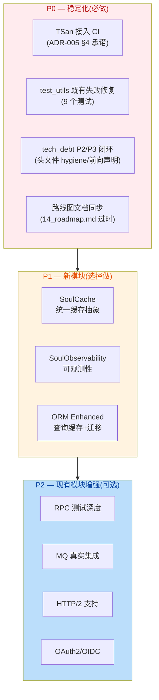
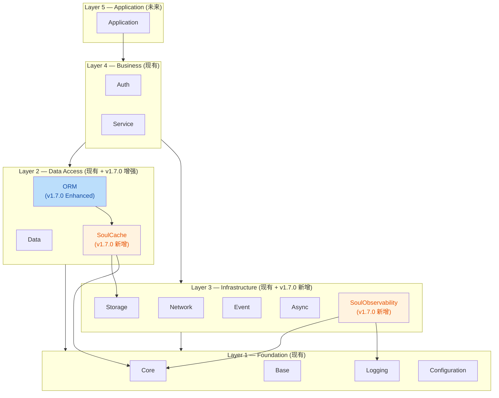
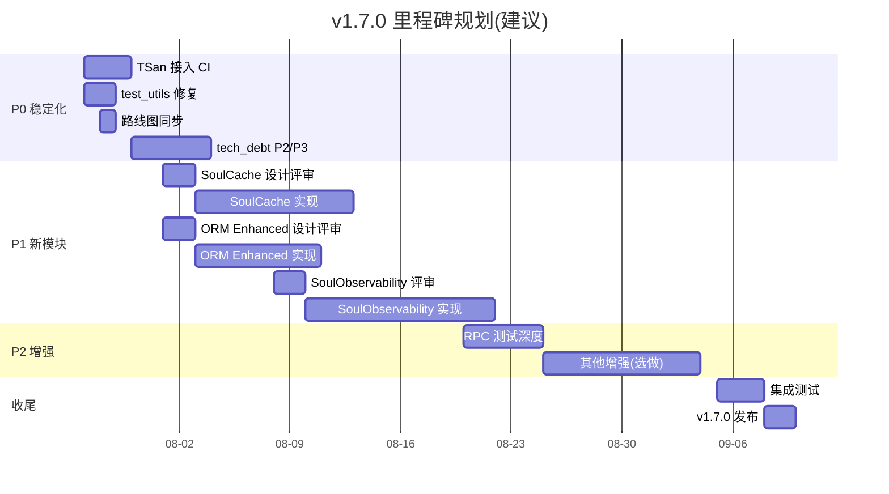

# SoulCoreKit v1.7.0 设计文档

**版本**: v1.7.0 (Released)
**起始日期**: 2026-07-26
**发布日期**: 2026-07-26
**前序基线**: v1.6.2 (工业级稳定,21/21 测试通过)
**目标状态**: 稳定加固 + 选择性引入新模块 + P2 MQ 真实集成
**发布策略**: 按范围发布(完成 P0+P1 后发布,无硬性时间盒)
**文档状态**: Released — 全部交付物已实现并通过验证

---

## 0. 文档结构

本目录包含 v1.7.0 迭代的全部设计文档:

| 文档 | 内容 | 状态 |
|------|------|------|
| `README.md`(本文档) | 总体规划、范围、里程碑、依赖图 | Released |
| `01_stabilization.md` | 稳定化工作(TSan/test_utils/tech_debt P2-P3) | Partial(部分延期到 v1.8.0) |
| `02_soul_cache_design.md` | SoulCache 缓存抽象模块设计 | Implemented |
| `03_soul_observability_design.md` | SoulObservability 可观测性模块设计 | Implemented |
| `04_orm_enhanced_design.md` | ORM Enhanced(查询缓存+迁移系统)设计 | Implemented |
| `05_existing_module_enhancements.md` | 现有模块增强(RPC/MQ/HTTP2/OAuth2) | Partial(MQ 已实现,其他延期) |
| `06_mq_real_integration_design.md` | MQ 真实集成设计(IAmqpBackend + 双后端) | Implemented |

---

## 1. 总体设计哲学

v1.7.0 遵循以下原则(与项目硬约束一致):

1. **稳定优先**: 任何新模块不得破坏 v1.6.x 已建立的工业级稳定基线
2. **最小侵入**: 新模块以独立库形式加入,不修改现有模块公共接口
3. **RFC 驱动**: 每个新模块必须先有设计文档,评审通过后方可实现
4. **5-10 年生命周期**: 所有设计决策考虑长期可维护性
5. **版本缓冲层**: 新模块保留 fallback 路径,允许渐进式迁移

---

## 2. v1.7.0 范围概览

### 2.1 范围分类

v1.7.0 工作项分为三大类,优先级递减:

### 2.2 范围决策矩阵

每个候选项按以下维度评估,辅助决策:

| 候选项 | 业务价值 | 技术风险 | 工作量 | 优先级建议 |
|--------|----------|----------|--------|------------|
| TSan 接入 CI | 高(防止并发回归) | 低(CI 配置) | 小 | **P0 必做** |
| test_utils 修复 | 中(测试可信度) | 低 | 小 | **P0 必做** |
| tech_debt P2/P3 | 低(预防性) | 低 | 中 | P0 选做 |
| 路线图同步 | 中(文档准确性) | 低 | 小 | **P0 必做** |
| SoulCache | 高(性能关键路径) | 中(新模块) | 大 | P1 推荐 |
| SoulObservability | 中(运维支撑) | 中(新模块) | 大 | P1 选做 |
| ORM Enhanced | 高(开发效率) | 中(改造现有) | 中 | P1 推荐 |
| RPC 测试深度 | 中(质量保证) | 低 | 中 | P2 选做 |
| MQ 真实集成 | 中(功能完整性) | 高(外部依赖) | 大 | P2 暂缓 |
| HTTP/2 | 低(性能优化) | 中(Qt 6.5 支持) | 中 | P2 暂缓 |
| OAuth2/OIDC | 中(安全合规) | 高(协议复杂) | 大 | P2 暂缓 |

---

## 3. 模块依赖关系图

v1.7.0 新增模块在现有 5 层架构中的位置:

**关键约束**:
- SoulCache 位于 Layer 2,可被 ORM 与业务层使用
- SoulObservability 位于 Layer 3,依赖 Logging 但不依赖 UI
- ORM Enhanced 改造现有 ORM 模块,公共接口保持向后兼容

---

## 4. 里程碑规划

### 4.1 里程碑时间线

### 4.2 里程碑验收标准

| 里程碑 | 验收标准 |
|--------|----------|
| M0 — P0 稳定化完成 | TSan 在 CI 运行零警告;test_utils 21/21 通过;路线图文档更新 |
| M1 — P1 新模块实现 | SoulCache/ORM Enhanced/SoulObservability 单元测试覆盖率 ≥ 80% |
| M2 — v1.7.0 发布 | 全量测试通过;ADR 合规性 100%;CHANGELOG 更新;版本号同步 |

---

## 5. 风险与缓解

| 风险 | 影响 | 缓解措施 |
|------|------|----------|
| SoulCache 设计复杂度超预期 | 推迟 M1 | 先实现内存缓存,磁盘/分布式缓存延后到 v1.7.1 |
| ORM Enhanced 改造破坏现有接口 | 回归风险 | 严格遵循向后兼容;新增方法而非修改现有方法 |
| TSan 暴露大量潜在竞争 | 阻塞 P0 | 仅标记明确的数据竞争,误报通过注解抑制 |
| SoulObservability 依赖外部库(metrics) | 引入第三方依赖 | 优先使用 Qt 内建能力;外部库通过 FetchContent 管理 |

---

## 6. 决策项(已确认)

以下决策项已确认,作为 v1.7.0 实现的输入:

1. **SoulCache 范围**: ✅ **仅内存 + 磁盘**(L1+L2) — 不引入 Redis 等分布式缓存,保持零外部依赖
2. **SoulObservability 范围**: ✅ **不引入 OpenTelemetry** — 自研轻量 Metrics/Tracing/JsonSink,降低耦合
3. **ORM Enhanced 迁移系统**: ✅ **纳入 v1.7.0** — 提供 `Migration`/`SchemaBuilder`/`MigrationManager`
4. **P2 增强项取舍**: ✅ **MQ 优先**(RabbitMQ) — HTTP/2 与 OAuth2/OIDC 延期到 v1.8.0
5. **v1.7.0 发布策略**: ✅ **按范围发布** — 完成 P0+P1 后发布,无时间盒压力

---

## 7. 文档评审流程

1. ~~团队成员阅读本文档及子文档~~(已完成)
2. ~~在评审会议上逐项确认第 6 节的待定决策~~(已确认)
3. ~~确定范围后,更新本文档状态为 `Accepted`~~(已完成)
4. 子文档按需细化,进入实现阶段
5. 实现过程中如发现设计缺陷,通过 ADR 流程修订

---

**文档作者**: SoulCoreKit 团队
**创建日期**: 2026-07-26
**确认日期**: 2026-07-26
**评审状态**: Accepted — 进入实现阶段
