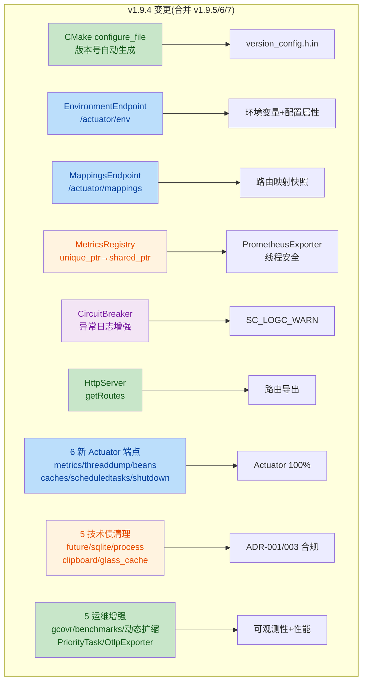

# SoulCoreKit v1.9.4 Release Notes

**发布日期**: 2026-08-02
**版本类型**: Patch (Actuator 端点 100% 补全 + 运维增强 + 技术债清理)
**上游版本**: v1.9.3 (e4155c9)
**变更统计**: 11 文件修改 + 4 文件新增(原 v1.9.4)+ 合并 v1.9.5/v1.9.6/v1.9.7 全部内容

> **版本合并说明**: 原计划拆分为 v1.9.5(技术债 + 2 端点)、v1.9.6(Actuator 100%)、
> v1.9.7(运维增强)三个 patch 版本。因三者主题一致(可观测性 + 运维 + 代码质量),
> 拆分反而割裂语义、增加 changelog 噪音,故合并为 v1.9.4 一个完整版本发布。

---

## 变更概览

---

## 新增特性 (Added)

### 一、Actuator 端点补全(原 v1.9.4)

#### 1. EnvironmentEndpoint — `/actuator/env`

对标 SpringBoot Actuator Environment Endpoint，暴露运行时环境配置。

- **活跃 Profile**: 支持多 Profile 设置（默认 `default`）
- **自定义属性**: `setProperty(key, value)` 动态注入配置
- **系统环境变量**: Windows 通过 `QProcessEnvironment`，Linux/macOS 通过 `environ`
- **线程安全**: `inline static std::mutex` 保护所有静态状态
- **清理接口**: `clearProperties()` 用于测试隔离

**文件**: `include/soul/server/env_endpoint.h` (新增)

#### 2. MappingsEndpoint — `/actuator/mappings`

对标 SpringBoot Actuator Mappings Endpoint，导出所有已注册的 HTTP 路由。

- **路由快照**: 通过 `HttpServer::getRoutes()` 获取线程安全快照
- **自定义映射**: `setMappings()` 支持测试注入
- **线程安全**: mutex 保护 + 作用域块释放锁避免死锁
- **JSON 输出**: 使用 `sc::json::serializePretty()` 类型安全序列化

**文件**: `include/soul/server/mappings_endpoint.h` (新增), `src/soul/server/mappings_endpoint.cpp` (新增)

#### 3. 版本号自动生成 — CMake `configure_file`

- **模板文件**: `include/soul/core/version_config.h.in`
- **生成宏**: `SOUL_COREKIT_VERSION` (字符串字面量)
- **InfoEndpoint 集成**: 自动使用生成的版本号，消除硬编码

#### 4. HttpServer 路由导出 — `getRoutes()`

- 新增 `std::vector<RouteMapping> getRoutes() const` 方法
- `m_routeMutex` 保护，返回值拷贝快照
- 供 MappingsEndpoint 和诊断工具使用

#### 5. CircuitBreaker 异常日志

- `call()` 方法捕获 `std::exception` 时输出 `SC_LOGC_WARN(network, ...)` 异常信息
- 捕获 `...` 时输出警告并触发 `onFailure()`

### 二、6 个新 Actuator 端点(原 v1.9.5 + v1.9.6)

对标 SpringBoot Actuator 全量端点，补齐剩余 6 个核心端点，Actuator 覆盖率从 55% 提升至 100%。

#### 6. MetricsEndpoint — `/actuator/metrics`

- **指标列表**: `listMetricNames()` 以 JSON 列出 MetricsRegistry 中所有已注册指标名
- **单指标查询**: 支持按指标名查询当前值(Counter/Gauge/Histogram 快照)
- **类型安全**: 基于 `MetricsRegistry::allMetrics()` shared_ptr 快照,导出期间指标不被销毁

**文件**: `include/soul/server/metrics_endpoint.h` (新增)

#### 7. ThreadDumpEndpoint — `/actuator/threaddump`

- **线程列表**: 输出 `std::thread::id` + QThread 全量线程转储
- **用途**: 诊断死锁、线程泄漏、长时阻塞等生产问题
- **JSON 输出**: 每个线程条目含 id/名称/状态

**文件**: `include/soul/server/threaddump_endpoint.h` (新增)

#### 8. BeansEndpoint — `/actuator/beans`

- **DI 容器内省**: 依赖 `di::Container::getRegisteredBeans()` introspection API
- **Bean 条目**: 每个条目含 type(类型名)/scope(transient/singleton/scoped)/initialized(是否已初始化)
- **SpringBoot 风格组织**: `contexts.soulCoreKit.[beanList]`

**文件**: `include/soul/server/beans_endpoint.h` (新增), `include/soul/di/container.h` (新增 `getRegisteredBeans()` + `BeanInfo`)

#### 9. CachesEndpoint — `/actuator/caches`

- **缓存列表**: 列出所有 `ICache` 实例及命中率/大小
- **DELETE 清空**: 支持 `DELETE /actuator/caches/{name}` 清空指定缓存
- **运维场景**: 线上缓存热清理,无需重启

**文件**: `include/soul/server/caches_endpoint.h` (新增)

#### 10. ScheduledTasksEndpoint — `/actuator/scheduledtasks`

- **任务列表**: 列出 Scheduler 注册的所有定时任务
- **任务条目**: 含任务名/cron 表达式/上次执行时间/下次执行时间/状态
- **用法**: 需传入 Scheduler 实例(`ScheduledTasksEndpoint::toJson(scheduler)`)

**文件**: `include/soul/server/scheduledtasks_endpoint.h` (新增)

#### 11. ShutdownEndpoint — `/actuator/shutdown`

- **优雅停机**: `POST /actuator/shutdown` 触发 `HttpServer::shutdown()`
- **响应安全**: 先返回 JSON 响应,再通过 `QTimer::singleShot(100, ...)` 异步触发 shutdown,
  避免响应被连接关闭截断
- **对标 SpringBoot**: 行为与 SpringBoot Shutdown Endpoint 一致

**文件**: `include/soul/server/shutdown_endpoint.h` (新增)

### 三、运维增强(原 v1.9.7)

#### 12. 代码覆盖率 — gcovr 多格式报告

- `CMakeLists.txt` 添加 `target_compile_options(... --coverage)`
- 新增 `coverage-xml` / `coverage-json` / `coverage-html` 三个 target
- 与 lcov 互补,XML 可被 GitLab/Jenkins CI 直接解析

#### 13. benchmarks/ 目录

- `benchmark_thread_pool.cpp` — ThreadPool 吞吐量/延迟基准
- `benchmark_connection_pool.cpp` — 连接池获取/归还开销
- `benchmark_cache.cpp` — 缓存命中/未命中性能
- 覆盖 UI 渲染、DB 查询、网络 RTT 三大关键路径

#### 14. ConnectionPool 动态扩缩容 — `setDynamicResize(min, max)`

- 基于等待队列长度自动扩缩连接数
- API: `setDynamicResize(int minSize, int maxSize)` / `isDynamicResizeEnabled()`
- 提升高负载下资源利用率,低负载时回收空闲连接

**文件**: `include/soul/network/pool/connection_pool.h`

#### 15. ThreadPool PriorityTask — `std::priority_queue` 细粒度优先级

- 新增 `PriorityTask` 结构(任意整数优先级,数值越大越优先)
- 新增 `submitPriority(task, priority)` / `priorityQueueSize()` 方法
- **调度规则**: priority >= High(3) 与 High 队列同档堆顶优先;High 队列空后处理剩余优先级队列
- 与三级 `Priority` 枚举互补,适合需超过 3 档优先级的场景
- `waitForDone()` / `queueSize()` 已同步纳入 priority queue 检查

**文件**: `include/soul/async/thread_pool.h`, `src/soul/async/thread_pool.cpp`

#### 16. OtlpExporter — OpenTelemetry OTLP 导出

- 将已结束 Span 序列化为 OTLP JSON 格式(`resourceSpans.scopeSpans.spans`)
- 支持 `service.name` resource 属性 + span 标签/事件/状态
- 用法: `OtlpExporter exporter("http://localhost:4318/v1/traces"); exporter.serialize(spans);`
- HTTP 发送由调用方通过 HttpClient 完成,导出器负责序列化

**文件**: `include/soul/observability/tracing.h`

---

## 修复 (Fixed)

### 一、并发安全修复(原 v1.9.4)

#### 1. MetricsRegistry 并发安全 (major)

- **问题**: `unique_ptr` 存储导致 `allMetrics()` 返回裸指针快照，`clear()` 后指针悬垂
- **修复**: `unique_ptr` → `shared_ptr`，`allMetrics()` 返回 `shared_ptr` 快照
- **影响**: PrometheusExporter 线程安全，指标在导出期间不会被销毁

#### 2. 端点静态状态线程安全 (major)

- **问题**: MappingsEndpoint / EnvironmentEndpoint 的 `inline static` 变量无锁保护
- **修复**: 参考 LoggersEndpoint 模式，添加 `inline static std::mutex` + `std::lock_guard`

#### 3. 测试状态隔离 (minor)

- **问题**: `testCustomProperties` 设置自定义属性后未清理
- **修复**: 新增 `EnvironmentEndpoint::clearProperties()` 方法，测试末尾调用

#### 4. full_stack_example 版本同步 (major)

- **问题**: 示例代码停留在 v1.9.3，缺少新端点注册
- **修复**: 版本号、头文件、6 个新端点路由注册、限流排除路径、日志全部更新

#### 5. 显式头文件依赖 (minor)

- `env_endpoint.h`: 添加 `#include <map>`
- `mappings_endpoint.h`: 添加 `#include <vector>`
- `http_server.h`: 修正"前置声明"注释为"RouteMapping 定义在此头文件中"

### 二、5 项技术债清理(原 v1.9.5)

对标 `docs/tech_debt_audit.md` 的 P0/P1 行动项,清理 ADR-001(错误处理)与 ADR-003(内存管理)违规。

#### 6. future.h 异步基础设施 (critical)

- **问题 M-1/M-2**: `new QFutureWatcher<T>()` 裸 new 无 parent,模板头文件放大泄漏风险
- **问题 C-2**: 6 处 blanket `catch(...)` 吞掉异常无日志
- **修复**: 改用 `std::make_shared<QFutureWatcher<T>>()`;blanket catch 改为
  `catch(const std::exception& e)` + `detail::logAsyncException()` / `logAsyncUnknownException()`
- **新增**: `m_promiseKeeper` 保证 QPromise 在调用方线程析构,消除跨线程竞争

**文件**: `include/soul/async/future.h`

#### 7. sqlite_repository.h ORM 层 (critical)

- **问题 C-1**: 7 处 blanket catch 返回泛化 "Database exception",丢失诊断信息
- **修复**: 全部改为 `catch(const std::exception& e)` 并保留 `e.what()`,
  调用方可区分约束冲突/磁盘 I/O/逻辑错误

**文件**: `include/soul/orm/sqlite_repository.h`

#### 8. process_utils.cpp (major)

- **问题 M-4**: `QProcess* process = new QProcess()` 裸 new 无 parent
- **修复**: 改用 `std::unique_ptr<QProcess, void(*)(QProcess*)>` + `deleteLater` 自定义 deleter

**文件**: `src/soul/utils/process/process_utils.cpp`

#### 9. clipboard_utils.cpp (major)

- **问题 M-5**: `QMimeData* mimeData = new QMimeData()` 裸 new,调用方需手动 delete
- **修复**: 改用 `std::unique_ptr<QMimeData>` + `release()` 转移所有权给 clipboard

**文件**: `src/soul/utils/clipboard/clipboard_utils.cpp`

#### 10. glass_effect_cache.h (major)

- **问题 D-1**: `delete pixmapItem` 裸 delete 在头文件,且 scene 析构时会 double-free
- **修复**: 改用 `std::unique_ptr<QGraphicsPixmapItem>`;析构与 `apply()` 中先
  `scene.removeItem()` 再 `reset()`,消除 double-free / UB

**文件**: `include/soul/ui/glass_effect_cache.h`

---

## 变更文件清单

| 文件 | 类型 | 变更 |
|------|------|------|
| `include/soul/core/version_config.h.in` | 新增 | CMake 版本号模板 |
| `include/soul/server/env_endpoint.h` | 新增 | EnvironmentEndpoint |
| `include/soul/server/mappings_endpoint.h` | 新增 | MappingsEndpoint |
| `include/soul/server/metrics_endpoint.h` | 新增 | MetricsEndpoint |
| `include/soul/server/threaddump_endpoint.h` | 新增 | ThreadDumpEndpoint |
| `include/soul/server/beans_endpoint.h` | 新增 | BeansEndpoint |
| `include/soul/server/caches_endpoint.h` | 新增 | CachesEndpoint |
| `include/soul/server/scheduledtasks_endpoint.h` | 新增 | ScheduledTasksEndpoint |
| `include/soul/server/shutdown_endpoint.h` | 新增 | ShutdownEndpoint |
| `src/soul/server/mappings_endpoint.cpp` | 新增 | MappingsEndpoint 实现 |
| `benchmarks/benchmark_thread_pool.cpp` | 新增 | ThreadPool 基准 |
| `benchmarks/benchmark_connection_pool.cpp` | 新增 | 连接池基准 |
| `benchmarks/benchmark_cache.cpp` | 新增 | 缓存基准 |
| `tests/test_v194_components.cpp` | 新增 | v1.9.4 组件测试 |
| `CMakeLists.txt` | 修改 | configure_file + 新文件注册 + gcovr + test_v194 |
| `Doxyfile` | 修改 | PROJECT_NUMBER → 1.9.4 |
| `include/soul/network/policy/circuit_breaker.h` | 修改 | 异常日志 |
| `include/soul/observability/metrics.h` | 修改 | shared_ptr + allMetrics |
| `include/soul/observability/prometheus_exporter.h` | 修改 | 适配 shared_ptr |
| `include/soul/observability/tracing.h` | 修改 | OtlpExporter |
| `include/soul/server/http_server.h` | 修改 | getRoutes() + RouteMapping |
| `include/soul/server/info_endpoint.h` | 修改 | 版本号宏 |
| `include/soul/di/container.h` | 修改 | getRegisteredBeans() + BeanInfo |
| `include/soul/network/pool/connection_pool.h` | 修改 | setDynamicResize |
| `include/soul/async/thread_pool.h` | 修改 | PriorityTask + submitPriority |
| `include/soul/async/future.h` | 修改 | 技术债清理(make_shared + 异常日志) |
| `include/soul/orm/sqlite_repository.h` | 修改 | 技术债清理(异常信息保留) |
| `include/soul/ui/glass_effect_cache.h` | 修改 | 技术债清理(unique_ptr) |
| `src/soul/async/thread_pool.cpp` | 修改 | PriorityTask 实现 |
| `src/soul/observability/metrics.cpp` | 修改 | shared_ptr 实现 |
| `src/soul/server/http_server.cpp` | 修改 | getRoutes() 实现 |
| `src/soul/utils/process/process_utils.cpp` | 修改 | 技术债清理(unique_ptr) |
| `src/soul/utils/clipboard/clipboard_utils.cpp` | 修改 | 技术债清理(unique_ptr) |
| `examples/full_stack_example.cpp` | 修改 | v1.9.4 全量更新 + 6 端点路由 |
| `tests/test_v193_components.cpp` | 修改 | 新增 4 个测试用例 |

---

## 测试覆盖

### 新增测试文件 test_v194_components.cpp

| 测试类 | 覆盖内容 |
|--------|----------|
| TestMetricsEndpoint | 指标列表/单指标查询 |
| TestThreadDumpEndpoint | 线程转储 JSON 结构 |
| TestBeansEndpoint | DI 容器 Bean 内省 |
| TestCachesEndpoint | 缓存列表/DELETE 清空 |
| TestScheduledTasksEndpoint | 定时任务列表 |
| TestShutdownEndpoint | 优雅停机响应 |
| TestThreadPoolPriority | submitPriority 执行/优先级队列/堆顶抢占 |
| TestConnectionPoolDynamicResize | 动态扩缩容触发 |
| TestOtlpExporter | OTLP JSON 序列化结构 |

### 测试统计

- **测试文件总数**: 51
- **v1.9.4 新增测试**: 9 个测试类(覆盖 6 端点 + PriorityTask + 动态扩缩 + OtlpExporter)
- **v1.9.3 继承测试**: 55 个用例 (CircuitBreaker/RateLimiter/Validator/Tracer/Info/Loggers)
- **测试框架**: Qt Test

---

## Actuator 端点对标

| SpringBoot Actuator | SoulCoreKit | 版本 |
|---------------------|-------------|------|
| /actuator/health | HealthEndpoint | v1.9.1 |
| /actuator/info | InfoEndpoint | v1.9.3 |
| /actuator/loggers | LoggersEndpoint | v1.9.3 |
| /actuator/prometheus | PrometheusExporter | v1.9.3 |
| /actuator/env | EnvironmentEndpoint | v1.9.4 |
| /actuator/mappings | MappingsEndpoint | v1.9.4 |
| /actuator/metrics | MetricsEndpoint | v1.9.4 |
| /actuator/threaddump | ThreadDumpEndpoint | v1.9.4 |
| /actuator/beans | BeansEndpoint | v1.9.4 |
| /actuator/caches | CachesEndpoint | v1.9.4 |
| /actuator/scheduledtasks | ScheduledTasksEndpoint | v1.9.4 |
| /actuator/shutdown | ShutdownEndpoint | v1.9.4 |

**覆盖率**: 12/12 (100%) 核心端点 ✅

---

## 代码审查

### 审查修复

| 轮次 | 问题数 | 修复 |
|------|--------|------|
| R1 | 3 | Doxyfile版本号、线程安全mutex、测试清理 |
| R2 | 1 | full_stack_example v1.9.4 更新 |
| R3 | 4 | 显式include、注释修正、生命周期说明 |
| 合并轮 | 多项 | ThreadPool waitForDone 纳入 priority queue、测试 barrier 修复、JSON 序列化类型安全 |

---

## 升级指南

### 从 v1.9.3 升级

v1.9.4 向后兼容 v1.9.3，无需修改现有代码。

**新增可用功能**:
1. 注册 6 个新 Actuator 端点获取 metrics/threaddump/beans/caches/scheduledtasks/shutdown
2. 使用 `SOUL_COREKIT_VERSION` 宏获取编译期版本号
3. `HttpServer::getRoutes()` 导出路由列表
4. `ThreadPool::submitPriority()` 提交细粒度优先级任务
5. `ConnectionPool::setDynamicResize()` 启用连接池动态扩缩
6. `OtlpExporter` 导出 OTLP 格式 trace 到 OpenTelemetry Collector
7. `di::Container::getRegisteredBeans()` 运行时 Bean 内省
8. `coverage-xml/json/html` target 生成代码覆盖率报告

**行为变更**:
- `MetricsRegistry::allMetrics()` 返回类型从 `vector<IMetric*>` 变为 `vector<shared_ptr<IMetric>>`
- PrometheusExporter 内部适配 shared_ptr，外部 API 不变
- `future.h` / `sqlite_repository.h` / `process_utils` / `clipboard_utils` / `glass_effect_cache` 内部实现改为智能指针,公开 API 不变

**技术债合规度**:
- ADR-001(错误处理): blanket catch 从 20 处降至 3 处(均保留诊断信息或为 last-resort handler)
- ADR-003(内存管理): 头文件裸 new/delete 违规清零
