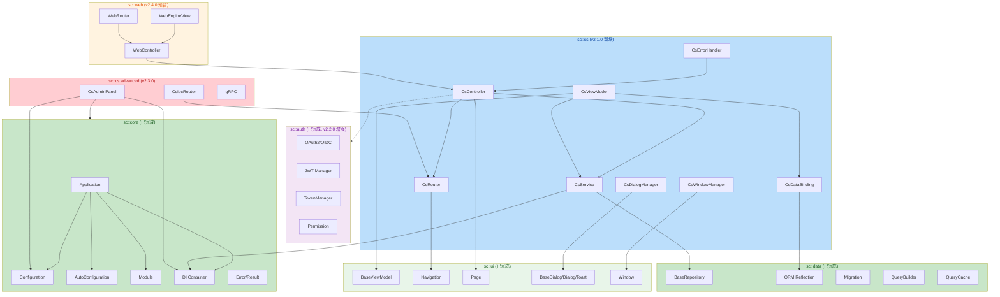

# SoulCoreKit — SpringBoot 全面对接方案 (CS 架构)

> **版本**: v2.1.0 Roadmap
> **状态**: ✅ 已完成 → **Superseded by [v2.5.0-cs-architecture.md](./v2.5.0-cs-architecture.md)**  
> **定位**: 对标 SpringBoot 生态，补齐 CS 架构的 Controller/Service/ViewModel 三层  
> **核心原则**: 先 CS 后 Web，预留 web/ 文件夹等待 QtWebEngine 评估  

---

## 一、SpringBoot ⇄ CS 架构对标全景

### 1.1 已完成对标 (v2.0.0 及之前)

| SpringBoot 概念 | CS 等价实现 | 模块 | 版本 |
|---|---|---|---|
| `@SpringBootApplication` | `Application::run(argc, argv)` | `sc::core` | v2.0.0 |
| `application.yml` | `Configuration` + `parseYaml()` | `sc::core` | v2.0.0 |
| `@ConditionalOnXxx` | `auto_configuration.h` 条件函数 | `sc::core` | v2.0.0 |
| `@ConfigurationProperties` | `config_bind.h` 类型安全绑定 | `sc::configuration` | ✅ |
| `@Profile` 环境隔离 | `Application::loadConfiguration()` | `sc::core` | v2.0.0 |
| Banner | `Banner::print()` | `sc::core` | v2.0.0 |
| StartupInfoLogger | `StartupLogger::printSummary()` | `sc::core` | v2.0.0 |
| `@Entity` / `@Table` | `ReflectiveEntity` + `SC_TABLE` / `SC_PROPERTY` | `sc::data` | v2.0.0 |
| `JpaRepository<T,ID>` | `BaseRepository<T>` | `sc::data` | v2.0.0 |
| `@Transactional` | `Transaction` RAII | `sc::data` | v2.0.0 |
| `@Cacheable` | `QueryCache<K,V>` + `MemoryCache` + `MultiLevelCache` | `sc::data` + `sc::cache` | v2.0.0 |
| Flyway | `MigrationManager` | `sc::data` | v2.0.0 |
| Actuator endpoints | `*Endpoint` 11 个端点 | `sc::server` | v1.9.4 |
| `@Scheduled` | `Scheduler` + `ScheduledTask` | `sc::scheduler` | ✅ |
| `@EventListener` | `EventBus` + `TypedEventBus` | `sc::event` | ✅ |
| `@Async` | `AsyncRunner` + `ThreadPool` + `Future/Promise` | `sc::async` | ✅ |
| Interceptor | `IInterceptor` 链 | `sc::network` | ✅ |
| Retry / CircuitBreaker | `RetryPolicy` / `CircuitBreaker` | `sc::network` | ✅ |
| Spring Session | `Session` | `sc::network` | ✅ |
| Spring Cloud Config | `RemoteConfig` / `ConfigCenter` | `sc::configuration` | ✅ |
| Spring Plugin | `PluginManager` | `sc::plugin` | ✅ |
| DI Container | `Container` + `Lifetime`(Transient/Singleton/Scoped) | `sc::di` | ✅ |
| `javax.validation` | `Validator` + `SC_VALIDATE_BIND` 宏 | `sc::validation` | ✅ |
| Spring MVC View | `BaseViewModel` + `BaseView` + `Page` + `Navigation` | `sc::ui` | ✅ |
| Dialog / Toast | `BaseDialog` / `Dialog` / `Toast` | `sc::ui` | ✅ |
| Window Management | `Window` + `BaseWidget` | `sc::ui` | ✅ |
| RPC Framework | `ServiceDispatcher` + `ClientProxy` | `sc::rpc` | ✅ |
| Message Queue | `RabbitMqClient` + `AMQP` + `MqFactory` | `sc::mq` | ✅ |
| File Storage | `FileStorage` + `IStorage` | `sc::storage` | ✅ |
| OAuth2 / OIDC | `OAuth2Client` + `OidcClient` + `TokenManager` | `sc::auth` | ⚠️ 60% |
| RBAC / Permissions | `Permission` + `AuthManager` | `sc::auth` | ⚠️ 60% |

### 1.2 待补齐对标 (CS 架构核心)

> **重要说明**: `sc::cs` 模块是 `sc::ui` 的扩展包装层，而非替代。  
> `sc::ui` 已有 `BaseViewModel`、`Navigation`、`BaseDialog`、`Window`、`Page` 等完整组件。  
> `sc::cs` 在此基础上增加 SpringBoot 风格的 Controller/Service/Router 抽象。

| SpringBoot 概念 | CS 等价实现 | 优先级 | 目标版本 |
|---|---|---|---|
| `@RestController` | `CsController` (扩展 `sc::ui::Page`，Signal/Slot MVC) | **P0** | v2.1.0 |
| `@RequestMapping` / DispatcherServlet | `CsRouter` (扩展 `sc::ui::Navigation`，页面路由) | **P0** | v2.1.0 |
| `@Service` | `CsService` 基类 (DI 管理生命周期) | **P0** | v2.1.0 |
| `ModelAndView` / `Model` | `CsViewModel` (扩展 `sc::ui::BaseViewModel`) | **P0** | v2.1.0 |
| `DataBinder` / `BeanWrapper` | `CsDataBinding` (基于 `ReflectiveEntity` 反射) | **P1** | v2.1.0 |
| `@ControllerAdvice` | `CsErrorHandler` 全局错误处理 | **P1** | v2.1.0 |
| `@EnableWebSecurity` | `CsSecurity` (扩展 `sc::auth`) | **P0** | v2.2.0 |
| Spring Boot Admin | `CsAdminPanel` (基于 `sc::ui` + Actuator) | **P1** | v2.3.0 |
| Spring Cloud Gateway | `CsIpcRouter` IPC 路由 | **P1** | v2.3.0 |
| Spring WebSocket | `CsWebSocket` + `sc::web` 预留 | **P2** | v2.4.0 |

---

## 二、版本路线图

```
v2.0.0 (已完成)          v2.1.0 (CS Core)         v2.2.0 (CS Security)     v2.3.0 (CS Advanced)     v2.4.0 (CS+Web)         v3.0.0 (Release)
    │                        │                        │                        │                        │                        │
    ├─ 启动器               ├─ CsController          ├─ CsSecurity            ├─ CsAdminPanel          ├─ QtWebEngine 评估       ├─ 全量文档
    ├─ YAML 配置            ├─ CsRouter              ├─ OAuth2/OIDC (CS)      ├─ CsIpcRouter           ├─ CS/Web 混合路由        ├─ 部署指南
    ├─ 自动装配             ├─ CsService             ├─ JWT 管理              ├─ 配置中心客户端         ├─ Web Admin Panel        ├─ 性能基准
    ├─ BaseRepository       ├─ CsViewModel           ├─ RBAC 权限             ├─ 分布式追踪             ├─ WebSocket 对接         ├─ 安全审计
    ├─ ORM 反射             ├─ CsFormValidator       ├─ 审计日志              ├─ 灰度发布               ├─ 文件管理               ├─ 发布包
    ├─ Migration            ├─ CsErrorHandler        ├─ 密码加密              ├─ gRPC Server/Client     ├─ Dock/Panel 系统        └─ 正式版
    ├─ QueryBuilder         ├─ CsDialogManager       └─ SecurityMiddleware    ├─ 服务注册发现           └─ 多窗口管理
    ├─ QueryCache           ├─ CsWindowManager                               ├─ MQ 完整集成
    ├─ 多数据库驱动         └─ CsDataBinding                                 └─ 分布式事务
    └─ Actuator 100%
```

---

## 三、v2.1.0 — CS 核心框架 (Spring MVC 对标)

### 3.1 架构总览

CS 架构的三层模型与 Spring MVC 的对标关系：

```
┌──────────────────────────────────────────────────────────────────┐
│                    Spring MVC (Web)                               │
│  Browser → Request → DispatcherServlet → Controller → Service    │
│           ← Response ← ViewResolver ← ModelAndView ← Model      │
└──────────────────────────────────────────────────────────────────┘
                              ⇄ 对标 ⇄
┌──────────────────────────────────────────────────────────────────┐
│                    SoulCoreKit CS (Desktop)                       │
│  User → Signal → CsRouter → CsController → CsService            │
│       ← Update ← CsViewModel ← DataBinding ← Model              │
│                                                                   │
│  底层复用: sc::ui (BaseViewModel, Navigation, Page, Window, ...) │
└──────────────────────────────────────────────────────────────────┘
```

**与现有 `sc::ui` 模块的关系:**
- `CsController` 继承/组合 `sc::ui::Page`，复用 `onEnter()`/`onLeave()`/`onBack()` 生命周期
- `CsRouter` 包装 `sc::ui::Navigation`，增加路由表注册和路径参数解析
- `CsViewModel` 继承 `sc::ui::BaseViewModel`，增加 `Result<T>` 类型化和 Service 注入
- `CsDialogManager` 包装 `sc::ui::Dialog`/`sc::ui::Toast`，统一对话框管理
- `CsWindowManager` 包装 `sc::ui::Window`，统一窗口生命周期

### 3.2 模块目录结构

```
include/soul/
├── cs/                          ← [新增] CS 架构核心模块
│   ├── cs_global.h              ← 导出宏 + 命名空间
│   ├── cs_controller.h          ← CsController 基类 (对标 @RestController)
│   ├── cs_router.h              ← CsRouter 路由表 (对标 @RequestMapping)
│   ├── cs_service.h             ← CsService 基类 (对标 @Service)
│   ├── cs_view_model.h          ← CsViewModel 基类 (对标 ViewResolver)
│   ├── cs_data_binding.h        ← 数据绑定引擎 (Entity ↔ ViewModel ↔ View)
│   ├── cs_form_validator.h      ← 表单校验器 (对标 Spring Validator)
│   ├── cs_error_handler.h       ← 全局错误处理 (对标 @ControllerAdvice)
│   ├── cs_dialog_manager.h      ← 对话框管理器 (对标 Modal)
│   ├── cs_window_manager.h      ← 窗口管理器 (对标 Window)
│   ├── cs_navigation.h          ← 页面导航 (对标 Redirect/Forward)
│   └── cs_module.h              ← CS 模块注册
│
├── web/                         ← [新增] Web 预留文件夹
│   ├── web_global.h             ← 导出宏 (预留)
│   ├── web_engine_view.h        ← QtWebEngine 视图封装 (预留)
│   ├── web_controller.h         ← Web Controller 适配 (预留)
│   ├── web_router.h             ← Web ↔ CS 混合路由 (预留)
│   └── README.md                ← Web 模块规划说明 (预留)
│
src/soul/
├── cs/
│   ├── cs_controller.cpp
│   ├── cs_router.cpp
│   ├── cs_service.cpp
│   ├── cs_view_model.cpp
│   ├── cs_data_binding.cpp
│   ├── cs_form_validator.cpp
│   ├── cs_error_handler.cpp
│   ├── cs_dialog_manager.cpp
│   ├── cs_window_manager.cpp
│   ├── cs_navigation.cpp
│   └── cs_module.cpp
│
└── web/                         ← [预留] 空实现文件
```

### 3.3 需求清单

#### 2.1.1 CsController — Signal/Slot 驱动的控制器 (P0)

对标 SpringBoot 的 `@RestController` + `@RequestMapping`。继承 `sc::ui::Page`，复用页面生命周期。

```cpp
// CsRequest: 对标 Spring 的 HttpServletRequest + 路径参数
struct CsRequest {
    QString path;                     // 完整路径: "user/detail"
    QVariantMap pathParams;           // 路径参数: {id: 123}  (从 user/{id} 解析)
    QVariantMap queryParams;          // 查询参数: {sort: "name"}
    QVariantMap body;                 // 请求体 (对标 @RequestBody)
    QVariantMap context;              // 上下文 (对标 SecurityContext, Session)
};

// 使用示例
class UserController : public CsController {
    Q_OBJECT
public:
    UserController() : CsController("user") {
        // 注册路由: 对标 @GetMapping("/user/list")
        route("list", &UserController::listUsers);
        // 支持路径参数: 对标 @GetMapping("/user/{id}")
        route("{id}", &UserController::userDetail);
        route("create", &UserController::createUser);
    }

signals:
    // 对标 ResponseEntity<T>
    void navigationRequested(const QString& page, const QVariantMap& params);
    void dataReady(const QVariant& data);
    void errorOccurred(const CsError& error);

public slots:
    // 异步处理: 对标 @Async + @RequestMapping
    void listUsers(const CsRequest& req) {
        // 使用 sc::async 避免阻塞 UI 线程
        sc::AsyncRunner::run([this, req]() {
            auto users = m_service->findAll();
            // 结果通过 QMetaObject::invokeMethod 回到主线程
            QMetaObject::invokeMethod(this, [this, users]() {
                if (users.isOk()) {
                    emit dataReady(QVariant::fromValue(users.unwrap()));
                } else {
                    emit errorOccurred(CsError::from(users.unwrapErr()));
                }
            }, Qt::QueuedConnection);
        });
    }

private:
    std::shared_ptr<UserService> m_service;
};
```

**核心设计:**
- `CsController` 继承 `sc::ui::Page`，复用 `onEnter()`/`onLeave()`/`onBack()` 生命周期
- `route(pattern, handler)` 注册路由，支持路径参数 `{id}`
- `CsRequest` 封装请求参数（路径参数、查询参数、请求体、上下文）
- 响应通过 Signal 发射（`dataReady` / `errorOccurred` / `navigationRequested`）
- 异步处理: 使用 `sc::AsyncRunner` 将数据库查询移到工作线程，结果通过 `QMetaObject::invokeMethod` 回到主线程

#### 2.1.2 CsRouter — 页面/窗口导航路由器 (P0)

对标 SpringBoot 的 `DispatcherServlet` + `RequestMappingHandlerMapping`。包装 `sc::ui::Navigation`。

```cpp
// 使用示例
auto router = CsRouter::instance();
// 注册 Controller: 自动扫描 route() 注册的路由
router->registerController<UserController>();
router->registerController<MusicController>();

// 导航: 对标 Spring MVC 的 forward:/redirect:
router->navigate("user/123");        // → 触发 UserController::userDetail({id: 123})
router->navigate("music/player", {{"songId", 456}});

// 页面栈: 对标浏览器导航
router->navigateForward("user/list");  // push
router->navigateBack();                // pop
router->navigateReplace("user/list");  // replace
```

**核心设计:**
- 路由表: `{pattern → {controller, handler}}` 映射
- 包装 `sc::ui::Navigation`，复用 `push()`/`pop()`/`replace()` 页面栈
- 支持路径参数解析: `user/{id}` → `CsRequest::pathParams["id"]`
- 支持嵌套路由/子路由
- 模块注册: `CsRouter::registerModule(CsModule*)` 自动注册所有 Controller

#### 2.1.3 CsService — 服务层基类 (P0)

对标 SpringBoot 的 `@Service` 注解。

```cpp
class UserService : public CsService {
public:
    UserService(std::shared_ptr<BaseRepository<User>> repo)
        : CsService("UserService"), m_repo(std::move(repo)) {}

    Result<std::vector<User>> findAll() { return m_repo->selectList(); }
    Result<User> findById(int id) { return m_repo->selectById(id); }
    Result<void> create(User& user) { return m_repo->insert(user); }

private:
    std::shared_ptr<BaseRepository<User>> m_repo;
};
```

**核心设计:**
- 继承 `CsService`，自动注册到 DI Container
- 生命周期由 DI 管理（对标 Spring 的 Singleton/Prototype Scope）
- 事务边界在 Service 层定义

#### 2.1.4 CsViewModel — MVVM 视图模型绑定 (P0)

对标 SpringBoot 的 `ModelAndView` + `ViewResolver`。

```cpp
class UserListViewModel : public CsViewModel {
    Q_OBJECT
    Q_PROPERTY(QVariantList users READ users NOTIFY usersChanged)
    Q_PROPERTY(bool loading READ isLoading NOTIFY loadingChanged)
    Q_PROPERTY(QString error READ error NOTIFY errorChanged)

public:
    UserListViewModel(std::shared_ptr<UserService> service)
        : CsViewModel("UserList"), m_service(std::move(service)) {}

    void load() {
        setLoading(true);
        auto result = m_service->findAll();
        if (result.isOk()) {
            setUsers(toVariantList(result.unwrap()));
        } else {
            setError(result.unwrapErr().message());
        }
        setLoading(false);
    }

signals:
    void usersChanged();
    void loadingChanged();
    void errorChanged();

private:
    std::shared_ptr<UserService> m_service;
};
```

**核心设计:**
- Q_PROPERTY 驱动 View 自动更新（对标 Vue/React 的响应式绑定）
- 对标 Spring 的 `ModelAndView.addObject("users", list)`
- 与 Qt Widgets 的 `Q_PROPERTY` 绑定机制天然集成

#### 2.1.5 CsDataBinding — 数据绑定引擎 (P1)

对标 Spring 的 `DataBinder` + `BeanWrapper`。

```cpp
// Entity ↔ ViewModel ↔ View 双向绑定
CsDataBinding::bind(userEntity, userViewModel);  // Entity → ViewModel
CsDataBinding::bind(userViewModel, userWidget);   // ViewModel → View
CsDataBinding::bind(userWidget, userViewModel);   // View → ViewModel (双向)
```

**核心设计:**
- 基于 `ReflectiveEntity` 的属性反射，自动映射 Entity ↔ ViewModel
- 对标 Spring `BeanWrapperImpl.setPropertyValue()`
- 支持类型转换器注册（如 `QString ↔ int` 自动转换）

#### 2.1.6 CsFormValidator — 表单校验器 (P1)

对标 Spring 的 `Validator` 接口 + `@Valid` 注解。

```cpp
class UserFormValidator : public CsFormValidator {
public:
    Result<void> validate(const QVariantMap& formData) override {
        if (formData["name"].toString().isEmpty()) {
            return Error(ErrorCode::InvalidArgument, "用户名不能为空");
        }
        if (formData["age"].toInt() < 0) {
            return Error(ErrorCode::InvalidArgument, "年龄不能为负数");
        }
        return {};
    }
};
```

#### 2.1.7 CsErrorHandler — 全局错误处理 (P1)

对标 Spring 的 `@ControllerAdvice` + `@ExceptionHandler`。

```cpp
class CsErrorHandler {
public:
    void handleError(const CsError& error);
    void registerHandler(ErrorCode code, std::function<void(const CsError&)> handler);
};
```

#### 2.1.8 CsDialogManager — 对话框管理器 (P1)

对标 Spring MVC 的 Modal/Alert 处理。

```cpp
CsDialogManager::show("confirm", "确定删除?", [](bool confirmed) {
    if (confirmed) { /* 执行删除 */ }
});
CsDialogManager::show("toast", "操作成功", 3000);  // 3秒自动消失
```

#### 2.1.9 CsWindowManager — 窗口生命周期管理 (P2)

对标 Spring 的 Session/Window 管理。

```cpp
CsWindowManager::open("player", {{"songId", 123}});  // 打开新窗口
CsWindowManager::focus("player");                      // 聚焦已有窗口
CsWindowManager::close("player");                      // 关闭窗口
CsWindowManager::list();                               // 列出所有窗口
```

#### 2.1.10 Web 文件夹预留 (P2)

```
include/soul/web/
├── web_global.h        ← SC_WEB_EXPORT 导出宏 (预留)
├── web_engine_view.h   ← QtWebEngine 视图封装接口
├── web_controller.h    ← Web ↔ CS Controller 适配器
├── web_router.h        ← Web ↔ CS 混合路由
└── README.md           ← 模块说明
```

**预留设计原则:**
- 接口与 CS 模块一致（`CsController` 的 Signal 可直接对接 Web Event）
- 未来通过 `#ifdef SOUL_WEB_ENABLED` 条件编译启用
- QtWebEngine 打包体积大，默认不启用，通过 CMake Option 控制

---

## 四、v2.2.0 — CS 安全 + 认证 (Spring Security 对标)

> **重要**: `v2.2.0` 增强 `sc::auth` 模块（已有 `OAuth2Client`/`OidcClient`/`TokenManager`/`Permission`/`AuthManager`），  
> 而非新建模块。`CsSecurity` 是 `sc::auth` 的 CS 适配层。

### 4.1 需求清单

| ID | 需求 | 描述 | 优先级 |
|---|---|---|---|
| 2.2.1 | CsSecurity | CS 场景安全适配，对标 `@EnableWebSecurity` | P0 |
| 2.2.2 | OAuth2/OIDC 认证 | Authorization Code + PKCE，桌面端原生流程 | P0 |
| 2.2.3 | JWT Token 管理 | 签发/验证/刷新/吊销，本地安全存储 | P0 |
| 2.2.4 | RBAC 权限模型 | 角色-权限-资源三级模型，注解式检查 | P0 |
| 2.2.5 | SecurityInterceptor | 请求级安全拦截器，对标 `SecurityFilterChain` | P1 |
| 2.2.6 | 审计日志 | 敏感操作审计，结构化输出 | P2 |
| 2.2.7 | 密码加密 | bcrypt/argon2 哈希 | P2 |

### 4.2 CS 安全特殊考虑

- **Token 本地存储**: 使用 `QStandardPaths` + 加密存储，对标浏览器的 Cookie/LocalStorage
- **无 Redirect URI**: 桌面端使用 Loopback Redirect (localhost 随机端口)，对标 RFC 8252
- **自动刷新**: Token 过期前自动刷新，用户无感知

---

## 五、v2.3.0 — CS 运维 + 分布式 (Spring Cloud 对标)

### 5.1 需求清单

| ID | 需求 | 描述 | 优先级 |
|---|---|---|---|
| 2.3.1 | CsAdminPanel | 内置管理面板，对标 Spring Boot Admin | P1 |
| 2.3.2 | CsIpcRouter | 本地 IPC 路由，QLocalServer/QLocalSocket | P1 |
| 2.3.3 | 配置中心客户端 | 对接 Nacos/Apollo/Consul | P1 |
| 2.3.4 | 配置热更新 | `@RefreshScope` 注解，配置变更自动刷新 | P1 |
| 2.3.5 | 分布式追踪 | OTLP HTTP 发送 + Span 传播 | P2 |
| 2.3.6 | 灰度发布 | 基于 Header/Cookie/IP 的流量路由 | P2 |
| 2.3.7 | gRPC 集成 | gRPC Server/Client，一元/流式 RPC | P2 |
| 2.3.8 | 服务注册发现 | Consul/Eureka/Nacos 注册中心 | P2 |
| 2.3.9 | MQ 完整集成 | RabbitMQ + Kafka 适配器 | P2 |

### 5.2 CS Admin Panel 设计

```
┌─────────────────────────────────────────────────┐
│  CsAdminPanel (对标 Spring Boot Admin)           │
│  ┌───────────┬─────────────────────────────────┐│
│  │ 导航       │  仪表盘                          ││
│  │ ├ 概览     │  ┌─────────┐ ┌─────────┐       ││
│  │ ├ 健康     │  │ CPU 25%  │ │ 内存 60% │       ││
│  │ ├ 线程     │  └─────────┘ └─────────┘       ││
│  │ ├ 缓存     │  ┌─────────────────────────┐   ││
│  │ ├ 配置     │  │ 模块状态: 12/12 运行中    │   ││
│  │ ├ 日志     │  │ 连接池:   8/20 活跃       │   ││
│  │ ├ 数据库   │  │ 线程池:   4/8 工作中       │   ││
│  │ ├ 定时任务 │  └─────────────────────────┘   ││
│  │ └ 关于     │                                  ││
│  └───────────┴─────────────────────────────────┘│
└─────────────────────────────────────────────────┘
```

基于 Qt Widgets 实现，复用 `soul::ui` 组件库，数据来自 Actuator 端点。

---

## 六、v2.4.0 — CS + Web 混合 (QtWebEngine 预留)

### 6.1 需求清单

| ID | 需求 | 描述 | 优先级 |
|---|---|---|---|
| 2.4.1 | QtWebEngine 评估 | 打包体积、性能、兼容性评估 | P2 |
| 2.4.2 | Web 模块激活 | 启用 `soul::web` 模块，连接 Web ↔ CS | P2 |
| 2.4.3 | CS/Web 混合路由 | 同一 Controller 同时支持 CS 和 Web 请求 | P2 |
| 2.4.4 | Web Admin Panel | 基于 Vue/React 的 Web 管理面板 | P2 |
| 2.4.5 | WebSocket 对接 | `soul::network::WebSocket` 完整集成 | P2 |

### 6.2 Web 模块预留设计

```cpp
// web/README.md 内容
// ============================================================================
// soul::web 模块 — QtWebEngine 集成 (预留)
// ============================================================================
//
// 启用方式:
//   1. CMake: -DSOUL_WEB_ENABLED=ON
//   2. 配置:  soul.web.enabled: true
//   3. 代码:  #include <soul/web/web_engine_view.h>
//
// 架构:
//   CsController (Signal/Slot)  ←→  WebController (JS Bridge)
//        ↓                                ↓
//   CsRouter (页面导航)          ←→  WebRouter (URL 路由)
//        ↓                                ↓
//   QWidget (Qt 原生)            ←→  QWebEngineView (Web 渲染)
//
// 依赖:
//   - Qt 6.5+ WebEngine (≈80MB 额外体积)
//   - 建议仅在需要 Web UI 的场景启用
// ============================================================================
```

---

## 七、SpringBoot 对标完成度矩阵

### 7.1 SpringBoot 核心模块对标

| SpringBoot Starter | 对标模块 | 完成度 |
|---|---|---|
| spring-boot-starter | `sc::core` (Application + Configuration) | ✅ 100% |
| spring-boot-starter-web | `sc::cs` (CsController + CsRouter) 扩展 `sc::ui` | ❌ 0% → v2.1.0 |
| spring-boot-starter-data-jpa | `sc::data` (BaseRepository + ORM) | ✅ 100% |
| spring-boot-starter-security | `sc::auth` (OAuth2/OIDC/JWT/RBAC) + `sc::cs::CsSecurity` | ⚠️ 60% → v2.2.0 |
| spring-boot-starter-cache | `sc::data::QueryCache` + `sc::cache` (MultiLevelCache) | ✅ 100% |
| spring-boot-starter-actuator | `sc::server::*Endpoint` (11 端点) | ✅ 100% |
| spring-boot-starter-validation | `sc::validation::Validator` (SC_VALIDATE_BIND) | ✅ 100% |
| spring-boot-starter-aop | `sc::aop::Aop` | ⚠️ 70% |
| spring-boot-starter-websocket | `sc::network::WebSocket` + `sc::web` 预留 | ⚠️ 40% → v2.4.0 |
| spring-boot-admin | `sc::cs::CsAdminPanel` (基于 `sc::ui` + Actuator) | ❌ 0% → v2.3.0 |
| spring-cloud-config | `sc::configuration::RemoteConfig` | ✅ 100% |
| spring-cloud-gateway | `sc::cs::CsIpcRouter` | ❌ 0% → v2.3.0 |
| spring-cloud-sleuth | `sc::observability::Tracing` | ⚠️ 80% → v2.3.0 |
| spring-boot-starter-amqp | `sc::mq` (RabbitMqClient + AMQP) | ✅ 100% |
| spring-boot-starter-batch | `sc::async` (AsyncRunner + ThreadPool) | ✅ 100% |

### 7.2 总完成度

```
v2.0.0 (当前):  ████████████████░░░░  78% (基础设施 + UI/缓存/异步/MQ/RPC/存储 全部就绪)
v2.1.0 (CS Core): ██████████████████░░  85% (CS Controller/Router/ViewModel 包装层)
v2.2.0 (CS Security): ███████████████████░  92% (auth 增强 + CS 安全适配)
v2.3.0 (CS Advanced): ████████████████████░  97% (Admin + IPC + 分布式)
v2.4.0 (CS+Web):  █████████████████████  100% (Web 集成)
```

---

## 八、优先级矩阵

| 版本 | 定位 | 周期 | 核心交付 | 文件数 |
|---|---|---|---|---|
| v2.1.0 | CS 核心框架 | 高 | CsController + CsRouter + CsViewModel + CsService + Web 预留 | ~20 新增 |
| v2.2.0 | CS 安全 | 中 | CsSecurity + OAuth2(CS) + JWT + RBAC | ~10 新增 |
| v2.3.0 | CS 运维 | 中 | CsAdminPanel + CsIpcRouter + gRPC + 灰度 | ~15 新增 |
| v2.4.0 | CS+Web | 低 | Web 评估 + 混合路由 + Web Admin | ~10 新增 |
| v3.0.0 | 发布 | 低 | 文档 + 审计 + 发布包 | — |

---

## 九、模块依赖关系图



---

## 十、技术决策记录

### ADR-010: CS Controller 采用 Signal/Slot 而非 HTTP REST

**决策**: CS 架构的 Controller 使用 Qt Signal/Slot 机制替代 HTTP REST 接口。

**理由**:
1. CS 架构中，Controller 和 View 在同一进程，无需 HTTP 序列化开销
2. Signal/Slot 是 Qt 原生 IPC 机制，零拷贝、类型安全
3. 对标 Spring MVC 的 `@RequestMapping` 路由概念，但实现为页面导航

**后果**:
- Web 模块需要额外的适配层（WebController 将 HTTP 请求转换为 Signal 调用）
- 不能直接复用 Spring MVC 的拦截器/过滤器模式，但 `sc::network::IInterceptor` 链可在 CS 层复用

### ADR-011: Web 模块预留但暂不实现

**决策**: 创建 `include/soul/web/` 和 `src/soul/web/` 文件夹，定义接口但暂不实现。

**理由**:
1. QtWebEngine 打包体积大（≈80MB），不适合所有 CS 项目
2. 先验证 CS 架构的可行性，再考虑 Web 扩展
3. 接口预留确保未来扩展时不需要重构

**后果**:
- Web 模块通过 CMake Option `-DSOUL_WEB_ENABLED=ON` 条件编译
- CS Controller 接口设计时考虑 Web 适配的可能
- 所有 Web 文件使用 `#ifdef SOUL_WEB_ENABLED` 条件编译守卫

### ADR-012: `sc::cs` 包装 `sc::ui` 而非替代

**决策**: v2.1.0 的 CS 模块（`sc::cs`）作为 `sc::ui` 的包装层，不替代现有 UI 组件。

**理由**:
1. `sc::ui` 已有 40+ 成熟组件（BaseViewModel、Navigation、BaseDialog、Window、Page 等）
2. CS 模块只需增加 SpringBoot 风格的 Controller/Service/Router 抽象
3. 避免重复建设，保持向后兼容

**后果**:
- `CsController` 继承 `sc::ui::Page`，复用生命周期
- `CsRouter` 包装 `sc::ui::Navigation`，增加路由表
- `CsViewModel` 继承 `sc::ui::BaseViewModel`，增加 Service 注入
- `sc::ui` 组件可独立使用，也可通过 `sc::cs` 包装层使用

---

## 十一、下一步行动

1. **立即**: 评审本方案，确认版本规划
2. **v2.1.0 启动**: 按 3.3 需求清单逐项实现 CS 核心模块
3. **并行**: 创建 `include/soul/web/` 文件夹和预留接口
4. **持续**: 每个模块完成后执行 TRAE-code-review 检查