# 02 — 架构总览

> **版本**: v2.5.0
> **日期**: 2026-08-05

---

## 2.1 三层架构模型

```
                       SoulCoreKit
                            │
             ┌──────────────┴──────────────┐
             │                             │
        Foundation                    Application
             │                             │
             │                        ┌────┴────┐
             │                        │         │
         基础设施层                    CS        Web
             │                        │         │
             │                        │    QtWebEngine
             │                        │    (预留)
             │                 Module/Router
             │                 Controller
             │                 Service
             │                 ViewModel
             │                 ErrorHandler
```

### Foundation 层

**职责**: 基础设施能力，与 UI 无关，与业务无关。所有模块独立于 CS/Web。

| 模块 | 职责 | 关键组件 |
|------|------|----------|
| Core | 核心类型与框架入口 | `Result<T>`, `Error`, `Singleton`, `Application`, `Scaffold`, `Module` |
| Base | 基础类 | `BaseObject`, `BaseManager`, `BaseService` |
| Logging | 日志系统 | `Logger`, `Sink`, `Formatter`, `DailyFileSink`, spdlog |
| Configuration | 配置管理 | `Config`, `JsonConfiguration`, `ConfigSchema`, `RemoteConfig` |
| Network | 网络通信 (4 子模块) | `HttpClient`, `WebSocket`, `TcpClient`, `Interceptor`, `CircuitBreaker` |
| Storage | 数据持久化 | `IRepository`, `SqliteDatabase`, `Cache`, `Serializer` |
| Async | 异步任务 | `ThreadPool`, `Future/Promise`, `TaskRunner` |
| Event | 事件总线 | `EventBus`, `TypedEventBus`, `MessageBus`, `Subscription` |
| Utils | 工具函数 | `JSON`, `File`, `String`, `Crypto`, `Image` |

### Application 层

**职责**: 业务架构能力，组织 Controller/Service/ViewModel/Route。

```
include/soul/
├── application/           # 应用上下文与注册表
│   ├── application_context.h    # ApplicationContext
│   ├── service_registry.h       # ServiceRegistry
│   └── controller_registry.h    # ControllerRegistry
├── cs/                    # CS 架构核心类型
│   ├── cs_module.h / cs_router.h / cs_controller.h
│   ├── cs_service.h / cs_view_model.h
│   ├── cs_error.h / cs_error_handler.h
│   └── cs_data_binding.h / cs_navigation.h / ...
├── ui/                    # UI 组件库 (30+ 组件)
└── web/                   # Web 预留 (README only)
```

---

## 2.2 模块依赖关系图

```mermaid
flowchart TB
    subgraph Foundation["Foundation Layer 基础设施层"]
        core["soul_core<br/>核心类型"]
        di["soul_di<br/>DI 容器"]
        logging["soul_logging<br/>日志系统"]
        data["soul_data<br/>数据抽象"]
        database["soul_database<br/>数据库驱动"]
        base["soul_base<br/>基础类"]
        utils["soul_utils<br/>工具函数"]
        config["soul_configuration<br/>配置管理"]
        storage["soul_storage<br/>存储"]
        cache["soul_cache<br/>缓存"]
        async["soul_async<br/>异步任务"]
        event["soul_event<br/>事件总线"]
        network["soul_network<br/>网络通信"]
        auth["soul_auth<br/>认证"]
        mq["soul_mq<br/>消息队列"]
        orm["soul_orm<br/>ORM"]
        observability["soul_observability<br/>可观测性"]
        aop["soul_aop<br/>AOP"]
        validation["soul_validation<br/>验证器"]
        scheduler["soul_scheduler<br/>定时任务"]
        server["soul_server<br/>HTTP Server"]
        rpc["soul_rpc<br/>RPC"]
        plugin["soul_plugin<br/>插件"]
    end

    subgraph Application["Application Layer 业务架构层"]
        app["soul_application<br/>ApplicationContext"]
        cs["soul_cs<br/>CS 架构核心"]
        ui["soul_ui<br/>UI 组件库"]
    end

    core --> di
    core --> logging
    core --> data
    data --> database
    core --> base
    core --> utils
    core --> config
    utils --> config
    config --> logging
    core --> storage
    core --> cache
    cache --> logging
    core --> async
    async --> logging
    core --> event
    async --> event
    event --> logging
    core --> network
    network --> logging
    core --> auth
    auth --> network
    auth --> storage
    auth --> utils
    auth --> config
    core --> mq
    mq --> logging
    mq --> async
    core --> orm
    orm --> logging
    orm --> data
    orm --> cache
    core --> observability
    observability --> logging
    observability --> async
    observability --> data
    observability --> network
    core --> aop
    aop --> logging
    core --> validation
    core --> scheduler
    scheduler --> di
    core --> server
    server --> logging
    server --> network
    server --> observability
    server --> scheduler
    core --> rpc
    core --> plugin
    plugin --> di
    plugin --> logging

    core --> app
    di --> app
    core --> cs
    di --> cs
    ui --> cs
    data --> cs
    app --> cs
    core --> ui
    base --> ui
    config --> ui

    style Foundation fill:#1a1a2e,color:#e0e0e0
    style Application fill:#16213e,color:#e0e0e0
    style core fill:#c8e6c9,color:#1a5e20
    style di fill:#bbdefb,color:#0d47a1
    style network fill:#fff3e0,color:#e65100
    style cs fill:#f3e5f5,color:#7b1fa2
    style ui fill:#ffcdd2,color:#b71c1c
```



---

## 2.3 核心生命周期

### 启动链路

```
Application
    │
    ▼ configure()                        ← 用户自定义配置
    │
    ▼ printBanner()                      ← ASCII Art 横幅
    │
    ▼ loadConfiguration()                ← YAML + Profile
    │
    ▼ registerModules()                  ← 注册模块
    │
    ▼ scanAndRegisterModules()           ← 自动扫描
    │
    ▼ topoSortWithPriority()             ← 拓扑排序 + 优先级
    │
    ▼ initializeModules()                ← 初始化 (失败自动回滚)
    │
    ▼ startModules()                     ← 启动 (失败自动回滚)
    │
    ▼ startServices()                    ← 启动服务
    │
    ▼ onStarted()                        ← 启动完成回调
    │
    ▼ event loop                         ← QCoreApplication::exec()
    │
    ▼ onStopping()                       ← 停止前回调
    │
    ▼ stopModules()                      ← 逆序停止
    │
    ▼ cleanupModules()                   ← 逆序清理
```

### 请求链路

```
User Action → CsRouter::navigate() → RouteMatcher::match()
    → CsController::dispatch() (强类型优先)
    → CsService::execute() → Repository
    → Result<T> → CsViewModel → Qt Widgets
```

### 停止链路

```
Application::shutdown() → ApplicationContext::close()
    ├── disconnectSignals()
    ├── shutdownServices()    ← 对标 @PreDestroy
    ├── unregisterRoutes()
    ├── disposeControllers()
    └── disposeServices()
```

---

## 2.4 依赖规则

| 规则 | 说明 |
|------|------|
| Foundation 不依赖 Application | 基础设施模块独立于业务架构 |
| Application 依赖 Foundation | Controller/Service 使用基础设施 |
| Controller 不直接依赖 Repository | 通过 Service 访问数据 |
| ViewModel 不直接依赖 Service | 通过 Controller 获取数据 |
| Service 不依赖 UI | 业务逻辑与表现层解耦 |
| No UI in Foundation | Network, Storage, Event 模块不得包含 UI 代码 |
| No Business Logic in View | UI 组件仅处理表现，不包含业务逻辑 |
| No circular dependencies | 禁止任何模块间循环依赖 |

---

## 2.5 反模式警示

- **Manager 大总管**: 避免单个类管理所有对象
- **ViewModel 越层访问**: ViewModel 通过 Controller 获取数据，不直接访问 Service/Repository/数据库
- **Web 提前架构污染**: Web 模块仅预留 README.md，不提前实现 WebController/WebRouter
- **字符串分发泛滥**: Controller 分发优先使用成员函数指针，字符串仅作回退

---

## 2.6 详细 CS 架构设计

参见 [v2.5.0-cs-architecture.md](v2.5.0-cs-architecture.md)，包含：
- ApplicationContext 设计
- ServiceRegistry / ControllerRegistry 设计
- CsRouter 路由表设计
- ViewModel 职责明确化
- CS 与 Web 共享业务架构
- 技术决策记录 (ADR-013 ~ ADR-016)