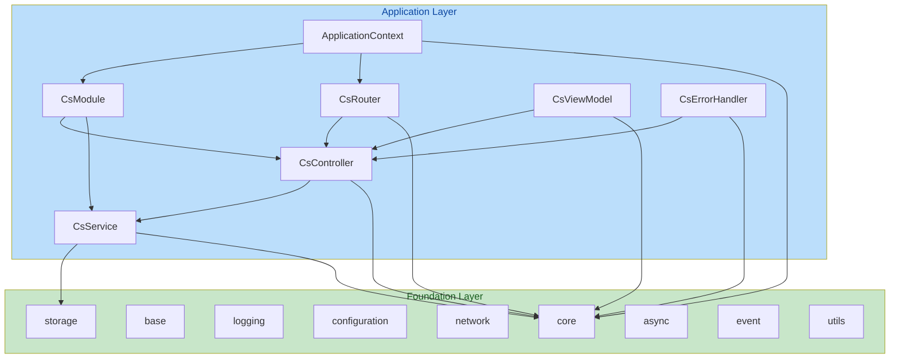

# SoulCoreKit — v2.5.0 CS 架构定义文档

> **版本**: v2.5.0
> **定位**: Qt Application Framework — 三层架构定稿 + ApplicationContext 引入
> **前置**: v2.1.0 CS 核心框架已完成
> **核心变更**: 引入 Foundation/Application 分层、ApplicationContext、ServiceRegistry、ViewModel 职责明确化

---

## 一、框架定位

### 1.1 一句话定义

> SoulCoreKit 是一个面向 Qt/C++ 的模块化应用开发框架，借鉴 Spring Boot 的分层架构、模块化、约定优于配置和生命周期管理理念，为 C/S 应用提供统一的 Module、Controller、Service、ViewModel、Router 与基础设施能力，并通过 Web Adapter 为未来 B/S UI 扩展提供基础。

### 1.2 简称

**Qt Application Framework**（而非 "Qt Utility Library"）

### 1.3 与 SpringBoot 的关系

- **借鉴**: 分层架构、IoC/DI、生命周期管理、约定优于配置
- **不复制**: Servlet/Tomcat/Filter/MVC HTTP 请求处理链
- **适配 CS**: Signal/Slot 替代 HTTP Request/Response，Page 导航替代 URL 路由

---

## 二、三层架构模型

### 2.1 总览

```
                        SoulCoreKit
                             │
              ┌──────────────┴──────────────┐
              │                             │
         Foundation                    Application
              │                             │
              │                        ┌────┴────┐
              │                        │         │
         Core Layer                   CS        Web
              │                        │         │
              │                        │    QtWebEngine
              │                        │    (预留，未实现)
              │                 Module/Router
              │                 Controller
              │                 Service
              │                 ViewModel
              │                 ErrorHandler
              │
              └──────────────────────────────
```

### 2.2 Foundation 层

**职责**: 基础设施能力，与 UI 无关，与业务无关。

| 模块 | 职责 | 独立于 CS/Web |
|------|------|:---:|
| `core/` | Result、Error、Singleton、Application、Version | ✅ |
| `base/` | BaseObject、BaseManager、BaseRepository | ✅ |
| `logging/` | Logger、Sink、Formatter | ✅ |
| `configuration/` | Config、JsonConfiguration、ConfigSchema | ✅ |
| `network/` | HttpClient、WebSocket、TcpClient、Interceptor | ✅ |
| `storage/` | IRepository、SqliteDatabase、Cache、Serializer | ✅ |
| `async/` | ThreadPool、Future/Promise、TaskRunner | ✅ |
| `event/` | EventBus、MessageBus、Subscription | ✅ |
| `utils/` | JSON、File、String、Crypto、Image | ✅ |

### 2.3 Application 层

**职责**: 业务架构能力，组织 Controller/Service/ViewModel/Route。

**当前目录结构 (v2.5.0 实际)**:

```
include/soul/
├── application/           # 应用上下文与注册表
│   ├── application_context.h    # ApplicationContext — 轻量级应用上下文
│   ├── service_registry.h       # ServiceRegistry — CsService 生命周期注册表
│   └── controller_registry.h    # ControllerRegistry — CsController 注册表
├── cs/                    # CS 架构核心类型
│   ├── cs_module.h              # CsModule — 模块注册与生命周期
│   ├── cs_router.h              # CsRouter — 路由表与页面导航
│   ├── cs_controller.h          # CsController — 请求分发
│   ├── cs_service.h             # CsService — 业务逻辑
│   ├── cs_view_model.h          # CsViewModel — UI 状态管理
│   ├── cs_error.h / cs_error_handler.h  # 错误处理
│   ├── cs_data_binding.h        # 数据绑定
│   ├── cs_navigation.h          # 导航辅助
│   ├── cs_dialog_manager.h      # 对话框管理
│   ├── cs_window_manager.h      # 窗口管理
│   ├── cs_form_validator.h      # 表单验证
│   ├── cs_request.h             # 请求对象
│   └── cs_global.h              # 模块导出宏
├── ui/                    # UI 组件库
└── web/                   # Web 预留 (README only)
```

**注意**: 当前 `cs/` 扁平结构是 v2.1.0 遗留。未来 v3.0 考虑重组为更细粒度的子目录（如 `application/module/`、`application/router/` 等），但当前阶段避免大规模文件移动以保持稳定性。`application/` 目录仅包含跨模块的注册表/上下文类型，CS 核心类型保留在 `cs/` 下。两个目录均属于 Application 层。```

---

## 三、核心生命周期

### 3.1 启动链路

```
Application
    │
    ▼
ApplicationContext::create()
    │
    ├── loadModules()          ← 扫描/注册 CsModule
    │
    ├── registerServices()     ← ServiceRegistry 注册所有 CsService
    │
    ├── initializeServices()   ← 对标 @PostConstruct
    │
    ├── registerControllers()  ← ControllerRegistry 注册所有 CsController
    │
    ├── registerRoutes()       ← CsRouter 构建路由表
    │
    ├── connectSignals()       ← Controller ↔ Router ↔ ErrorHandler 信号连接
    │
    └── Application Ready
```

### 3.2 请求链路

```
User Action
    │
    ▼
CsRouter::navigate(path)
    │
    ▼
RouteMatcher::match(path)     ← 路径参数解析
    │
    ▼
RouteEntry { controller, handler }
    │
    ▼
CsController::dispatch(request)
    │
    ├── 强类型分发: m_handlers[pattern](request)  [推荐]
    └── 回退分发:   QMetaObject::invokeMethod     [兼容]
    │
    ▼
CsService::execute()          ← 业务逻辑
    │
    ▼
BaseRepository / Infrastructure
    │
    ▼
Result<T>
    │
    ▼
CsController → emit dataReady / errorOccurred
    │
    ▼
CsViewModel → UI State Update
    │
    ▼
Qt Widgets → repaint
```

### 3.3 停止链路

```
Application::shutdown()
    │
    ▼
ApplicationContext::close()
    │
    ├── disconnectSignals()    ← 断开信号连接
    │
    ├── shutdownServices()     ← 对标 @PreDestroy
    │
    ├── unregisterRoutes()     ← 清空路由表
    │
    ├── disposeControllers()   ← 释放 Controller
    │
    └── disposeServices()      ← 释放 Service
```

---

## 四、ViewModel 职责明确化

### 4.1 分层职责

```
┌──────────────┐
│   View       │  QWidget / QML — 纯 UI 渲染
│   (Qt)       │  不包含业务逻辑，不直接访问 Service/Repository
├──────────────┤
│   ViewModel  │  UI State 管理
│              │  - 持有 UI 状态 (Q_PROPERTY)
│              │  - 暴露 UI Commands
│              │  - 不直接访问 Repository/数据库
│              │  - 通过 Controller 获取数据
├──────────────┤
│  Controller  │  Command / Request 分发
│              │  - 路由注册
│              │  - 输入校验
│              │  - 调用 Service
│              │  - 返回 Result
├──────────────┤
│   Service    │  业务逻辑
│              │  - 事务管理
│              │  - 领域编排
│              │  - Repository 协调
├──────────────┤
│  Repository  │  数据访问
│              │  - CRUD 操作
│              │  - 查询构建
│              │  - 缓存集成
└──────────────┘
```

### 4.2 正确示例

```cpp
// ✅ 正确: ViewModel 通过 Controller 获取数据
class UserListViewModel : public CsViewModel {
    Q_OBJECT
    Q_PROPERTY(QVariantList users READ users NOTIFY usersChanged)

public:
    void load() {
        // 通过 Controller 获取数据，而非直接访问 Service
        m_controller->getUsers();
    }

public slots:
    void onUsersLoaded(const QVariantList& users) {
        m_users = users;
        emit usersChanged();
    }

private:
    QVariantList m_users;
    UserController* m_controller;  // 由 DI 注入
};
```

### 4.3 错误示例

```cpp
// ❌ 错误: ViewModel 直接访问 Repository
class UserListViewModel : public CsViewModel {
    void load() {
        auto users = m_repo->selectList();  // 越层访问
        m_users = toVariantList(users.unwrap());
    }
private:
    std::shared_ptr<BaseRepository<User>> m_repo;  // 不应在 ViewModel 中
};

// ❌ 错误: ViewModel 直接访问数据库
class UserListViewModel : public CsViewModel {
    void load() {
        auto db = QSqlDatabase::database();  // 严重越层
    }
};
```

---

## 五、ApplicationContext 设计

### 5.1 定位

轻量级应用上下文，对标 Spring 的 `ApplicationContext`，但**不是巨型 IoC 容器**。

**职责**:
- 管理 Module 注册与生命周期
- 管理 Service 实例（通过 ServiceRegistry）
- 管理 Controller 实例（通过 ControllerRegistry）
- 协调 Router 路由表构建

### 5.2 接口定义

```cpp
// include/soul/application/application_context.h
namespace sc {

class ApplicationContext {
public:
    static ApplicationContext& instance();

    // === 生命周期 ===
    void initialize();   // 加载模块、注册服务、构建路由
    void shutdown();     // 停止服务、清理资源

    // === 模块管理 ===
    void registerModule(std::unique_ptr<CsModule> module);
    template<typename T, typename... Args>
    T& registerModule(Args&&... args);

    // === 服务管理 ===
    ServiceRegistry& serviceRegistry();
    template<typename T>
    std::shared_ptr<T> getService();

    // === 控制器管理 ===
    ControllerRegistry& controllerRegistry();

    // === 路由 ===
    CsRouter& router();

private:
    ApplicationContext() = default;
    // ...
};

} // namespace sc
```

### 5.3 ServiceRegistry 设计

```cpp
// include/soul/application/service_registry.h
namespace sc {

class ServiceRegistry {
public:
    /// @brief 注册服务实例
    template<typename T, typename... Args>
    std::shared_ptr<T> registerService(Args&&... args);

    /// @brief 获取服务实例
    template<typename T>
    std::shared_ptr<T> getService();

    /// @brief 初始化所有已注册服务（对标 @PostConstruct）
    void initializeAll();

    /// @brief 关闭所有已注册服务（对标 @PreDestroy）
    void shutdownAll();

private:
    std::vector<std::shared_ptr<CsService>> m_services;
    // 内部委托给 sc::di::Container
};

} // namespace sc
```

### 5.4 与 CsModule 的关系

```
ApplicationContext
    │
    ├── ModuleRegistry
    │       │
    │       └── CsModule (UserModule, MusicModule, ...)
    │               │
    │               ├── onRegister() → 注册 Controller + Service
    │               ├── onStart()    → 模块启动逻辑
    │               └── onStop()     → 模块停止逻辑
    │
    ├── ServiceRegistry
    │       │
    │       └── CsService 实例 (UserService, MusicService, ...)
    │
    ├── ControllerRegistry
    │       │
    │       └── CsController 实例 (UserController, MusicController, ...)
    │
    └── CsRouter
            │
            └── RouteTable (user/list → UserController, ...)
```

**关键原则**: CsModule 只负责注册，不持有 Service/Controller 的所有权。所有权由 ApplicationContext 集中管理。

---

## 六、Controller 分发机制

### 6.1 设计决策

Controller 的核心分发机制使用**强类型注册**（成员函数指针），MetaObject 仅作为 Qt 集成/动态调用能力保留。

```cpp
// ✅ 推荐: 强类型注册（编译期类型安全）
class UserController : public CsController {
    Q_OBJECT
public:
    UserController() : CsController("user") {
        route("list",   &UserController::listUsers);    // 编译期检查
        route("{id}",   &UserController::userDetail);   // 编译期检查
        route("create", &UserController::createUser);   // 编译期检查
    }

public slots:
    void listUsers(const CsRequest& req);
    void userDetail(const CsRequest& req);
    void createUser(const CsRequest& req);
};
```

```cpp
// ⚠️ 兼容: 字符串方式（仅用于 QML 动态调用场景）
class UserController : public CsController {
    Q_OBJECT
public:
    UserController() : CsController("user") {
        route("list", "listUsers");    // 运行时查找
    }
};
```

### 6.2 分发流程

```
CsController::dispatch(request)
    │
    ├── request.handlerName 非空?
    │       │
    │       ├── 是 → m_handlers.find(handlerName)
    │       │           │
    │       │           ├── 找到 → 直接调用成员函数 [推荐路径]
    │       │           └── 未找到 → QMetaObject::invokeMethod [回退]
    │       │
    │       └── 否 → 遍历路由表匹配
    │
    └── 返回 true/false
```

---

## 七、CS 与 Web 共享业务架构

### 7.1 核心原则

**业务 Service 不应该知道自己是 CS 还是 Web。**

```
                  UserService
                      ▲
                      │
            ┌─────────┴─────────┐
            │                   │
       CsController        Web Adapter
            ▲                   ▲
            │                   │
        ViewModel          JavaScript
            ▲
            │
       Qt Widgets
```

### 7.2 Web 模块（预留）

```
web/
├── README.md              ← 模块说明
└── architecture.md        ← 预留架构设计（可选）
```

**不做的事**:
- 不提前实现 WebController / WebRouter
- 不提前实现 WebEngineView / WebBridgeManager
- 不创建 Web 模块的 .h/.cpp 文件

**Web Adapter 未来的职责**（仅供架构参考）:
- 将 HTTP 请求转换为 CsController 的 Signal 调用
- 复用已有的 CsService 和 CsRouter
- 不复制业务逻辑

---

## 八、模块依赖关系

### 8.1 依赖图



### 8.2 依赖规则

| 规则 | 说明 |
|------|------|
| Foundation 不依赖 Application | 基础设施模块独立于业务架构 |
| Application 依赖 Foundation | Controller/Service 使用基础设施 |
| Controller 不直接依赖 Repository | 通过 Service 访问数据 |
| ViewModel 不直接依赖 Service | 通过 Controller 获取数据 |
| Service 不依赖 UI | 业务逻辑与表现层解耦 |

---

## 九、v2.5.0 变更清单

### 9.1 架构文档变更

| 变更项 | 内容 | 优先级 |
|--------|------|:---:|
| DOC-01 | 创建 `v2.5.0-cs-architecture.md`（本文档） | P0 |
| DOC-02 | 更新 `00_vision.md` — 精确定位：Qt Application Framework | P0 |
| DOC-03 | 更新 `01_architecture.md` — 三层模型 + ApplicationContext 生命周期 | P0 |
| DOC-04 | 更新 `14_roadmap.md` — v2.5.0 条目 | P0 |
| DOC-05 | 更新 `03_module_specification.md` — CS 模块规格 | P1 |

### 9.2 代码变更

| 变更项 | 内容 | 优先级 |
|--------|------|:---:|
| CODE-01 | 引入 `ApplicationContext` | P0 |
| CODE-02 | 引入 `ServiceRegistry` | P0 |
| CODE-03 | 引入 `ControllerRegistry` | P0 |
| CODE-04 | 重构 `CsModule` — 不持有 Service/Controller 所有权 | P0 |
| CODE-05 | Controller 分发优先使用强类型 | P0 |
| CODE-06 | 精简 `web/` — 删除提前实现的 .h 文件 | P0 |
| CODE-07 | 添加 `application/` 目录结构 | P0 |

### 9.3 目录结构变更

```
include/soul/
├── application/                    ← [新增] Application 层
│   ├── application_context.h       ← ApplicationContext
│   ├── service_registry.h          ← ServiceRegistry
│   └── controller_registry.h       ← ControllerRegistry
│
├── cs/                             ← [保留] CS 模块
│   ├── cs_controller.h
│   ├── cs_router.h
│   ├── cs_service.h
│   ├── cs_view_model.h
│   ├── cs_data_binding.h
│   ├── cs_form_validator.h
│   ├── cs_error_handler.h
│   ├── cs_dialog_manager.h
│   ├── cs_window_manager.h
│   ├── cs_navigation.h
│   └── cs_module.h                 ← [重构] 不持有所有权
│
├── web/                            ← [精简] 仅预留
│   └── README.md
│
└── foundation/                     ← [现有] Foundation 层
    ├── core/
    ├── base/
    ├── logging/
    ├── configuration/
    ├── network/
    ├── storage/
    ├── async/
    ├── event/
    └── utils/
```

---

## 十、版本路线图

```
v2.1.0 (已完成)          v2.5.0 (架构定稿)         v2.6.0 (CS Security)     v2.7.0 (CS Advanced)     v3.0.0 (Release)
    │                        │                        │                        │                        │
    ├─ CsController          ├─ ApplicationContext    ├─ CsSecurity            ├─ CsAdminPanel          ├─ 全量文档
    ├─ CsRouter              ├─ ServiceRegistry       ├─ OAuth2/OIDC (CS)      ├─ CsIpcRouter           ├─ 部署指南
    ├─ CsService             ├─ ControllerRegistry    ├─ JWT 管理              ├─ 配置中心客户端         ├─ 性能基准
    ├─ CsViewModel           ├─ 三层架构定稿           ├─ RBAC 权限             ├─ 分布式追踪             ├─ 安全审计
    ├─ CsDataBinding         ├─ ViewModel 职责明确     ├─ 审计日志              ├─ 灰度发布               ├─ 发布包
    ├─ CsErrorHandler        ├─ 强类型分发优先         ├─ 密码加密              ├─ gRPC Server/Client     └─ 正式版
    ├─ CsDialogManager       ├─ Web 模块精简          └─ SecurityMiddleware    ├─ 服务注册发现
    ├─ CsWindowManager       └─ 模块依赖规则                               └─ MQ 完整集成
    └─ CsModule
```

---

## 十一、技术决策记录

### ADR-013: ApplicationContext 轻量化设计

**决策**: 引入 `ApplicationContext` 作为轻量级应用上下文，而非巨型 IoC 容器。

**理由**:
1. Qt 已有 parent-child 对象树管理生命周期
2. `sc::di::Container` 已提供 DI 能力
3. ApplicationContext 仅协调模块注册、服务生命周期、路由构建

**后果**:
- ApplicationContext 不替代 DI Container
- ServiceRegistry 内部委托给 DI Container
- 模块间通过 DI 获取依赖，而非通过 ApplicationContext 获取

### ADR-014: ViewModel 通过 Controller 访问数据

**决策**: ViewModel 不直接访问 Service 或 Repository，通过 Controller 获取数据。

**理由**:
1. 保持分层清晰：View → ViewModel → Controller → Service → Repository
2. ViewModel 职责限于 UI State 管理，不包含业务逻辑
3. Controller 作为 Command/Request 的统一入口

**后果**:
- ViewModel 需要持有 Controller 引用（由 DI 注入）
- Controller 需要提供 ViewModel 可调用的接口

### ADR-015: Web 模块最小预留

**决策**: `web/` 目录仅保留 `README.md`，不提前实现任何 Web 架构组件。

**理由**:
1. 避免提前架构污染
2. CS 和 Web 共享业务 Service 层，不需要复制业务架构
3. QtWebEngine 尚未评估，打包体积和性能影响未知

**后果**:
- 删除现有 `web_global.h`、`web_controller.h`、`web_router.h`、`web_engine_view.h`
- 未来 Web 模块通过 Web Adapter 复用已有 CsService 和 CsRouter

### ADR-016: 强类型分发优先

**决策**: Controller 的核心分发机制使用成员函数指针（强类型），MetaObject 仅作为回退。

**理由**:
1. C++ 最值钱的能力之一是编译期类型安全
2. 成员函数指针在重构时自动更新，避免字符串拼写错误
3. 对标 Spring 的 `@RequestMapping` 注解的编译期检查

**后果**:
- `route()` 提供两个重载：成员函数指针（推荐）和字符串（兼容）
- `dispatch()` 优先查找成员函数指针，回退到 MetaObject
- QML 动态调用场景仍可使用字符串方式

---

## 十二、下一步行动

1. **立即**: 评审本方案，确认架构变更
2. **v2.5.0 启动**: 按 9.2 变更清单逐项实现
3. **并行**: 更新所有架构文档
4. **持续**: 每个模块完成后执行 TRAE-code-review 检查