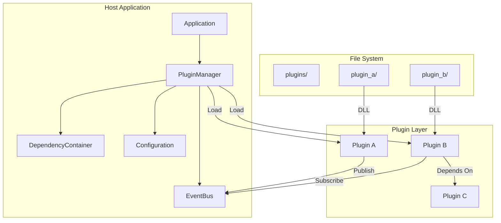
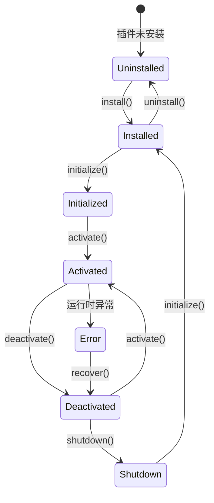
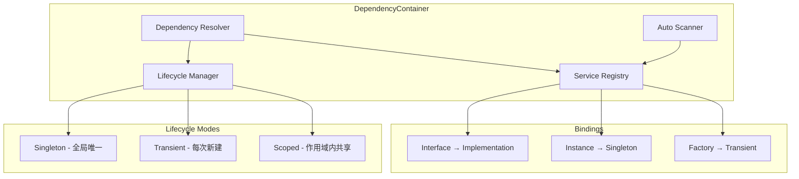
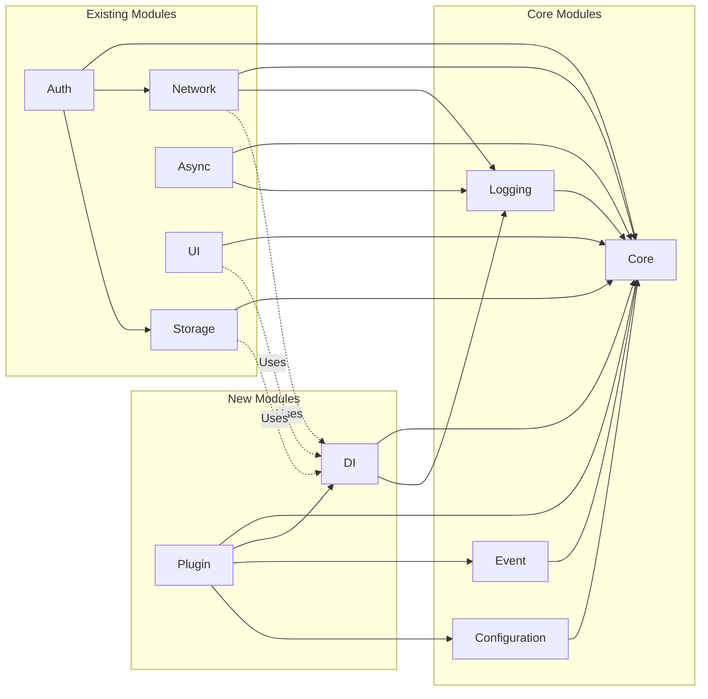

# SoulCoreKit V1.3.0 产品需求文档（PRD）

| 属性 | 值 |
|------|-----|
| 版本 | V1.3.0 |
| 状态 | 正式版 |
| 目标平台 | Qt 6.5+ / C++17 |
| 定位 | 插件化架构 + 依赖注入容器 |
| 文档编号 | SC-PRD-003 |
| 创建日期 | 2026-07-21 |

---

## 一、版本概述

### 1.1 版本定位

V1.3.0 是 SoulCoreKit 从"单体模块库"向"可扩展插件架构"演进的关键版本。核心目标是引入**插件系统**和**依赖注入容器**，实现：

- **运行时可扩展性**：动态加载/卸载模块，支持热更新
- **依赖解耦**：通过 DI 容器管理对象生命周期，消除全局单例依赖
- **模块化演进**：支持第三方开发者编写插件扩展应用功能

### 1.2 版本口号

> **"Plug & Play, Wire & Run"**

### 1.3 核心改进

| 维度 | V1.2.0 | V1.3.0 |
|------|--------|--------|
| 架构模式 | 单体模块库 | 插件化架构 + DI |
| 模块扩展 | 编译时静态链接 | 运行时动态加载 |
| 依赖管理 | 手动传递/全局单例 | 自动依赖注入 |
| 热更新 | 不支持 | 支持插件热重载 |

---

## 二、核心需求

### 2.1 插件系统（Plugin System）

#### 2.1.1 需求描述

> **作为应用开发者，我希望能够动态加载外部插件模块，以便在不重新编译的情况下扩展应用功能。**

> **作为插件开发者，我希望有统一的插件开发规范，以便我的插件能够无缝集成到 SoulCoreKit 应用中。**

#### 2.1.2 功能列表

| 需求编号 | 功能点 | 优先级 | 描述 |
|---------|--------|--------|------|
| PLG-001 | 插件动态加载 | P0 | 支持从 DLL/SO/DYLIB 文件动态加载插件 |
| PLG-002 | 插件元数据 | P0 | 插件必须提供元数据（名称、版本、作者、依赖） |
| PLG-003 | 插件生命周期 | P0 | 支持 install → initialize → activate → deactivate → shutdown → uninstall |
| PLG-004 | 插件依赖管理 | P0 | 支持插件声明依赖关系，自动解析加载顺序 |
| PLG-005 | 插件热重载 | P2 | 支持运行时卸载并重新加载插件，无需重启应用。**注意：热重载要求插件使用C-ABI边界接口，不支持包含复杂C++类型的直接导出** |
| PLG-006 | 插件配置 | P1 | 支持插件自有配置文件，与主应用配置隔离 |
| PLG-007 | 插件通信 | P1 | 支持插件间通过事件总线通信 |
| PLG-008 | 插件安全沙箱 | P2 | 限制插件对系统资源的访问权限 |
| PLG-009 | 插件市场 | P2 | 支持插件索引、搜索、安装管理 |

#### 2.1.3 插件系统架构



#### 2.1.4 插件生命周期



#### 2.1.5 插件元数据规范

每个插件必须提供 `plugin.json` 元数据文件：

```json
{
    "id": "com.soulcore.plugin.example",
    "name": "Example Plugin",
    "version": "1.0.0",
    "author": "SoulCore Team",
    "description": "An example plugin demonstrating plugin system capabilities",
    "main": "libexample_plugin.dll",
    "apiVersion": "1.3.0",
    "dependencies": {
        "com.soulcore.plugin.base": "^1.0.0"
    },
    "permissions": [
        "network",
        "storage",
        "ui"
    ],
    "configSchema": {
        "enabled": {
            "type": "boolean",
            "default": true,
            "description": "Whether the plugin is enabled"
        }
    }
}
```

#### 2.1.6 插件接口设计

##### IPlugin 接口

```cpp
namespace sc::plugin {

class IPlugin {
public:
    virtual ~IPlugin() = default;
    
    virtual const PluginMetadata& metadata() const = 0;
    
    virtual Result<void> install() { return Result<void>::ok(); }
    virtual Result<void> initialize(DependencyContainer* container) = 0;
    virtual Result<void> activate() = 0;
    virtual Result<void> deactivate() = 0;
    virtual Result<void> shutdown() { return Result<void>::ok(); }
    virtual Result<void> uninstall() { return Result<void>::ok(); }
    
    virtual PluginState state() const = 0;
};

} // namespace sc::plugin
```

##### PluginManager 核心接口

```cpp
namespace sc::plugin {

class PluginManager {
public:
    virtual ~PluginManager() = default;
    
    virtual Result<void> loadPlugin(const QString& pluginId) = 0;
    virtual Result<void> unloadPlugin(const QString& pluginId) = 0;
    virtual Result<void> reloadPlugin(const QString& pluginId) = 0;
    
    virtual Result<void> loadAllPlugins() = 0;
    virtual Result<void> unloadAllPlugins() = 0;
    
    virtual bool isPluginLoaded(const QString& pluginId) const = 0;
    virtual PluginState getPluginState(const QString& pluginId) const = 0;
    
    virtual std::vector<PluginMetadata> getAllPlugins() const = 0;
    virtual std::vector<PluginMetadata> getLoadedPlugins() const = 0;
    
    virtual void setPluginPath(const QString& path) = 0;
    virtual QString pluginPath() const = 0;
};

} // namespace sc::plugin
```

#### 2.1.7 插件开发规范

##### 插件目录结构

```text
plugins/
├── plugin_a/
│   ├── plugin.json          # 元数据
│   ├── libplugin_a.dll      # 插件动态库
│   ├── config.json          # 插件配置（可选）
│   ├── resources/           # 资源文件（可选）
│   │   ├── icons/
│   │   └── translations/
│   └── README.md            # 插件说明
└── plugin_b/
    └── ...
```

##### 插件导出宏

```cpp
#define SC_PLUGIN_EXPORT extern "C" SC_CORE_EXPORT

#define SC_PLUGIN_ENTRY(PluginClass) \
    SC_PLUGIN_EXPORT sc::plugin::IPlugin* createPlugin() { \
        return new PluginClass(); \
    } \
    SC_PLUGIN_EXPORT void destroyPlugin(sc::plugin::IPlugin* plugin) { \
        delete plugin; \
    }
```

##### 插件实现示例

```cpp
class ExamplePlugin : public sc::plugin::IPlugin {
public:
    const PluginMetadata& metadata() const override {
        static PluginMetadata meta = {
            "com.soulcore.plugin.example",
            "Example Plugin",
            "1.0.0",
            "SoulCore Team"
        };
        return meta;
    }
    
    Result<void> initialize(DependencyContainer* container) override {
        m_container = container;
        m_eventBus = container->resolve<IEventBus>();
        return Result<void>::ok();
    }
    
    Result<void> activate() override {
        m_eventBus->subscribe<MyEvent>([this](const auto& e) {
            handleEvent(e);
        });
        return Result<void>::ok();
    }
    
    Result<void> deactivate() override {
        m_eventBus->unsubscribe<MyEvent>();
        return Result<void>::ok();
    }
    
private:
    DependencyContainer* m_container = nullptr;
    IEventBus* m_eventBus = nullptr;
};

SC_PLUGIN_ENTRY(ExamplePlugin)
```

---

### 2.2 依赖注入容器（Dependency Injection Container）

#### 2.2.1 需求描述

> **作为应用开发者，我希望通过依赖注入容器管理对象生命周期，以便消除全局单例依赖，提高代码可测试性。**

> **作为框架维护者，我希望 DI 容器支持多种生命周期模式，以便灵活管理不同类型对象的创建和销毁。**

#### 2.2.2 功能列表

| 需求编号 | 功能点 | 优先级 | 描述 |
|---------|--------|--------|------|
| DI-001 | 构造器注入 | P0 | 支持通过构造函数自动注入依赖 |
| DI-002 | 生命周期管理 | P0 | 支持 Singleton / Transient / Scoped 三种生命周期 |
| DI-003 | 接口绑定 | P0 | 支持接口与实现类的绑定 |
| DI-004 | 延迟加载 | P0 | 支持对象按需创建（懒加载） |
| DI-005 | 循环依赖检测 | P0 | 在编译期/运行期检测并报告循环依赖 |
| DI-006 | 手动注册 | P1 | 支持手动注册对象实例 |
| DI-007 | 自动扫描 | P1 | 支持自动扫描指定目录的类并注册 |
| DI-008 | 命名绑定 | P1 | 支持同一接口多个实现的命名区分 |
| DI-009 | 装饰器模式 | P2 | 支持通过装饰器增强对象功能 |
| DI-010 | 作用域管理 | P2 | 支持自定义作用域（如请求作用域） |

#### 2.2.3 DI 容器架构



#### 2.2.4 生命周期模式对比

| 生命周期 | 创建时机 | 实例数量 | 销毁时机 | 适用场景 |
|---------|---------|---------|---------|---------|
| **Singleton** | 首次解析时 | 全局唯一 | 容器销毁时 | Logger、EventBus、Config |
| **Transient** | 每次解析时 | 每次新建 | 使用完毕后 | HttpClient、Repository |
| **Scoped** | 作用域开始时 | 作用域内唯一 | 作用域结束时 | RequestContext、UserSession |

#### 2.2.5 核心接口设计

##### 设计原则说明

> **重要技术约束**：C++17 不支持运行时反射，无法自动解析构造函数参数。DI 容器采用**工厂函数注册模式**，由开发者显式提供对象创建逻辑。这与 Spring 等框架的自动注入不同，但保证了类型安全和编译期检查。

DI 容器基于现有的 `IFactory<T>` 扩展，提供生命周期管理和依赖解析能力。

##### IDependencyContainer 接口

```cpp
namespace sc::di {

enum class Lifecycle {
    Singleton,
    Transient,
    Scoped
};

class IDependencyContainer {
public:
    virtual ~IDependencyContainer() = default;
    
    template<typename Interface, typename Implementation>
    void bind(Lifecycle lifecycle = Lifecycle::Singleton) {
        bind(typeid(Interface).name(), 
             [this]() {
                 return std::static_pointer_cast<void>(
                     std::make_shared<Implementation>()
                 );
             }, 
             lifecycle);
    }
    
    template<typename Interface>
    void bind(std::function<std::shared_ptr<Interface>()> factory,
              Lifecycle lifecycle = Lifecycle::Singleton) {
        bind(typeid(Interface).name(),
             [factory]() {
                 return std::static_pointer_cast<void>(factory());
             },
             lifecycle);
    }
    
    template<typename T>
    void bindInstance(std::shared_ptr<T> instance) {
        bindInstance(typeid(T).name(), instance);
    }
    
    template<typename T>
    std::shared_ptr<T> resolve() {
        return std::dynamic_pointer_cast<T>(resolve(typeid(T).name()));
    }
    
    template<typename T>
    bool hasBinding() const {
        return hasBinding(typeid(T).name());
    }
    
    virtual void bind(const std::string& key, 
                      std::function<std::shared_ptr<void>()> factory,
                      Lifecycle lifecycle) = 0;
    
    virtual void bindInstance(const std::string& key, 
                             std::shared_ptr<void> instance) = 0;
    
    virtual std::shared_ptr<void> resolve(const std::string& key) = 0;
    
    virtual bool hasBinding(const std::string& key) const = 0;
    
    virtual void unbind(const std::string& key) = 0;
    
    virtual void scan(const QString& path) = 0;
    
    virtual void createScope() = 0;
    virtual void endScope() = 0;
    
    virtual size_t scopeDepth() const = 0;
};

} // namespace sc::di
```

##### 与 IFactory<T> 的关系

DI 容器扩展了 `IFactory<T>` 的能力：

| 能力 | IFactory\<T\> | IDependencyContainer |
|------|--------------|---------------------|
| 按名称创建对象 | ✅ | ✅ |
| 生命周期管理 | ❌ | ✅ (Singleton/Transient/Scoped) |
| 依赖解析 | ❌ | ✅ |
| 接口绑定 | ❌ | ✅ |
| 作用域管理 | ❌ | ✅ |

##### 线程安全要求

- `resolve()` 方法必须是**线程安全**的
- Singleton 创建必须使用**双重检查锁定模式**（DCLP）
- 绑定操作（`bind`/`bindInstance`）在容器初始化完成后应禁止修改

##### 绑定宏定义

```cpp
namespace sc::di {

#define SC_SINGLETON(ClassName) \
    static std::shared_ptr<ClassName> create(sc::di::IDependencyContainer* container) { \
        return std::make_shared<ClassName>(); \
    }

#define SC_TRANSIENT(ClassName) \
    static std::shared_ptr<ClassName> create(sc::di::IDependencyContainer* container) { \
        return std::make_shared<ClassName>(); \
    }

#define SC_BIND_INTERFACE(Interface, Implementation) \
    container->bind<Interface>([]() { \
        return std::make_shared<Implementation>(); \
    }, sc::di::Lifecycle::Singleton);

} // namespace sc::di
```

#### 2.2.6 使用示例

##### 注册与解析

```cpp
// 1. 创建容器
auto container = std::make_shared<DependencyContainer>();

// 2. 绑定接口与实现（简单类型）
container->bind<IEventBus, DefaultEventBus>();
container->bind<ILogger, ConsoleLogger>();

// 3. 绑定单例实例
auto config = std::make_shared<Config>();
container->bindInstance(config);

// 4. 解析依赖
auto eventBus = container->resolve<IEventBus>();
auto logger = container->resolve<ILogger>();
```

##### 工厂函数注册（含依赖注入）

```cpp
class UserService {
public:
    UserService(IEventBus* eventBus, ILogger* logger, IRepository<User>* repo)
        : m_eventBus(eventBus), m_logger(logger), m_repo(repo) {}
    
private:
    IEventBus* m_eventBus;
    ILogger* m_logger;
    IRepository<User>* m_repo;
};

// 通过工厂函数显式注册，手动解析依赖
container->bind<IRepository<User>, SqliteRepository<User>>();

container->bind<IUserService>([&container]() {
    auto eventBus = container->resolve<IEventBus>();
    auto logger = container->resolve<ILogger>();
    auto repo = container->resolve<IRepository<User>>();
    return std::make_shared<UserService>(eventBus.get(), logger.get(), repo.get());
});

// 解析 UserService
auto userService = container->resolve<IUserService>();
```

##### 生命周期管理

```cpp
// Singleton - 全局唯一（线程安全的双重检查锁定）
container->bind<ILogger, ConsoleLogger>(Lifecycle::Singleton);
auto logger1 = container->resolve<ILogger>();
auto logger2 = container->resolve<ILogger>();
// logger1 == logger2

// Transient - 每次新建
container->bind<HttpClient>([]() {
    return std::make_shared<HttpClient>();
}, Lifecycle::Transient);
auto client1 = container->resolve<HttpClient>();
auto client2 = container->resolve<HttpClient>();
// client1 != client2

// Scoped - 作用域内共享
container->createScope();
auto ctx1 = container->resolve<RequestContext>();
auto ctx2 = container->resolve<RequestContext>();
// ctx1 == ctx2
container->endScope();
```

##### 循环依赖检测

```cpp
// 错误示例：循环依赖
class A {
public:
    A(std::shared_ptr<B> b) : m_b(b) {}
private:
    std::shared_ptr<B> m_b;
};

class B {
public:
    B(std::shared_ptr<A> a) : m_a(a) {}
private:
    std::shared_ptr<A> m_a;
};

// 绑定
container->bind<A>([&container]() {
    return std::make_shared<A>(container->resolve<B>());
});
container->bind<B>([&container]() {
    return std::make_shared<B>(container->resolve<A>());
});

// 解析时会抛出异常（检测到循环依赖）
try {
    auto a = container->resolve<A>(); // 抛出 CircularDependencyException
} catch (const CircularDependencyException& e) {
    SC_ERROR() << "Circular dependency detected: " << e.what();
}
```

#### 2.2.7 与现有 Singleton<T> 的共存策略

##### 背景

项目中已存在 `Singleton<T>` 和 `SingletonRegistry`，用于管理全局单例的生命周期。DI 容器引入后需要与现有模式共存并逐步迁移。

##### 共存方案

```mermaid
flowchart TD
    subgraph Legacy Singletons
        SingletonT[Singleton<T>]
        SingletonRegistry[SingletonRegistry]
        Logger[Logger]
        ThreadPool[ThreadPool]
    end
    
    subgraph DI Container
        Container[DependencyContainer]
        DIRegistry[DI Managed Singletons]
    end
    
    SingletonRegistry -->|Registers| SingletonT
    SingletonT -->|Creates| Logger
    SingletonT -->|Creates| ThreadPool
    
    Container -->|Wraps| SingletonRegistry
    Container -->|Manages| DIRegistry
    
    DIRegistry -->|Can reference| Legacy Singletons
```

##### 迁移策略

| 阶段 | 策略 | 说明 |
|------|------|------|
| **Phase 1** | DI 容器包装现有单例 | DI 容器通过 `bindInstance` 注册现有 Singleton 实例 |
| **Phase 2** | 新代码使用 DI | 新开发的服务类直接使用 DI 容器管理 |
| **Phase 3** | 逐步迁移 | 将核心单例（Logger、EventBus）迁移到 DI 容器 |
| **Phase 4** | 淘汰旧模式 | 移除 `Singleton<T>` 模板，统一使用 DI 容器 |

##### 包装示例

```cpp
// Phase 1: 将现有单例包装到 DI 容器
auto container = std::make_shared<DependencyContainer>();

// 包装现有 Logger 单例
container->bindInstance(
    std::shared_ptr<ILogger>(&Logger::instance(), [](ILogger*) {})
);

// 包装现有 EventBus 单例
container->bindInstance(
    std::shared_ptr<IEventBus>(&EventBus::instance(), [](IEventBus*) {})
);

// 新服务使用 DI 容器获取依赖
class UserService {
public:
    UserService(ILogger* logger, IEventBus* eventBus)
        : m_logger(logger), m_eventBus(eventBus) {}
private:
    ILogger* m_logger;
    IEventBus* m_eventBus;
};

container->bind<IUserService>([&container]() {
    return std::make_shared<UserService>(
        container->resolve<ILogger>().get(),
        container->resolve<IEventBus>().get()
    );
});
```

---

## 三、模块依赖关系

### 3.1 新增模块

| 模块 | 依赖 | 职责 |
|------|------|------|
| **Plugin** | Core + DI + Event + Configuration | 插件系统 |
| **DI** | Core + Logging | 依赖注入容器 |

### 3.2 依赖关系图



---

## 四、非功能需求

### 4.1 性能要求

| 指标 | 要求 |
|------|------|
| 插件加载时间 | < 100ms/插件 (> 1MB) |
| 插件热重载时间 | < 500ms |
| DI 容器解析时间 | < 1ms/对象（含双重检查锁定） |
| DI 容器启动时间 | < 100ms（100个绑定） |
| 内存占用 | 插件系统 < 5MB，DI 容器 < 2MB |

### 4.2 稳定性要求

| 指标 | 要求 |
|------|------|
| 单元测试覆盖率 | Plugin 模块 > 90%，DI 模块 > 95% |
| 插件崩溃隔离 | 单个插件崩溃不影响主应用 |
| 循环依赖检测 | 100% 覆盖率 |
| 内存泄漏 | 插件卸载后无内存泄漏 |
| DI 线程安全 | `resolve()` 方法支持并发调用，无数据竞争 |

### 4.3 兼容性要求

| 平台 | 要求 |
|------|------|
| Windows | MSVC 2022，DLL 加载 |
| macOS | Clang 14+，dylib 加载 |
| Linux | GCC 11+，SO 加载 |
| Qt 版本 | Qt 6.5+ |
| **插件 ABI** | 热重载插件必须使用 C-ABI 边界接口（extern "C"） |

### 4.4 安全要求

| 要求 | 描述 |
|------|------|
| 插件签名验证 | 支持插件数字签名验证 |
| 权限隔离 | 插件只能访问声明的权限 |
| 沙箱机制 | 限制插件对文件系统/网络的访问范围 |

---

## 五、API 设计

### 5.1 插件系统 API

#### 5.1.1 头文件结构

```text
include/soul/plugin/
├── i_plugin.h          # IPlugin 接口
├── plugin_metadata.h   # 插件元数据结构
├── plugin_manager.h    # PluginManager 接口
├── plugin_state.h      # 插件状态枚举
├── plugin_exception.h  # 插件异常类
└── soul_plugin.h       # 导出宏与全局入口
```

#### 5.1.2 核心类型定义

```cpp
namespace sc::plugin {

enum class PluginState {
    Uninstalled,
    Installed,
    Initialized,
    Activated,
    Deactivated,
    Shutdown,
    Error
};

struct PluginMetadata {
    QString id;
    QString name;
    QString version;
    QString author;
    QString description;
    QString main;
    QString apiVersion;
    QMap<QString, QString> dependencies;
    QStringList permissions;
    QJsonObject configSchema;
};

class PluginException : public std::exception {
public:
    explicit PluginException(const QString& message);
    const char* what() const noexcept override;
private:
    QString m_message;
};

} // namespace sc::plugin
```

### 5.2 DI 容器 API

#### 5.2.1 头文件结构

```text
include/soul/di/
├── i_container.h           # IDependencyContainer 接口
├── dependency_container.h  # DependencyContainer 实现
├── lifecycle.h             # 生命周期枚举
├── binding.h               # 绑定定义
└── circular_dependency_exception.h
```

#### 5.2.2 绑定类型定义

```cpp
namespace sc::di {

struct Binding {
    std::string key;
    std::function<std::shared_ptr<void>()> factory;
    Lifecycle lifecycle;
    std::shared_ptr<void> instance;
    bool resolved = false;
};

class CircularDependencyException : public std::exception {
public:
    explicit CircularDependencyException(const std::string& message);
    const char* what() const noexcept override;
private:
    std::string m_message;
};

} // namespace sc::di
```

---

## 六、验收标准

### 6.1 插件系统验收

| 编号 | 测试项 | 预期结果 |
|------|--------|---------|
| PLG-T01 | 加载单个插件 | 插件成功加载并激活 |
| PLG-T02 | 加载多个插件 | 插件按依赖顺序加载 |
| PLG-T03 | 加载不存在的插件 | 返回错误，应用正常运行 |
| PLG-T04 | 插件热重载 | 插件卸载后重新加载，状态正确 |
| PLG-T05 | 插件依赖缺失 | 加载失败，提示缺失依赖 |
| PLG-T06 | 插件崩溃 | 插件崩溃不影响主应用 |
| PLG-T07 | 插件通信 | 插件间通过事件总线正常通信 |
| PLG-T08 | 插件配置 | 插件配置正确加载和保存 |

### 6.2 DI 容器验收

| 编号 | 测试项 | 预期结果 |
|------|--------|---------|
| DI-T01 | 工厂函数注册 | 通过工厂函数成功注册并解析对象 |
| DI-T02 | Singleton 生命周期 | 多次解析返回同一实例，线程安全（双重检查锁定） |
| DI-T03 | Transient 生命周期 | 多次解析返回不同实例 |
| DI-T04 | Scoped 生命周期 | 作用域内共享，作用域外隔离 |
| DI-T05 | 接口绑定 | 解析接口返回实现类实例 |
| DI-T06 | 循环依赖检测 | 检测到循环依赖并抛出异常 |
| DI-T07 | 延迟加载 | 对象在首次解析时创建 |
| DI-T08 | 容器销毁 | 所有 Singleton 实例正确销毁 |
| DI-T09 | 线程安全 | 多线程并发 resolve() 无数据竞争 |
| DI-T10 | 现有单例包装 | 成功将 Singleton<T> 实例包装到 DI 容器 |
| DI-T11 | 实例绑定 | bindInstance 注册的实例被正确返回 |

### 6.3 集成验收

| 编号 | 测试项 | 预期结果 |
|------|--------|---------|
| INT-T01 | 插件使用 DI | 插件通过 DI 容器获取依赖 |
| INT-T02 | 应用使用插件 | 主应用正确加载和使用插件功能 |
| INT-T03 | 完整启动流程 | Application → DI → PluginManager → 加载插件 |
| INT-T04 | 完整关闭流程 | 卸载插件 → DI 销毁 → Application 退出 |

---

## 七、发布计划

### 7.1 版本里程碑

| 阶段 | 时间 | 目标 |
|------|------|------|
| M1 | 第 1-2 周 | DI 容器核心实现 |
| M2 | 第 3-4 周 | 插件系统核心实现 |
| M3 | 第 5-6 周 | DI + 插件集成测试 |
| M4 | 第 7-8 周 | 文档完善 + 示例编写 |
| Release | 第 9 周 | V1.3.0 正式发布 |

### 7.2 发布资产

| 资产 | 说明 |
|------|------|
| SoulCoreKit-v1.3.0.zip | 源码压缩包 |
| SoulCoreKitConfig.cmake | CMake 配置文件 |
| Doxygen 文档 | API 参考文档 |
| 插件开发指南 | Plugin Development Guide |
| DI 容器使用指南 | Dependency Injection Guide |
| 示例应用 | 插件系统演示 Demo |

---

## 八、风险与应对

| 风险 | 概率 | 影响 | 应对措施 |
|------|------|------|---------|
| 动态库加载跨平台兼容性 | 中 | 高 | 封装平台抽象层，测试三大平台 |
| 循环依赖检测漏报 | 低 | 高 | 实现完整的依赖图遍历算法 |
| 插件热重载内存泄漏 | 中 | 中 | 使用智能指针，实现插件资源清理钩子 |
| DI 容器性能瓶颈 | 低 | 中 | 实现缓存机制，优化解析算法 |
| 插件安全漏洞 | 低 | 高 | 实现权限沙箱，支持插件签名验证 |

---

## 九、附录

### 9.1 插件 ID 命名规范

```
com.soulcore.plugin.<category>.<name>

示例：
- com.soulcore.plugin.ui.theme-dark
- com.soulcore.plugin.network.oauth
- com.soulcore.plugin.storage.encryption
```

### 9.2 版本兼容性策略

| 变更类型 | API 版本变更 | 兼容策略 |
|---------|------------|---------|
| 新增功能 | MINOR | 向后兼容 |
| Bug 修复 | PATCH | 向后兼容 |
| API 移除 | MAJOR | 不兼容，需插件升级 |
| API 变更 | MAJOR | 不兼容，需插件升级 |

### 9.3 参考资料

1. **OSGi Framework** - 插件化架构参考
2. **Spring Framework** - DI 容器设计参考
3. **Boost.DI** - C++ DI 库参考
4. **Qt Plugin System** - Qt 原生插件机制